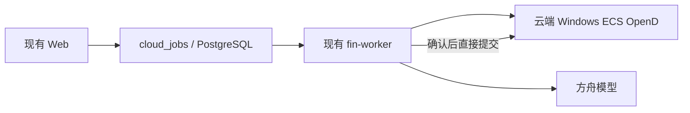
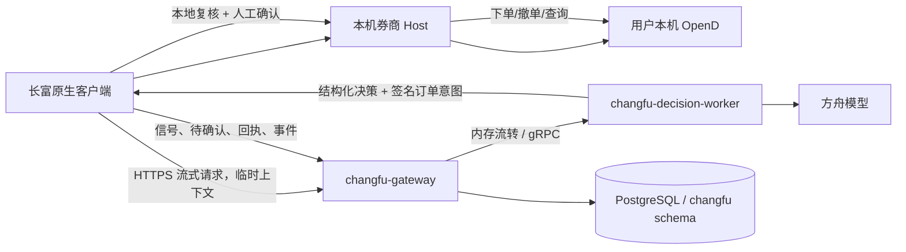
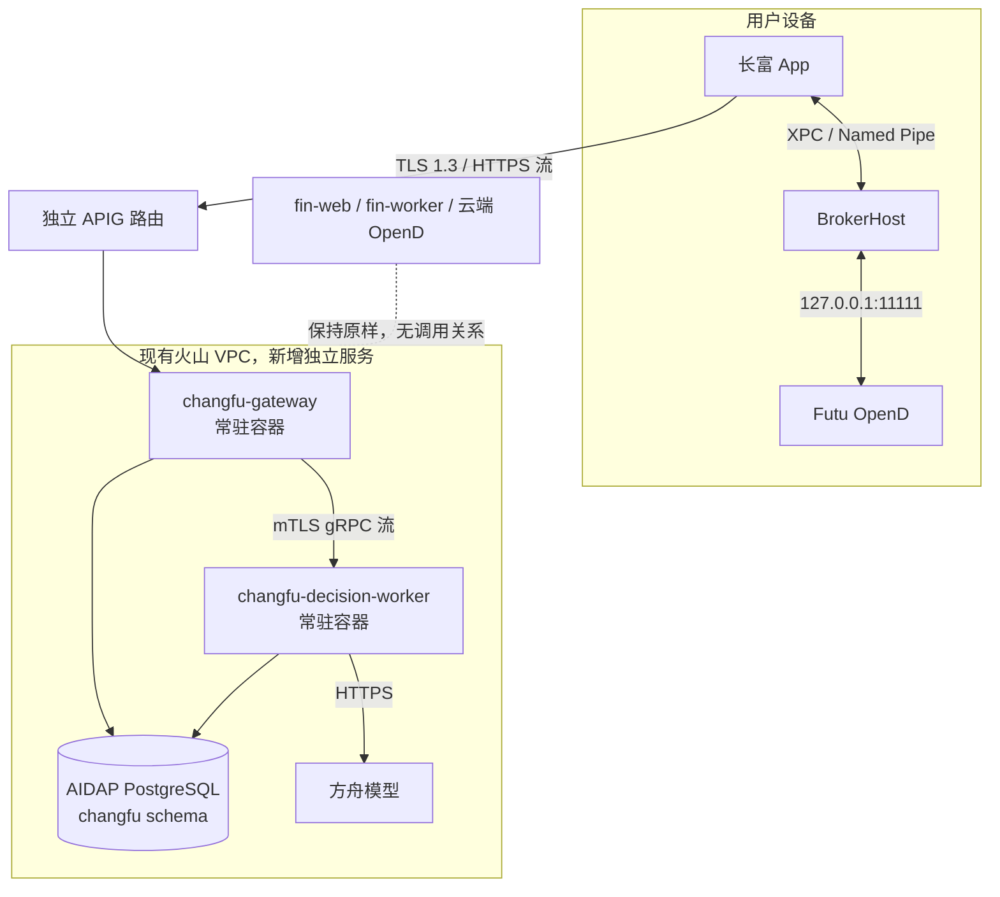
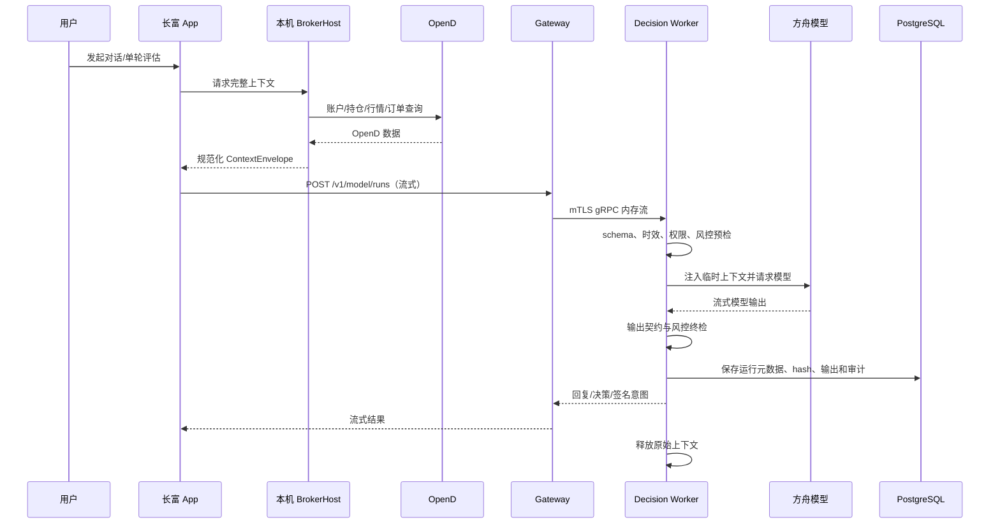
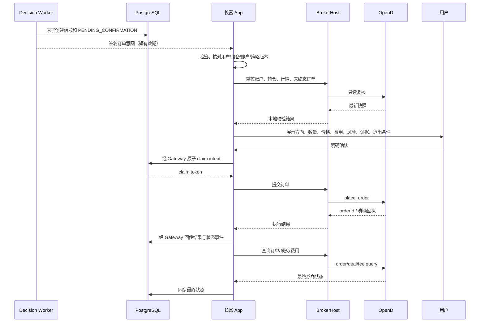
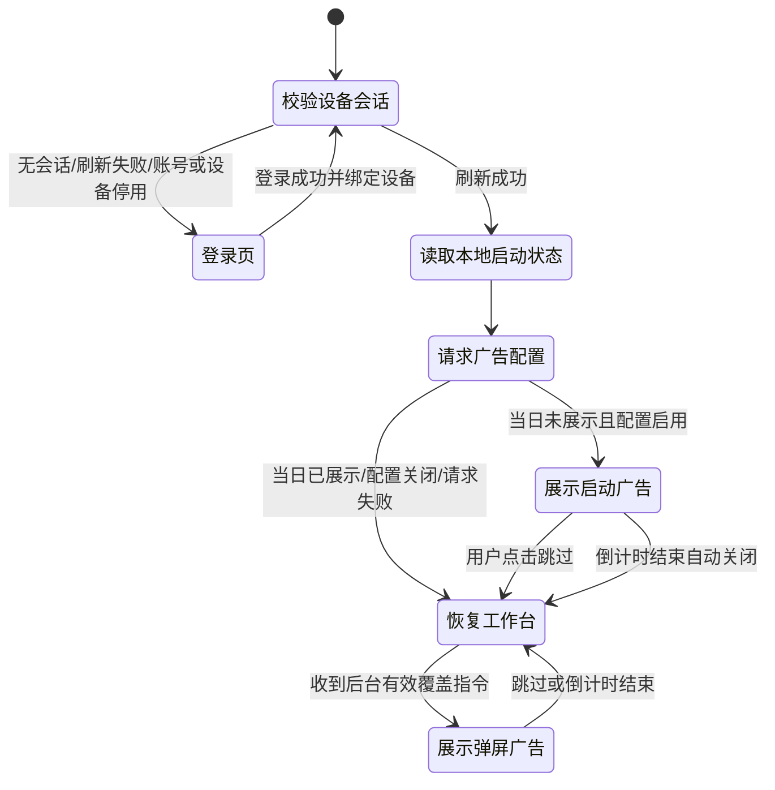

# 长富桌面客户端与独立决策后台实施方案

> 日期：2026-09-17
>
> 状态：macOS 本地可用基线已验收，后续交易与 Windows 阶段待实施
>
> 核心约束：新增工程必须与现有 Web、`fin-web`、`fin-worker` 完全隔离；实施时不得修改现有 `src/`、`api/`、`shared/`、根 `package.json`、现有数据库脚本或现有发布脚本。

## 一、Summary

### 1.1 目标

建设名为“长富”的原生桌面客户端：

1. 首期交付 macOS，随后交付 Windows。
2. macOS 使用 SwiftUI/AppKit；Windows 使用 WPF + .NET 8。
3. 客户端连接用户本机 Futu OpenD，负责账户、持仓、行情、订单和成交数据采集。
4. 模型请求所需的 OpenD 数据由客户端按请求发送给独立后台决策 Worker，Worker 将数据直接组装进模型上下文。
5. 逐笔、盘口、分钟线、账户和持仓原始上下文仅在请求内存中使用，不写 PostgreSQL、不进入消息队列、不打印到日志。
6. 模型只返回结构化决策或订单草案；真实下单、撤单、改单和券商状态核验只能由持有交易租约的桌面客户端通过本机 OpenD 执行。
7. 订单、策略信号、待确认订单、执行回执、状态事件、模型审计元数据、报告和对话历史长期保存到 PostgreSQL。
8. 所有现有账号均可绑定自己的 OpenD；同一账号允许多设备登录，但同一时刻只有一台设备拥有交易执行权。
9. UI 参考豆包桌面端的桌面交互密度，但采用工作台优先结构：顶部固定 A 股、Futu、Longbridge 平台标签，左侧为随平台变化的任务导航，中间为金融工作区，右侧为固定可伸缩模型对话。
10. 当前已完成 Futu 美股/港股工作台能力，并进入 Longbridge 只读接入阶段；A 股仍显示“规划中”。Longbridge 必须使用独立适配进程和独立状态，禁止复用或污染 Futu OpenD 会话。
11. 每天首次冷启动先显示静态广告占位页；倒计时秒数由后台配置，计时中始终可跳过，结束后自动关闭并恢复上次平台、任务页和布局状态。
12. 预留后台弹屏广告能力，可在应用运行期间覆盖工作台；首期同样只展示本地静态占位素材，不支持视频、外链或动态素材下载。
13. 客户端采用强制认证门禁：冷启动先校验并刷新设备会话，只有服务端确认登录有效后才能初始化 OpenD、广告和工作台；无登录态、refresh 失败、账号停用、设备吊销或任一业务接口返回 401 时立即清除本地会话并显示登录页。

### 1.2 成功标准

* macOS 客户端可发现并辅助启动本机 OpenD，显示连接、登录、行情权限和交易解锁状态。

* 未登录用户无法看到工作台、账户、持仓、行情、对话或广告；用户登录长富后，只能看到自己绑定设备采集的数据及自己的长期业务记录。

* 账户、持仓、行情、K 线、逐笔、盘口、订单、成交等 Futu 能力均由本机执行，不再由云端 Worker 直连 OpenD。

* 一次模型请求的数据链路可审计，但高频原始上下文在请求结束后不可从数据库、队列或日志恢复。

* 模型输出无法直接触发下单；客户端必须校验签名意图、设备租约、有效期、账户、行情、持仓、时段和硬风控，并默认要求人工确认。

* 网络重试、客户端崩溃、后台重启和重复点击不会造成重复下单。

* 三个平台入口始终可见；切换平台后左侧任务导航同步变化，未实现平台不会误导为可用。

* 每日首次启动广告、主动跳过、倒计时自动关闭和后台弹屏覆盖均按配置准确执行，广告故障不阻断进入工作台。

* macOS 正式包完成签名、公证、升级验证；Windows 阶段达到同一协议与功能验收。

* 新核心模块单元测试覆盖率不低于 85%，所有真实交易测试默认使用替身或 Futu 模拟环境。

## 二、Current State Analysis

### 2.1 现有工程形态

现有仓库是 React 18 + Vite + TypeScript 前端与 Express/TypeScript 后端组成的单体工程：

* Web 路由入口：`src/App.tsx`

* 云端认证壳：`src/cloud/CloudApp.tsx`

* Futu 实盘页面：`src/pages/LiveTradingView.tsx`

* Futu 实盘引擎：`api/live/liveTradingEngine.ts`

* 模型决策：`api/live/liveTradingDecisionService.ts`

* 生产提示词与输出校验：`api/live/tradingPromptV2.ts`

* 模型上下文：`api/live/tradingPromptContext.ts`

* 待确认与提交状态机：`api/live/liveOrderQueueService.ts`

* Futu 订单提交：`api/live/futuLiveOrderService.ts`

* Python/OpenD 桥：`api/futu_bridge/*.py`

* 云端 Worker：`api/cloud/worker/workerServer.ts`

* 云端任务分发：`api/cloud/jobs/jobHandlers.ts`

* PostgreSQL 基础表：`deploy/volcano/pg/schema.sql`

* 多用户 schema：`deploy/volcano/pg/multiuser_schema.sql`

### 2.2 当前链路与目标链路的根本差异

当前链路：



目标链路：



差异：

* 现有 Worker 同时持有模型决策权和券商执行权；长富必须拆开。

* 长富后台不能连接任何用户 OpenD，也不能持有 Futu 交易密码、RSA 私钥或券商登录态。

* 长富客户端是唯一券商执行边界，后台返回的是“建议/意图”，不是券商调用结果。

* 现有 `cloud_jobs` 会持久化 payload，不适合承载禁止落盘的高频行情上下文。

* 因此不能复用或扩展现有 `fin-worker`，必须新增独立常驻后台。

### 2.3 可借鉴但不可运行时依赖的现有能力

新工程可依据以下现有实现重新实现并建立黄金样例测试，但不得从新工程 import 现有源码：

* `api/live/tradingPromptContext.ts`：账户、持仓、行情、订单、趋势和数据缺口的上下文结构。

* `api/live/tradingPromptV2.ts`：结构化输出契约、证据引用、反证、退出条件、上下文时效和 fail-closed 校验。

* `api/live/liveOrderQueueService.ts`：待确认订单、确认、失败和提交后的状态语义。

* `api/live/futuLiveOrderService.ts`：Futu 实盘订单、详情、成交、费用和撤单能力清单。

* `api/futu_bridge/*.py`：已验证的 Futu 字段语义、市场代码、账户和订单行为。

* `src/pages/LiveTradingView.tsx` 与相关 hooks/components：页面功能清单和用户工作流。

新后台以 `dual-broker-production-v2.4.3-1` 的已验证约束为起点，复制为独立的 `changfu-futu-v1` 版本；之后由长富独立演进，不与现有 Worker 共享运行时文件。

### 2.4 Futu 官方 SDK 结论

官方文档：

* 介绍：`https://openapi.futunn.com/futu-api-doc/intro/intro.html`

* 环境：`https://openapi.futunn.com/futu-api-doc/quick/env.html`

结论：

* OpenD 支持 Windows 与 macOS。

* 官方 SDK 支持 Python、Java、C#、C++、JavaScript，不支持 Swift。

* macOS 使用 SwiftUI/AppKit 作为 UI，通过 Objective-C++ 封装官方 C++ SDK。

* Windows 使用 WPF/.NET 8，通过升级编译后的官方 C# SDK。

* 不自行实现 OpenD 裸 TCP/Protobuf 协议。

* 不把 OpenD 捆绑进长富安装包；只检测、配置并辅助启动用户已安装的 OpenD。

## 三、工程与目录边界

新增三个顶层目录，现有目录保持不变：

```text
Financial/
├── changfu-contracts/                 # 唯一跨端协议源
│   ├── openapi/changfu-v1.yaml
│   ├── schemas/
│   │   ├── context-envelope.schema.json
│   │   ├── model-result.schema.json
│   │   ├── signed-order-intent.schema.json
│   │   └── broker-event.schema.json
│   ├── fixtures/                      # 跨语言黄金样例
│   ├── scripts/                       # 客户端生成和兼容性检查
│   └── README.md
├── changfu-desktop/                   # 桌面客户端总工程
│   ├── macos/
│   │   ├── ChangFu.xcodeproj
│   │   ├── App/                       # SwiftUI/AppKit
│   │   ├── Features/                  # 工作台、报告、模拟、实盘、对话
│   │   ├── Domain/
│   │   ├── Infrastructure/
│   │   ├── BrokerHost/                # XPC 服务
│   │   ├── FutuCppBridge/             # Objective-C++ / 官方 C++ SDK
│   │   ├── Generated/
│   │   ├── Tests/
│   │   └── UITests/
│   ├── windows/
│   │   ├── ChangFu.sln
│   │   ├── ChangFu.App/               # WPF
│   │   ├── ChangFu.Domain/
│   │   ├── ChangFu.Infrastructure/
│   │   ├── ChangFu.BrokerHost/        # 独立进程 + Named Pipe
│   │   ├── ChangFu.FutuAdapter/        # 官方 C# SDK
│   │   ├── ChangFu.Generated/
│   │   └── ChangFu.Tests/
│   ├── docs/
│   └── README.md
└── changfu-backend/                   # 完全独立后台 workspace
    ├── package.json
    ├── apps/
    │   ├── gateway/                    # 登录、设备、HTTP 流、业务 API
    │   └── decision-worker/            # 上下文校验、模型、决策校验
    ├── packages/
    │   ├── auth/
    │   ├── ads/
    │   ├── domain/
    │   ├── model/
    │   ├── persistence/
    │   ├── observability/
    │   └── generated-contracts/
    ├── migrations/                    # 仅 changfu schema
    ├── deploy/                        # 独立镜像和发布脚本
    ├── tests/
    └── README.md
```

隔离规则：

1. 三个新目录有独立依赖、构建、测试、版本和发布流程。
2. 不修改根 `package.json`，不纳入现有 Vite/TypeScript 构建。
3. 不引用 `src/**`、`api/**`、`shared/**` 的运行时代码。
4. 只允许通过测试夹具比较新旧决策语义；现有工程仍可独立构建和发布。
5. 新数据库对象全部进入 PostgreSQL `changfu` schema，不改现有表结构。
6. 复用账号仅表示只读查询 `public.cloud_users` 和 `multiuser.user_profiles`；长富设备、会话和业务数据不写回现有业务表。

## 四、目标架构

### 4.1 组件职责

#### macOS 客户端

* SwiftUI 实现页面、导航、对话和确认交互。

* AppKit 负责多窗口、菜单栏、系统托盘、快捷键和窗口恢复。

* XPC `BrokerHost` 独占 Futu SDK、OpenD 连接和交易调用。

* Objective-C++ 将官方 C++ SDK 转换为稳定的 Swift Domain DTO。

* Keychain 保存设备刷新令牌、设备私钥和本地敏感配置。

* 本地 SQLite 只保存 UI 配置、会话索引缓存和未回传的业务事件 outbox；禁止保存逐笔、盘口、分钟线、账户和持仓原始上下文。

#### Windows 客户端

* WPF + MVVM 实现与 macOS 相同的信息架构和功能。

* 独立 `ChangFu.BrokerHost` 进程调用官方 C# SDK。

* UI 与 BrokerHost 通过受限 Named Pipe 通信。

* Windows Credential Manager/CNG 保存令牌和设备私钥。

* 与 macOS 使用相同的 OpenAPI/JSON Schema、状态机和黄金样例。

#### `changfu-gateway`

* 复用现有账号数据完成密码验证，但签发独立的桌面访问令牌。

* 管理设备注册、吊销、心跳和单活交易租约。

* 接收模型请求并以流式方式转发给 decision worker。

* 接收信号、待确认订单、执行结果和订单事件，原子落库。

* 提供报告、历史、会话和策略配置 API。

* 提供启动广告配置、弹屏广告指令和曝光/跳过结果接口；广告配置与交易权限完全隔离。

* 不连接 OpenD、不持有 Futu 凭据、不调用模型。

#### `changfu-decision-worker`

* 在内存中验证 `ContextEnvelope` 完整性、大小、时间戳、序列号和数据缺口。

* 构建 `changfu-futu-v1` 模型上下文并调用方舟模型。

* 验证结构化模型输出、证据引用、风控和上下文时效。

* 生成普通研究回复、交易草案、组合裁决或挂单管理建议。

* 对可执行草案生成服务端签名订单意图。

* 只持久化模型运行元数据、输入哈希、输出、错误和审计结论，不持久化输入原文。

#### PostgreSQL

* 长期保存用户设备关系、策略配置、信号、待确认订单、执行结果、订单事件、报告、对话和模型审计。

* 不保存模型请求中的账户/持仓原始快照、逐笔、盘口或分钟线数组。

* 不作为高频上下文消息队列。

### 4.2 部署拓扑



部署要求：

* `changfu-gateway` 与 `changfu-decision-worker` 使用独立镜像、服务账号、日志主题和告警。

* Gateway 可公网访问的唯一入口是 APIG HTTPS；decision worker 仅 VPC 内网可达。

* 两服务均为常驻服务，不使用会持久化请求 payload 的 `cloud_jobs`。

* 发布顺序固定为 decision worker → gateway；发布失败不触碰现有 `fin-worker`/`fin-web`。

## 五、协议与数据流

### 5.1 上下文信封

`ContextEnvelope` 是一次请求的临时数据：

```text
schemaVersion
requestId
userId（由令牌解析，客户端值仅用于比对）
deviceId
brokerConnectionId
purpose: CHAT | SINGLE_DECISION | PORTFOLIO_REVIEW | MANAGED_ORDER_REVIEW | REPORT
capturedAt
expiresAt
sequence
account
positions
marketSessions
quotes
minuteBars
tickerPoints
orderBooks
openOrders
recentDeals
strategyConfigVersion
clientPolicyVersion
dataGaps[]
contentHash
deviceSignature
```

规则：

* 传输使用 HTTPS，正文可压缩；解压后最大 2 MiB。

* 单标的执行决策最终模型消息仍限制在 768 KiB；超限必须裁剪最旧行情并在 `dataGaps` 记录。

* `capturedAt` 不得晚于服务器时间 5 秒；可执行决策的源数据最长有效 60 秒。

* 客户端对规范化 JSON 做 SHA-256，再用设备密钥签名。

* Gateway 只做流式转发和限流；decision worker 处理完成后立即释放原始对象引用。

* 应用日志只能记录 requestId、字节数、条目计数、hash、耗时和错误码，不得记录正文。

* 崩溃转储和 APM body capture 对 `/v1/model/runs` 强制关闭。

### 5.2 模型请求时序



失败策略：

* Gateway 或 worker 不可用：返回可重试错误，不将上下文降级写入 PG/文件/队列。

* 客户端断线：取消模型调用；用户重试时必须重新采集上下文。

* worker 崩溃：运行记录标记 `INTERRUPTED`，不保留原始数据；客户端用新 requestId 重发。

* 数据过期或字段不足：只允许研究回复或 `HOLD`，禁止产生可执行意图。

### 5.3 订单执行时序



### 5.4 下单安全规则

1. 默认只允许人工确认；首期不提供自动下单开关。
2. 签名意图使用 Ed25519，至少绑定：

   * `intentId`

   * `userId`

   * `deviceId`

   * `brokerConnectionId`

   * `accountIdHash`

   * 订单全部字段

   * `contextHash`

   * `strategyVersion`

   * `issuedAt`

   * `expiresAt`
3. 可执行有效期取 `min(sourceValidUntil, issuedAt + 60 秒)`。
4. 一次 intent 只能被一个设备 claim 一次；`intentId` 是全链路幂等键。
5. 同一账号只有持有交易租约的设备可 claim；租约默认 90 秒，每 30 秒续租。
6. 客户端确认前必须重新查询：

   * OpenD 登录和交易解锁状态

   * 账户 ID

   * 市场交易时段

   * 当前持仓和可平数量

   * 同标的未终态订单

   * 最新报价和每手股数
7. 任何账户变化、持仓冲突、订单冲突、上下文过期、策略版本变化或签名失败均使意图过期并要求重新评估。
8. `MARKETABLE_LIMIT` 默认最大滑点 15 bps；超出后不得客户端自行改价，必须重新评估。
9. 真实订单请求包含 `intentId`/`claimToken` 对应的 remark；券商返回超时后先按 remark、时间窗和订单字段查单，禁止直接重试下单。
10. 模型建议撤单同样生成签名撤单意图并默认人工确认；客户端只撤未成交剩余量。

## 六、后台接口

### 6.1 认证与设备

客户端启动认证顺序固定为：

1. 读取 macOS Keychain / Windows Credential Manager 中的 refresh token，不从 `UserDefaults`、配置文件或环境变量恢复生产会话。
2. 没有 refresh token 时直接显示登录页，不初始化 BrokerHost/OpenD，不请求广告、模型或业务数据。
3. 存在 refresh token 时调用 `POST /v1/auth/refresh`；服务端同时校验账号启用状态、设备状态、会话吊销状态和过期时间。
4. refresh 成功后，access token 只保存在进程内存，refresh token 轮换后覆盖保存到系统安全存储；随后才允许启动 BrokerHost、读取广告并显示工作台。
5. access token 到期前 60 秒自动 refresh；refresh 失败或任一受保护接口返回 401 时，立即清除内存 access token 和本机 refresh token、断开 BrokerHost、清空当前账户数据并强制返回登录页。
6. 禁止离线绕过登录进入缓存工作台；网络不可用时停留在登录页或会话校验页，不展示上次账户、持仓或行情快照。

* `POST /v1/auth/login`

  * 使用现有 `cloud_users` 密码哈希和 `multiuser.user_profiles.active`。

  * 返回 15 分钟桌面 access token。

* `POST /v1/auth/refresh`

  * 使用设备绑定、可吊销的 30 天 refresh token。

* `POST /v1/auth/logout`

* `POST /v1/devices/enroll`

  * 注册设备公钥、平台、应用版本和设备显示名。

* `GET /v1/devices`

* `DELETE /v1/devices/{deviceId}`

* `POST /v1/trading-lease/acquire`

* `POST /v1/trading-lease/renew`

* `POST /v1/trading-lease/release`

设备私钥必须不可导出：

* macOS：Keychain，硬件允许时使用 Secure Enclave。

* Windows：CNG/DPAPI + Windows Credential Manager。

### 6.2 模型与对话

* `POST /v1/model/runs`

  * 请求：`ContextEnvelope + userMessage?`

  * 返回：SSE/NDJSON 流，终态包含结构化结果。

* `GET /v1/model/runs/{requestId}`

  * 只返回状态、结果和审计元数据，不返回原始上下文。

* `POST /v1/conversations`

  * 客户端首次发送消息时才调用；打开空白窗口不创建记录。

* `GET /v1/conversations`

* `GET /v1/conversations/{id}/messages`

* `DELETE /v1/conversations/{id}`

模型对话支持：

* 基于当前账户、持仓、行情、报告、策略和选中标的进行研究问答。

* 回答必须结构化展示证据、反证、风险、数据缺口和退出/重新评估条件。

* 交易相关输出只能生成订单草案并进入统一待确认状态机。

* 对话消息和模型回复长期保存；引用的高频上下文只保存对象 ID、hash、计数和时间范围。

* 模型回复中已经形成的文字摘要会随对话长期保存，UI 需在发送前明确提示。

### 6.3 业务记录

* `GET/PUT /v1/strategies`

* `GET /v1/signals`

* `GET /v1/pending-orders`

* `POST /v1/pending-orders/{id}/claim`

* `POST /v1/pending-orders/{id}/reject`

* `POST /v1/pending-orders/{id}/expire`

* `POST /v1/order-executions`

* `POST /v1/order-events/batch`

* `GET /v1/orders`

* `GET /v1/orders/{id}`

* `POST /v1/orders/{id}/cancel-intent`

* `GET/POST /v1/reports`

* `GET /v1/reports/{id}`

所有写接口必须带 `Idempotency-Key`；所有资源归属从 access token 获取，不接受客户端指定其他用户 ID。

### 6.4 广告配置

* `GET /v1/ads/active?placement=startup|overlay`

  * 返回服务端时间、配置版本、是否启用、倒计时秒数、有效期和静态素材 ID。

* `PUT /v1/admin/ad-configs/{placement}`

  * 仅 owner 可配置启停、1–30 秒倒计时、优先级、有效期和版本。

* `POST /v1/ads/{campaignId}/events`

  * 记录 `SHOWN | SKIPPED | AUTO_CLOSED | DEFERRED`，不携带资产或行情数据。

首期静态素材随安装包发布，后台不得返回外部素材 URL；客户端只接受协议白名单中的本地素材 ID。

## 七、PostgreSQL 数据模型

新增 `changfu` schema：

| 表                            | 作用                            | 保留策略              |
| ---------------------------- | ----------------------------- | ----------------- |
| `changfu.devices`            | 用户设备、公钥、平台、版本、状态              | 设备删除后保留审计墓碑       |
| `changfu.device_sessions`    | refresh token 哈希、吊销和最后活动      | 到期清理              |
| `changfu.trading_leases`     | 单活交易设备租约                      | 短期状态              |
| `changfu.broker_connections` | 用户与本机 OpenD 逻辑绑定、账户指纹         | 长期；不存 OpenD 密码    |
| `changfu.strategy_configs`   | 版本化策略和提示词选择                   | 长期                |
| `changfu.model_runs`         | requestId、hash、计数、时效、模型、结果、错误 | 长期；无 context JSON |
| `changfu.signals`            | 模型策略信号与证据摘要                   | 长期                |
| `changfu.pending_orders`     | 待确认状态机与签名意图                   | 长期                |
| `changfu.order_executions`   | 客户端执行请求与券商回执                  | 长期                |
| `changfu.order_events`       | 提交、部分成交、成交、撤单、失败事件            | 长期、只追加            |
| `changfu.reports`            | 报告正文、参数、模型版本                  | 长期                |
| `changfu.conversations`      | 用户首次发送后创建的会话                  | 长期                |
| `changfu.messages`           | 用户消息、模型回复、引用对象与上下文 hash       | 长期                |
| `changfu.ad_configs`         | 广告位置、启停、倒计时、优先级、有效期和版本        | 长期                |
| `changfu.ad_deliveries`      | 用户/设备曝光、跳过、自动关闭及弹屏送达状态         | 长期                |
| `changfu.security_audit`     | 登录、设备、租约、权限和交易审计              | 长期、只追加            |

明确禁止：

* 不建 `ticks`、`order_books`、`minute_bars`、`account_snapshots` 或 `position_snapshots` 历史表。

* `model_runs` 不得包含原始 prompt、完整账户/持仓或行情正文。

* SQL、应用日志、APM、错误堆栈和崩溃转储不得出现 OpenD 密码、设备私钥、完整 bearer token 或原始模型上下文。

## 八、桌面产品设计

### 8.1 信息架构

主窗口采用“顶部平台 + 三栏工作区”布局：

```text
┌─────────────────────────────────────────────────────────────────────────────┐
│ 长富                 [ A 股 ] [ Futu ] [ Longbridge ]        连接/账户/设置 │
├──────────────┬──────────────────────────────────────┬──────────────────────┤
│ 平台任务导航 │ 当前平台金融工作区                   │ 固定模型对话         │
│              │                                      │                      │
│ 今日总览     │ 资金、收益、风险、连接和数据覆盖     │ 会话列表/当前会话    │
│ 市场         │ 政策、监管动态和重要事件             │ 当前上下文范围       │
│ 研究         │ 标的池、量化研究、SELL PUT 期权研究  │ 证据/反证/风险       │
│ 交易         │ 当前订单、成交和本机执行边界         │ 退出条件/订单草案    │
│ 资产         │ 按标的归组的持仓与集中度             │                      │
│ 策略中心     │ 订单总览、策略报告和同步状态         │                      │
│ 套餐（全局） │ 轻量版、高级版、旗舰版与支付入口     │ 不显示模型对话       │
└──────────────┴──────────────────────────────────────┴──────────────────────┘
```

规则：

* 品牌“长富”必须在首屏明确出现。

* 顶部平台标签始终显示 A 股、Futu、Longbridge；Futu 与 Longbridge 提供真实只读数据，A 股显示“规划中”空状态。Longbridge 未授权时显示连接引导，不出现伪数据或把空数据解释为零资产。

* 顶部平台标签只决定业务平台；左侧任务导航随当前平台切换，禁止把不同平台的账户、策略和订单混在同一列表。

* Futu 与 Longbridge 左侧一级任务固定为：今日总览、市场、研究、交易、资产、策略中心；两者复用信息架构和视觉令牌，但账户、连接、刷新、市场状态和数据快照完全隔离。

* 套餐是全局入口，固定在平台导航底部，不属于任何券商或股票市场；打开套餐页时不显示市场状态条和模型对话。

* 中央区域始终是主要工作画布，模型对话固定在右侧，不抢占默认首页。

* 全局只使用中文，Futu、OpenD、API 等专有名词除外。

* 外层窗口/主面板 24px 圆角；工作区模块卡片统一 8px 圆角，胶囊状态标签除外。

* 金融工作站保持高信息密度，不使用营销落地页布局。

* 对话栏可折叠和拖动宽度；切换平台或工作区不丢当前会话，但上下文选择器必须明确显示当前引用的平台与页面。

* 盈利红色并带 `+`，亏损绿色并带 `-`。

* 实盘页顶部固定显示市场状态、OpenD 状态和当前交易设备租约。

* 首次安装尚无上次位置时，广告结束后默认进入 Futu 今日总览；之后恢复上次平台、任务页、滚动位置、导航折叠状态和对话宽度。

### 8.2 启动广告与弹屏广告

首期只实现“静态占位素材 + 后台行为配置”，不下载动态图片或视频：



行为规则：

* “每天首次”按设备本地时区的自然日判断，以后台返回的服务端时间校正明显时钟漂移。

* 冷启动指应用进程从未运行到启动；从后台切回前台不重复触发启动广告。

* 倒计时秒数由 `changfu.ad_configs.duration_seconds` 配置，允许范围 1–30 秒。

* 跳过按钮从广告出现第一秒即可点击；倒计时归零后自动关闭。

* 广告关闭后恢复上次平台和任务页；无历史状态时进入 Futu 今日总览。

* 后台弹屏广告通过客户端每 60 秒拉取轻量配置；同一 `campaignId + version` 每台设备最多展示一次。

* 弹屏广告不得在订单确认窗口、正在提交订单或交易密码输入期间覆盖；延迟到关键交易流程结束后再展示。

* 已通过登录校验后，广告服务异常、超时或配置非法时直接进入工作台，不阻断 OpenD 和交易能力；广告异常不得绕过认证门禁。

* 首期静态占位素材随安装包发布，后台只配置启停、位置、倒计时、优先级、有效期和版本。

* 首期不支持广告视频、外部 URL、动态素材下载、个性化画像或基于资产数据定向。

### 8.3 首期功能映射

| 长富模块                 | macOS 首期 | Windows 第二阶段 |
| -------------------- | -------: | -----------: |
| 顶部 A 股/Futu/Longbridge 平台标签 | 是，A 股规划中 | 同协议实现 |
| 每日首次启动广告与后台弹屏覆盖 | 是，静态占位素材 | 同协议实现 |
| 登录、设备绑定、会话恢复         |        是 |        同协议实现 |
| OpenD 自动发现、辅助启动、状态检测 |        是 |        同协议实现 |
| Futu 账户、资产、持仓、盈亏     |        是 |        同协议实现 |
| 自选、快照、K 线、盘口、逐笔、市场状态 |        是 |        同协议实现 |
| Top30 报告与报告历史        |        是 |        同协议实现 |
| Futu 模拟盘             |        是 |        同协议实现 |
| Futu 美股/港股实盘决策       |        是 |        同协议实现 |
| 待确认、订单、成交、费用、撤单监管    |        是 |        同协议实现 |
| 模型研究对话与交易草案          |        是 |        同协议实现 |
| Longbridge 只读账户、持仓、行情、订单与成交 |        是 |        同协议实现 |
| 独立 A 股工作台            |        否 |            否 |

### 8.4 OpenD 生命周期

* 首次启动扫描官方默认安装位置，也允许用户选择可执行文件。

* 可启动已安装 OpenD，但不代填账号、密码、验证码或交易密码。

* 默认只连接 `127.0.0.1:11111`；远程 OpenD 地址首期禁用。

* 状态拆分为：程序未安装、未启动、端口不可达、未登录、行情权限不足、交易未解锁、可用。

* OpenD 断连时客户端继续展示长期历史，但停止行情、模型交易评估和订单执行。

* App 退出时不强制关闭用户的 OpenD。

## 九、客户端本地架构

### 9.1 统一 Broker Port

两端分别实现同一接口：

```text
connect / disconnect / health
listAccounts / accountSnapshot / positions
subscribeQuotes / subscribeBars / subscribeTicks / subscribeOrderBook
marketSessions / instrumentInfo / optionChain
listOrders / orderDetail / deals / fees
placeOrder / cancelOrder / modifyOrder
```

返回 DTO 必须通过 `changfu-contracts` 黄金样例验证。

### 9.2 进程隔离

macOS：

* `ChangFu.app` 不直接加载 Futu C++ SDK。

* `ChangFuBrokerService.xpc` 加载 SDK 并保持 OpenD 长连接。

* XPC 接口只暴露白名单 DTO，不接受任意方法名或脚本。

* 下单方法必须携带已验证 intent、用户确认凭据和本地风控结果。

Windows：

* `ChangFu.App.exe` 不直接加载 Futu C# SDK。

* `ChangFu.BrokerHost.exe` 使用当前用户权限运行。

* Named Pipe 使用当前用户 SID ACL，拒绝其他会话连接。

* 下单规则与 macOS 保持同一状态机和测试向量。

### 9.3 本地缓存

* 高频行情只保存在有界内存 ring buffer。

* 默认窗口：1 分钟 K 线 120 根、逐笔 240 条、盘口 5 档；策略可在服务端允许范围内调整。

* 切换账号、OpenD 断线或应用锁定时立即清空敏感内存缓存。

* outbox 只保存订单/信号/回执等允许长期保存的业务事件，回传成功后删除。

* 本地日志使用字段白名单和滚动限制，不记录上下文正文。

## 十、模型与策略实现

### 10.1 模型角色

* `CHAT_RESEARCH`：研究问答，可引用当前页面和用户选择的数据。

* `SINGLE_DECISION`：单标的决策。

* `PORTFOLIO_REVIEW`：候选池组合裁决。

* `MANAGED_ORDER_REVIEW`：挂单 KEEP/CANCEL 建议。

* `REPORT`：Top30/专题报告。

### 10.2 输出要求

所有交易相关输出必须包含：

* `approved`

* `action`

* `ticker`

* `orderQuantity`

* `limitPrice`

* `positionEffect`

* `reason`

* `riskAssessment`

* `evidenceIds`

* `counterEvidenceIds`

* `invalidationPrice`

* `exitCondition`

* `requestedFollowUp`

Worker 负责 JSON Schema、业务规则、证据归属、数量、每手股数、可平量、预算、订单冲突和时效校验。校验失败统一转为不可执行结果，不尝试从自由文本恢复订单。

### 10.3 客户端与后台双重风控

* 后台风控用于阻止模型产生不合格意图。

* 客户端风控使用最新 OpenD 数据重新计算，不信任后台账户状态。

* 两端风险策略由相同版本号和黄金样例约束，但各自独立实现。

* 两端结果不一致时 fail closed，并上报差异审计，不允许以任一端结果覆盖继续下单。

## 十一、实施阶段

### 阶段 0：协议与可行性门禁

1. 创建三个独立顶层目录及各自构建。
2. 定义 OpenAPI、JSON Schema、错误码、状态机和黄金样例。
3. macOS 验证官方 C++ SDK 在当前 Xcode、Intel 与 Apple Silicon 上的编译/运行。
4. 验证 Objective-C++ → XPC → Swift 并发回调和断线恢复。
5. 验证 Windows 官方 C# SDK 可升级到 .NET 8。
6. 若 macOS arm64 官方库不可用，优先从官方 C++ 源码编译 universal binary；本方案不回退 Python，也不自行实现裸协议。

门禁：macOS 可完成 OpenD 状态、账户只读和行情订阅后才进入 UI 全量开发。

### 阶段 1：独立后台基础

1. 创建 `changfu` schema 和幂等迁移器。
2. 实现账号复用、桌面 token、设备注册/吊销和交易租约。
3. 实现 gateway 与 decision worker 的 mTLS gRPC 流。
4. 实现上下文不落盘保护、日志脱敏和 body capture 禁用测试。
5. 建立模型运行元数据、会话、信号、待确认和订单事件持久化。
6. 建立广告配置、设备送达状态和 owner 管理接口。
7. 部署独立开发环境，不接入现有 `fin-*` 服务。

### 阶段 2：macOS 只读工作台

1. 完成 SwiftUI 顶部平台标签、平台随动任务导航、中央工作区、固定对话栏、登录、设备和 OpenD 状态。
2. 完成 XPC BrokerHost 与 C++ SDK 封装。
3. 实现账户、资产、持仓、自选、行情、K 线、盘口、逐笔和订单只读页面。
4. 实现每日首次启动广告、恢复上次工作位置和后台弹屏覆盖；A 股显示“规划中”，Longbridge 进入独立只读接入。
5. 接入研究对话、报告和历史。
6. 验证原始上下文不落盘。

门禁：只读稳定运行至少一个完整交易日，断线恢复和多账号隔离通过。

### 阶段 3：macOS 模拟盘与影子决策

1. 实现模拟盘策略、候选池和信号。
2. 决策 Worker 以 `shadow` 模式运行，禁止返回可 claim 意图。
3. 对比长富与现有 Futu 逻辑的黄金样例结果。
4. 完成交易状态机、幂等、超时查单和事件回传。

门禁：影子结果、上下文时效、订单冲突和风控测试全部通过。

### 阶段 4：macOS 实盘人工确认

1. 开启签名意图。
2. 完成本地最终复核与人工确认弹窗。
3. 完成 REAL 下单、订单详情、成交、费用、撤单和部分成交处理。
4. 先使用 Futu 模拟环境进行完整验收。
5. 真实账户只做人工批准的小数量受控验证，禁止 CI 或无人值守真实下单。

门禁：真实执行必须同时满足服务端模式、账号权限、设备租约、客户端本地门禁和用户确认。

### 阶段 5：macOS 正式发布

1. 构建 universal app。
2. Developer ID 签名、Hardened Runtime、公证和 DMG。
3. 建立签名升级清单和灰度渠道。
4. 先内测，再按设备白名单灰度，最后开放全部账号。

### 阶段 6：Windows 对等实现

1. 复用协议和黄金样例，建立 WPF/MVVM 工程。
2. 实现 C# SDK BrokerHost 和 Named Pipe。
3. 按 macOS 相同顺序完成只读、影子、模拟、实盘确认。
4. 使用签名 MSIX/AppInstaller 发布和升级。
5. 跨平台一致性测试确保同一输入得到同一风控结论和状态转换。

## 十二、Verification

### 12.1 静态与单元测试

* JSON Schema/OpenAPI lint 和破坏性变更检测。

* TypeScript `check`、lint、Vitest。

* SwiftLint、Swift Testing/XCTest。

* .NET build、analyzers、xUnit。

* Objective-C++/C++ sanitizer 与生命周期测试。

* 核心模块覆盖率不低于 85%：

  * 认证与设备

  * 交易租约

  * 上下文校验

  * 模型输出校验

  * 双重风控

  * 订单状态机

  * 幂等与回执同步

### 12.2 契约测试

* 三端对同一 fixture 的字段、枚举、金额精度、时间和 hash 结果一致。

* 未知字段向前兼容；缺少必填字段 fail closed。

* macOS 与 Windows 对同一订单输入输出相同的本地风控结果。

* 服务端签名意图可被两端验证，篡改任一字段均失败。

### 12.3 集成测试

* 使用 Fake OpenD/BrokerHost 测试断线、超时、重复回调、乱序和部分成交。

* 使用 Futu SIMULATE 验证账户、行情、下单、撤单、成交和费用。

* Gateway → Worker → 模型替身 → 客户端完整链路。

* 模型运行期间断网、Gateway 重启和 Worker 重启。

* 重复确认、重复 claim、提交超时后查单，断言最多产生一笔券商订单。

* 多用户与多设备隔离；只读设备无法 claim。

### 12.4 隐私与安全验收

* 数据库扫描确认不存在逐笔、盘口、分钟线、账户或持仓原始上下文。

* 日志、APM、错误跟踪和崩溃文件扫描确认无原始上下文与密钥。

* 抓包确认仅 TLS 传输。

* 伪造设备、过期 token、吊销设备、丢失租约、重放 intent 全部被拒绝。

* OpenD 仅监听本机；客户端不上传 OpenD 登录凭据和交易密码。

* 渲染层无法直接访问 Futu SDK、文件系统、Keychain/Credential Manager 或下单 IPC。

### 12.5 UI 验收

* macOS 常见 13/14/16 英寸分辨率无重叠、截断和跳动。

* 三栏在最小窗口下按“导航折叠 → 对话折叠 → 中央内容保持可用”的顺序响应。

* 顶部 A 股、Futu、Longbridge 标签始终可见；切换后左侧导航和上下文标签同步。A 股显示“规划中”，Longbridge 未授权时显示明确授权空态。

* 每天仅首次冷启动展示启动广告；计时中可立即跳过，计时结束自动关闭，并恢复上次平台、任务页和布局。

* 同一弹屏广告版本每设备最多展示一次；订单确认、提交和交易密码输入期间不会被广告覆盖。

* 广告配置接口超时、离线或返回非法秒数时直接进入工作台。

* 全局无中英文混杂，专有名词除外。

* 所有订单确认信息无需滚动即可看到方向、数量、价格、账户、费用、主要风险和确认按钮。

* 无输入时模型对话仍可创建新会话并发送；只有首次发送成功后才持久化会话。

### 12.6 发布验收

新后台：

1. 先发布 `changfu-decision-worker`。
2. 验证健康、模型替身、数据库迁移和内存上下文清理。
3. 再发布 `changfu-gateway`。
4. 验证登录、设备、租约、流式请求和 API 健康。
5. 确认现有 `fin-worker` 单 Leader、心跳和 `/api/health` 不受影响。

macOS：

1. 安装签名包。
2. OpenD 未安装/未启动/未登录/未解锁四种状态均有正确提示。
3. 只读、对话、报告、模拟和实盘人工确认逐项验收。
4. 自动升级使用签名清单并验证回滚。

Windows：

1. 在干净 Windows 环境安装签名 MSIX。
2. 验证 OpenD 发现、C# SDK、Named Pipe ACL 和凭据存储。
3. 复跑全部跨平台契约和交易验收。

## 十三、Assumptions & Decisions

* 产品名固定为“长富”。

* 首期目标用户为现有账号体系内用户，所有账号均可绑定各自 OpenD。

* Futu 美股/港股能力已完成，Longbridge 按同一六工作区信息架构接入只读能力；A 股仍仅呈现“规划中”。

* macOS 首发，Windows 后续，但协议、数据库和后端从第一天按双平台设计。

* macOS 使用 SwiftUI/AppKit + Objective-C++ + Futu C++ SDK；Windows 使用 WPF/.NET 8 + Futu C# SDK。

* 不使用 Electron、Tauri、Python 边车或 OpenD 裸协议。

* OpenD 由用户独立安装和登录；长富只检测并辅助启动。

* 原始高频行情、账户和持仓上下文仅在内存中用于一次模型请求，不持久化。

* 订单、策略信号、待确认订单、订单事件、报告和对话历史长期保存在 PG。

* 模型对话可生成交易草案，但不能绕过统一订单状态机。

* 实盘首期只有人工确认，不提供自动下单开关。

* 同账号多设备可读，单活设备可交易。

* 产品默认是工作台优先，不是对话首页；模型对话固定在右侧并可折叠、调整宽度。

* 每台设备每天首次冷启动展示静态广告占位页；后台配置 1–30 秒倒计时，计时中可跳过，结束自动关闭。

* 后台弹屏广告首期只使用安装包内静态素材，不支持外链、视频、动态下载或基于金融数据定向。

* 新后台是独立常驻服务，不使用现有 `fin-worker`，不修改现有 Web/Worker。

## 十四、明确不做

* 不修改或重构现有 Web、Worker、共享类型和现有发布流程。

* 不让后台连接用户 OpenD。

* 不把 Futu 登录密码、交易密码、RSA 私钥上传云端。

* 不持久化模型输入中的逐笔、盘口、分钟线、账户和持仓原文。

* 不允许模型文本直接调用下单工具。

* 不在当前阶段实现自动下单、Longbridge 写交易、独立 A 股真实能力、移动端或浏览器插件。

* 不在首期实现动态广告素材、广告外链、视频广告或个性化广告画像。

* 不把 OpenD 打进长富安装包。

## 十五、2026-09-17 本地验收基线

本轮已完成并验证：

* 未登录时只显示登录页；登录成功前不启动 OpenD、广告、工作台或业务数据加载。
* refresh token 和设备私钥进入 Keychain，access token 仅保留在内存；刷新失败或受保护接口返回 401 时强制退出登录。
* macOS App 通过独立一次性 BrokerHost 和官方 Futu C++ SDK 连接本机 `127.0.0.1:11111`。
* BrokerHost 可读取真实账户汇总、持仓和市场状态；写完 IPC 结果后主动结束，规避供应商 SDK 析构线程阻塞。
* BrokerHost 标准输出和错误输出写入自动清理的临时文件，避免全量快照超过 Pipe 缓冲区后父子进程互相等待；单次调用设置 90 秒硬超时，超时后终止子进程并返回明确错误。
* 登录后立即刷新，之后每 30 秒刷新；断线时自动重连，刷新按钮只在刷新请求执行期间禁用。
* Gateway 与 Decision Worker 使用本地 PostgreSQL `changfu` schema；设备签名、令牌轮换、Futu 账户绑定、模型调用和审计元数据落库链路已打通。
* 模型原始账户、持仓和行情上下文不落库；协议外模型输出 fail closed 为观望结果。
* App 包自包含 BrokerHost、protobuf、OpenSSL 动态库并通过本地签名校验。

本轮质量证据：

* Swift 桌面测试 45 项全部通过，包含虚拟宿主异常分支、账户累计收益、研究技能与套餐模型、全量快照契约和真实 OpenD 握手/快照。
* LLVM 行覆盖率：领域层 100%，`BackendClient` 91.22%，`FutuBrokerClient` 94.69%；Keychain 系统适配层按外部 I/O 边界单独排除。
* 后端 16 项单元测试全部通过，总行覆盖率 92.74%。
* Gateway、Decision Worker、方舟模型和 PostgreSQL 全链路集成冒烟通过，临时用户及业务数据已清理。
* 4 个 JSON Schema 与 2 个黄金样例契约检查通过。

尚未纳入本地可用基线：Futu 下单、撤单、改单、交易租约完整 UI、正式签名/公证、自动升级和 Windows 客户端；这些仍按第十一、十二章门禁推进，不应被解释为已交付。

## 十六、2026-09-17 Futu A 视觉与 OpenD 全量只读接入

### 16.1 视觉基线

桌面端不再使用 macOS 系统默认蓝色工作区。视觉基线与 Web Futu A 工作台保持一致：

* 画布采用暖白、浅琥珀和浅橙背景，主模块为白色，边框为浅橙，正文为炭灰。
* 主操作与选中态使用橙色，风险使用玫瑰红；盈利红色、亏损绿色。
* 主窗口内容不绘制额外外框、圆角、描边或四周留白；顶栏、导航、工作区与模型对话直接铺满系统窗口。24px 圆角约束不再适用于桌面主窗口，只保留工作区模块 8px 圆角。
* “今日总览、市场、研究、交易、资产、策略中心”六个工作区均为实际模块页面，不允许回退为 `ContentUnavailableView` 占位。
* 总览只承担资金、收益、风险、市场连接和数据覆盖，不展示持仓列表；持仓明细统一进入资产页。
* 无数据时显示具体数据源或权限缺口，不展示示例行情和伪造订单。

实现文件：

* `changfu-desktop/macos/App/FutuTheme.swift`
* `changfu-desktop/macos/App/FutuWorkspaces.swift`
* `changfu-desktop/macos/App/RootView.swift`

### 16.2 OpenD 快照范围

`ChangFuBrokerHost` 继续采用一次性进程边界，每次刷新生成同一批次的只读快照。快照包含：

* 账户资金、全部持仓和主市场状态。
* 以真实持仓标的为订阅范围的基本报价。
* 前 8 个优先标的各 60 根一分钟 K 线、最多 50 条逐笔成交和十档盘口；量化评估时 Provider 池标的优先于普通持仓，避免非持仓研究标的只有静态信息而缺少行情证据。
* 当前订单、当前成交、近 30 日历史订单和近 30 日历史成交。
* 每个权限不足、订阅失败或主动限流项进入 `dataGaps`；部分行情失败不得使资金和持仓刷新整体失败。

模型上下文同步携带 `quotes`、`minuteBars`、`tickerPoints`、`orderBooks`、`openOrders`、`recentDeals` 与真实 `dataGaps`。这些高频原始数据仅存在于客户端内存和单次模型请求中，后台仍只持久化计数、哈希、状态和模型结果。

### 16.3 本机真实数据验收

在本机 OpenD `127.0.0.1:11111` 实盘只读账户完成快照验证：

| 数据类别 | 返回数量 |
| --- | ---: |
| 持仓 | 24 |
| 基本报价 | 24 |
| 一分钟 K 线 | 480 |
| 逐笔成交 | 34 |
| 十档盘口 | 8 |
| 当前订单 | 0 |
| 当前成交 | 0 |
| 近 30 日历史订单 | 47 |
| 近 30 日历史成交 | 59 |

当前订单和成交为 0 是 OpenD 真实结果，不以示例记录填充。`dataGaps` 仅包含“深度行情按前 8 个优先标的加载”的主动限流说明。

质量门禁：

* Swift 桌面测试 45 项通过，新增旧版快照兼容、账户累计收益、研究技能与套餐模型、全量快照编码往返和真实 OpenD 扩展数据校验。
* 后台 TypeScript 类型检查与 16 项单元测试通过，总行覆盖率 92.74%。
* Gateway、Decision Worker、PostgreSQL、方舟模型和认证全链路集成冒烟通过，测试数据已清理。

### 16.4 工作区信息架构修订

#### 今日总览

* 第一行固定最多四个资金指标：总资产、可用现金、购买力、持仓市值。列宽随中央工作区等分拉伸，折叠右侧模型对话后必须占满剩余宽度，不能继续保留原对话栏的空白。
* 第二行放置今日收益和总收益。总收益提供“今日、近 7 日、近 30 日、今年、全部”区间筛选。
* 根因确认：Futu 官方 `Trd_GetFunds` 文档明确规定 `realizedPL` 与 `unrealizedPL` 仅适用于期货账户，当前综合证券账户不返回这两个字段属于协议限制，不是连接或解析故障。证券账户不得用这两个字段实现总收益。
* 今日和历史区间收益必须来自账户级资产收益序列，需包含已卖出仓位、费用、利息、分红、出入金和汇率影响；不得累加当前持仓 `td_plVal` 冒充账户收益。
* 在可靠历史收益源接入前，相关区间显示“不可用/待接入”，不显示估算值。
* 账户风险、市场与连接、数据覆盖使用同高模块，正文采用较大字号，便于快速扫描。

#### 资产

* 持仓明细按标的归组，正股及其期权、其他衍生品进入同一标的组；组头显示持仓项数、绝对市值和持仓今日盈亏。
* 当前 OpenD 快照没有独立标的类型字段时，可按市场前缀和期权代码结构解析标的作为兜底。正式版本应补充证券类型及底层标的字段，避免长期依赖字符串推断。
* 资产页是唯一完整持仓列表入口，总览与研究页只展示聚合信息或研究标的。

#### 市场与研究

* 市场页职责调整为市场政策、监管变化和重要事件，不再承载个股报价、K 线、盘口和逐笔模块。数据源、时效、地域与事件范围未确认前保持明确空态。
* 研究页第一行只放全宽研究标的池，后续研究技能按两列网格排列，一行最多两个模块且同一行严格等高。
* 首期研究技能为“量化研究”和“SELL PUT 期权研究”。每项技能独立展示模型档位、提示词版本、提示词结构和数据边界，后续新增研究类型时按同一技能协议扩展。
* SELL PUT 期权研究至少需要完整期权链、到期日、行权价、隐含波动率、Delta、流动性和现金占用数据；数据不完整时禁止生成伪候选。

#### 列表与表格规范

* 持仓、订单、成交、报价、逐笔、信号和后续策略候选统一使用显式表头及固定列宽。
* 标识与名称列左对齐；时间列左对齐；方向列居中；数量、价格、收益和比例列右对齐并使用等宽数字。
* 数据行之间使用低对比度虚线分隔，不依赖自由伸缩的 `Spacer` 推断列位置。
* 长标识最多两行，数值列不得换行；窗口缩小时优先压缩标识列，不允许数值列错位或互相覆盖。

### 16.5 产品质量系统与主动需求机制

长富是独立新业务，Agent 不得只被动实现逐条反馈。每轮迭代必须主动完成“问题发现 → 根因 → 产品需求 → 数据契约 → 验收证据 → 后续待办”闭环，并把稳定结论写回本方案。

#### 视觉系统门禁

| 层级 | 字号/字重 | 行距与用途 |
| --- | --- | --- |
| 页面眉题 | 13 / Semibold | 品牌与工作区上下文 |
| 页面标题 | 26 / Bold | 每页唯一一级标题 |
| 页面说明 | 15 / Regular | 2px 附加行距 |
| 模块标题 | 17 / Semibold | 所有工作台模块统一 |
| 模块说明 | 13 / Regular | 2px 附加行距 |
| 正文/键值 | 14 / Regular | 每行最小高度 24px |
| 强调正文 | 14 / Semibold | 仅用于关键值和标的 |
| 指标标签 | 13 / Medium | 指标名称 |
| 指标数值 | 22 / Bold Rounded | 等宽数字 |
| 表头 | 12 / Semibold | 固定列头 |
| 表格正文 | 13 / Regular | 等宽数值、固定列宽 |

* 页面模块间距统一 16px，模块内边距统一 16px，正文块间距统一 12px。
* 同一 `HStack` 中的卡片必须在卡片背景内部使用相同最小高度；不得只扩大背景外层占位。
* 总览三块状态模块内部高度统一为 230px；资产两块概览模块统一为 250px；研究标的池高度至少 230px，研究技能模块统一为至少 490px。
* 研究标的池独占整行；研究技能每行最多两个，提示词摘要必须保留在对应技能模块内，禁止拆成无归属的公共提示词卡。
* 每次 UI 变更至少验收 1440×900、当前大屏尺寸，以及模型对话展开/折叠两种状态；检查同级字号、标题基线、卡片高度、段落行距、列对齐和内容溢出。
* `changfu-desktop/macos/scripts/check-ui-contract.sh` 在本地打包前自动扫描设计令牌、散落系统字号和核心等高约束；失败时禁止生成应用包。

#### 证券账户收益 P0 需求

新增独立 `ProfitSeriesProvider`，不得让视图直接猜测收益口径：

1. 当前净值来自 `Trd_GetFunds.totalAssets`，统一换算到用户选择的基准币种。
2. 接入 `Trd_FlowSummary`，逐日读取账户资金流水；仅把出入金和账户间调拨归类为外部现金流，买卖证券、费用、利息、分红和换汇必须按收益计算规则单独处理。未知流水类型直接使当日收益标记为“不完整”。
3. 本地只保存派生后的日级聚合账本：日期、期初/期末净值、外部净流入、日收益、币种、完整性状态和来源版本；禁止保存逐笔、持仓和账户原文。
4. 日收益金额口径为“期末净值 - 期初净值 - 外部净流入”；收益率采用时间加权方法，跨币种需记录汇率来源和估值时点。
5. 本地账本只能从首次启用后的完整交易日开始生成。历史区间若缺少期初净值或完整流水，不得回填估算值；后续可增加用户主动导入 Futu 对账单/资产分析导出作为历史补齐渠道。
6. 总览收益模块必须展示数据状态：可用、不完整、未开始采集或接口受限，并提供可查看的口径说明。

官方依据：

* Futu 查询账户资金：`https://openapi.futunn.com/futu-api-doc/trade/get-funds.html`
* Futu 查询账户资金流水：`https://openapi.futunn.com/futu-api-doc/trade/get-acc-cash-flow.html`

#### 主动产品待办

* P0：完成证券账户收益账本、资金流水分类表、跨币种口径和至少 30 个交易日的回放测试。
* P0：增加 SwiftUI 视觉回归截图基线和布局尺寸断言，阻止同级卡片高度、字号或列宽再次漂移。
* P1：研究页建立“技能配置 → 对话中 `@` 本轮调用 → 标的池选择 → 数据完整性 → 候选 → 证据/风险 → 研究结论”的闭环；禁止把技能配置状态误作对话默认选择。
* P1：市场页明确政策和事件的数据源、更新频率、地域范围、去重规则和影响等级后再接入。
* P1：为每个不可用状态提供根因码和下一步动作，禁止只显示“不可用”而没有解释。

### 16.6 研究技能、标的池与对话上下文

#### 产品原则

* 标的池是付费权益，不等同于当前持仓、自选股或临时搜索结果。
* 未付费用户和不同套餐拥有不同标的池容量；容量、有效期和替换周期均由后台权益服务返回，客户端不得自行计算或放宽。
* 标的一旦进入池即锁定，只有达到套餐约定的替换时间才能提交替换申请。升级套餐可以增加容量，但不能默认解除已有标的锁定。
* 右侧模型对话只允许选择标的池内标的，支持单选、多选和 `/全部`；`/全部` 表示选择当前标的池全部标的。客户端选择只是请求，后台仍需按当前权益和池版本重新校验。
* 标的池无权益数据时保持只读空态，禁止用当前持仓自动填充，避免把用户资产暴露误认为已购买研究权益。
* 模型对话是跨平台、跨工作区的全局能力，默认不启用任何技能、智能体或工具。没有 `@` 时必须按普通全局对话处理，客户端和后台都不得回退到量化研究或其他默认能力。
* `@` 是本轮能力选择入口，候选对象统一来自后台能力目录，可包含技能、智能体和工具。只有输入正文中被明确 `@` 的对象才进入本轮签名上下文并开放为 Tool Call；发送完成后不保留为下一轮默认值。
* `/` 只负责选择研究标的池中的标的，不承担技能路由。`@` 与 `/` 的职责必须分离，避免标的选择隐式启用研究技能。

#### 研究页信息架构

1. **研究标的池**：独占第一行，显示套餐、已用/总容量、替换周期、下次可替换日期、池内标的和锁定状态。
2. **研究技能模块**：量化研究与 SELL PUT 期权研究各自是一张独立卡片；每行最多两个模块，双列顶部对齐且同行等高。该布局由 Futu 与 Longbridge 共用，不允许按 Provider 出现尺寸或基线差异；SELL PUT 的运行状态区域固定预留两行高度，避免状态切换引发布局跳动。
3. **技能内部配置**：每个模块分别选择模型档位，并展示自身提示词版本、提示词结构、强制输出和数据缺口规则。研究页不提供“用于当前对话”勾选，客户端不接收或持久化完整系统提示词。
4. **右侧对话**：直接输入文本即为全局对话；输入 `@` 展示技能、智能体和工具候选，选中后插入明确 mention 并显示本轮能力标签；输入 `/` 展示标的池候选，输入 `/代码` 切换单个标的，输入 `/全部` 选择池内全部标的。
5. **本轮作用域**：能力列表严格从发送瞬间的正文 mention 解析，不读取上轮状态和 UserDefaults。删除 mention 必须同步移除能力标签；发送后输入框清空，下一轮重新选择。
6. **Tool Call 上下文**：本轮被 `@` 的能力共享当前对话标的集合，但各自携带独立类型、模型档位、提示词版本和工具策略；不得绕过标的池临时输入任意代码。
7. **SELL PUT 执行与归档**：SELL PUT 研究不得新增左侧一级工作区或独立标的池入口；用户直接在研究页技能模块执行。系统自动同步在 NYSE/NASDAQ 交易的全球市值 Top30 专属标的池，每个标的保留独立请求与 `request_id`，并按 OpenD 期权链 30 秒最多 10 次的限制分批并发采集，禁止一次并发 30 条导致限流缺口；若外部页面占用频率窗口，受影响标的保持原 `request_id` 等待窗口后最多重试两次。报告复用 Web Prompt v3；模型超时或不可用时必须先落库并返回确定性审计报告，不能阻断其余标的数据缺口与候选结果。结果统一展示在“策略中心 → 报告”模块，数据库中的 `bigint` 版本号对桌面 API 必须序列化为整数。

#### 签名上下文

`ContextEnvelope.research` 为可选对象，只表达研究权益与标的选择，不再承担能力选择，当前结构包含：

* `entitlementStatus`、`planName`、`poolLimit`
* `poolSymbols`、`conversationSymbols`

`ContextEnvelope.capabilities` 为必填数组，普通全局对话发送空数组。每个条目包含：

* `id`：后台能力目录中的稳定 ID。
* `kind`：`skill`、`agent` 或 `tool`。
* `title`：本轮 UI 展示名，不作为授权依据。
* `promptVersion`、`modelProfile`、`toolPolicyVersion`：按能力类型填写；不适用时为 `null`。

安全约束：

* `conversationSymbols` 必须是 `poolSymbols` 子集且不得重复；选择 `/全部` 时两者集合一致。
* `poolSymbols` 不得超过套餐容量；套餐非 `active` 时不得选择对话标的。
* `capabilities` 允许为空且不得重复；空数组不得触发任何能力。非空条目的 `kind + id`、模型档位、提示词版本和工具策略必须与后台能力目录逐项匹配。
* 客户端不得下发完整系统提示词、供应商模型 ID、API Key 或任意 Tool 定义。
* 客户端只提交能力引用。后台将本轮引用、实时套餐权益、提示词策略和服务端工具白名单取交集后，生成供应商 Tool 定义；客户端不得直接决定函数名、参数 Schema 或执行器。
* 首期 `research-readonly-v1` 只预留研究工具契约，不开放下单、改单、撤单或账户写操作。
* 客户端模型档位仅表示用户意图，后台必须从实时套餐权益推导可用档位；篡改客户端档位不得提升模型或额度。
* 后台每轮对话都重新读取实时权益和标的池，不信任签名上下文中的旧池状态；套餐降级或标的替换在下一轮立即生效。
* Tool Call 参数中的市场、标的、时间范围、返回字段和数量必须由服务端校验；目标标的必须属于实时池，批量读取和原始数据导出默认禁止。
* Worker 在存在本轮能力时要求模型逐一发起对应函数调用，验证调用名和参数后返回受控结果，再由模型生成最终结构化回复；模型调用未授权能力、遗漏必需能力或把标的替换为池外代码时整轮失败关闭。
* Worker 在 `capabilities` 为空时不传 Tool 定义，系统提示词明确禁止自行加载能力；不得使用 `quantitative`、任意智能体或工具作为缺省回退。
* 后续协议需加入服务端 `entitlementVersion`、`poolVersion` 和会话 nonce，并绑定账号、设备、会话和轮次，防止旧签名跨会话或跨设备重放。
* 研报、新闻、证券名称和 Tool 结果都按不可信数据处理，必须与系统指令隔离，防止提示词注入。

#### 后续接口

* `GET /v1/research/entitlement`：返回套餐、容量、替换周期和有效期。
* `GET /v1/research/pool`：返回池版本、锁定时间和标的列表。
* `POST /v1/research/pool/items`：在额度内新增标的并生成锁定期，要求幂等键。
* `POST /v1/research/pool/replacements`：达到替换时间后提交原标的与新标的，后台原子校验。
* `GET /v1/research/models`：返回当前套餐可请求的模型档位，不暴露供应商部署 ID。
* `GET /v1/research/skills`：返回技能 ID、提示词版本、标题、可展示摘要和套餐可用性，不返回完整系统提示词。
* `GET /v1/conversation/capabilities`：返回当前用户可 `@` 的技能、智能体和工具目录及其类型、展示信息和可用状态；未注册或无权益对象不得出现在候选中。

#### 验收标准

* 主窗口在展开/折叠模型对话时均无额外外框和四周留白，内容铺满系统窗口。
* 未同步权益时标的池容量为 0，新增和替换操作不可用且显示原因。
* 锁定期内不能替换标的；升级套餐只能扩容，不能绕过锁定期。
* 非池内标的、超过套餐容量的标的、过期套餐、未知技能、技能与提示词版本错配、未知模型档位或未知工具策略均由后台拒绝。
* 新会话和每次发送后的输入框均无默认能力；普通文本请求的 `capabilities` 必须为空，且模型请求不得包含 Tool 定义。
* 输入 `@` 只展示真实可用目录项；选择多个对象时本轮上下文逐项携带，删除 mention 后对应能力不得进入请求。
* 篡改模型档位不能获得套餐外模型；套餐降级或移除标的后，下一轮立即拒绝旧权限。
* 复制签名上下文到其他设备或会话、重复使用 nonce、在 Tool 参数中替换为池外标的，均不得触发模型或工具调用。
* 对话区实时显示正文解析出的本轮能力和已选标的，二者均可直接移除；不得显示持久化“已选技能”。
* 模型运行审计只保存本轮能力类型与 ID、模型档位映射、提示词版本和上下文计数，不持久化完整提示词、账户、持仓或行情原文。

### 16.7 全局套餐与支付预留

#### 信息架构

* 左侧导航底部固定“套餐”入口，与 A 股、Futu、Longbridge 平台选择解耦。
* 套餐中心首期展示轻量版、高级版、旗舰版三档；每档展示能力差异，但价格、标的池容量和替换周期必须来自后续服务端套餐目录，当前统一显示“价格待配置”。
* 套餐中心不展示券商市场状态条，也不打开模型对话，避免用户误解套餐依赖当前市场或账户。
* 三个支付渠道预留为微信支付、支付宝支付和抖音支付，正式联调前全部禁用并明确显示“待接入”。

#### 支付安全边界

1. 客户端先向服务端创建套餐订单并取得一次性支付参数，不得自行拼接金额、套餐权益或支付签名。
2. 支付成功只以服务端验签后的渠道异步回调为准；客户端回跳、截图或本地状态不得直接开通权益。
3. 服务端按渠道交易号和业务订单号执行双重幂等，重复回调不得重复记账、重复开通或延长权益。
4. 订单金额、币种、套餐版本和用户必须在回调时与服务端原订单完全匹配，不匹配进入人工审计。
5. 客户端只轮询订单状态并展示“待支付、处理中、成功、失败、已关闭”，支付密钥和回调验签证书不得下发到桌面端。

### 16.8 资产行情与策略中心修订

#### 持仓价格口径

* 持仓表不得使用单一“现价”表达不同交易时段。每行固定展示上一交易日收盘价与当前市场时段价格，两者分列。
* 上一交易日收盘价来自 `Qot_GetBasicQot.lastClosePrice`；常规盘价格来自 `curPrice`。
* 盘前、盘后和夜盘价格来自 `Qot_GetSecuritySnapshot` 的 `preMarket.price`、`afterMarket.price` 和 `overnight.price`，不得用常规盘价格冒充。
* 当前时段必须显示“盘中、盘前、盘后、夜盘、已收盘”等明确标签；盘前、盘后和夜盘标签使用风险强调色，其中夜盘必须为红色。
* 持仓时段按证券所属交易所分别查询。同一账户同时持有港股和美股时，禁止把某一个交易所的状态复用于其他交易所。
* 每个交易所必须使用固定、稳定、可交易的正股作为会话探针：美股使用 `US.AAPL`，港股使用 `HK.00700`，沪市使用 `SH.600519`，深市使用 `SZ.000001`；禁止使用“当前持仓第一项”，因为第一项可能是期权并返回“已收盘”。
* 会话标签与持仓价格采用不同数据源：交易所探针只决定夜盘/盘前/盘中/盘后等标签；每个持仓仍从自己的 `preMarket`、`curPrice`、`afterMarket`、`overnight` 字段选择价格。某品种在当前会话没有价格时显示“不可用”，不得篡改交易所会话标签。
* 当前时段没有对应价格时显示“不可用”，保留时段标签和昨收，不回退成无法辨别来源的“现价”。
* 扩展时段快照失败属于部分数据缺口，只记录到 `dataGaps`，不得中断资金、持仓和基本报价刷新。

美股会话状态机：

| Futu 状态 | 客户端标签 | 价格字段 |
| --- | --- | --- |
| `OVERNIGHT_BEGIN`、`OVERNIGHT`、`NIGHT` | 夜盘 | `overnight.price` |
| `OVERNIGHT_END`、`PreMarketEnd`、`WaitingOpen` | 等待开盘 | 不冒充实时价 |
| `PreMarketBegin` | 盘前 | `preMarket.price` |
| `Morning`、`Afternoon` | 盘中 | `curPrice` |
| `AfterHoursBegin` | 盘后 | `afterMarket.price` |
| `AfterHoursEnd`、`Closed` | 已收盘 | `curPrice` |

#### 资产隐私与持仓折叠

* 资产页提供统一的显示/隐藏按钮，隐藏后账户标识、总资产、现金、购买力、持仓数量、成本、市值、盈亏和集中度数字均以固定掩码展示。
* 币种、环境、证券代码、证券名称和数据状态保留可见，便于用户在隐私模式下识别账户上下文。
* 持仓明细模块右上角提供“全部收起/全部展开”；每个标的组头同时提供独立收起/展开。
* 折叠只影响界面展示，不修改持仓数据、行情订阅、模型上下文或后台快照。

#### 策略中心

* 原 Futu“历史”一级入口更名为“策略中心”；客户端恢复旧版 `history` 持久化值时自动迁移到 `strategyCenter`。
* 策略中心采用纵向全宽信息架构：订单为第一大块，报告为第二大块，后续大块依次向下扩展。
* 订单大块内部使用分段控件切换当前委托、今日成交、历史委托和历史成交，不再拆成并列卡片。
* 报告大块按研究类型筛选并展示真实历史报告与详情；SELL PUT 执行结果必须在此归档展示，不得回流为独立一级 Tab。没有真实报告数据时显示明确空态，不构造示例报告。
* SELL PUT 报告的 Top5、Bottom5 与逐标的明细使用同一固定列宽表格契约，包含表头、行分隔和交替底色；行内不展开长详情。点击行或详情图标后使用独立弹窗展示完整指标、数据缺口、风险与退出条件，完整 Markdown 同样独立查看，避免展开内容遮挡后续标的。
* 固定列宽只约束报告表格内部；当中央工作区宽度不足时，表格必须在报告区域内横向滚动，不得撑宽根布局或挤压左侧一级导航与右侧模型对话。报告头必须展示本地化生成时间；历史报告若包含 OpenD 高频限制错误，必须明确标注为分批限流修复前的采集结果并提示重新执行，禁止改写历史记录。
* 页面顶部提供订单、报告直达按钮。回到顶部按钮固定悬浮在中央工作区右下角，不得进入或覆盖右侧模型会话栏。

#### 验收标准

* 任一持仓行同时可见“昨收”和带市场状态标签的当前时段价；夜盘状态与价格来源可区分。
* 隐私开关一次操作覆盖资产页全部敏感数字，切换过程不改变布局宽度。
* 全部折叠、全部展开和单组折叠可组合使用，空持仓时统一按钮禁用。
* 策略中心订单、报告各占一整行；顶部导航和回顶操作只滚动中央工作区。

2026-09-18 本机验收：

* Swift 桌面离线测试 46 项全部通过，包含真实 OpenD 时为 51 项；领域层行覆盖率 100%，`BackendClient` 91.22%，`FutuBrokerClient` 92.92%。
* OpenD 实盘只读快照返回 25 个持仓和 25 条基本报价；逐市场验证中 `HK.07747` 为“交易中”，`US.GOOG`、`US.NVDA` 为“夜盘”，港股与美股状态互不污染。
* UI 静态契约、客户端、BrokerHost、应用打包与本地临时签名全部通过。

## 十七、2026-09-18 Longbridge 只读工作台

### 17.1 接入边界

* 新增独立 `ChangFuLongbridgeHost` 一次性进程。SwiftUI 渲染层和主 App 不执行 Longbridge CLI；主 App 只负责通过系统安全存储管理用户主动配置的凭据，渲染层不得读取已保存的密钥明文。
* `ChangFuLongbridgeHost` 只允许执行硬编码只读命令：授权探测、账户资产、持仓、报价、市场状态、订单和成交查询。下单、撤单、改单、资金划转和自选变更在当前阶段全部关闭。
* Host 将 Longbridge 动态 JSON 标准化为共享 `BrokerSnapshot`；字段缺失进入 `dataGaps`，关键授权或账户读取失败则整次快照失败关闭。
* 应用包携带经过版本固定的 Longbridge CLI，并优先解析 Host 同目录二进制。开发环境允许通过显式环境变量覆盖路径，但不得扫描用户目录或读取未声明的凭据文件。
* Longbridge CLI 当前不提供持续推送能力，首版采用独立 30 秒轮询。后续切换官方 SDK/WebSocket 时保持 `BrokerSnapshot` 和 UI 契约不变。

#### Longbridge 认证方式

* 支持 OAuth 2.0 和 Legacy API Key 两种认证。OAuth 2.0 是官方推荐方式，CLI 可通过 `auth login` 动态注册客户端并自动维护 token。
* 为兼容用户已在 Longbridge Developer Center 创建的应用，客户端提供 App Key、App Secret、Legacy Access Token 三项配置；三项必须同时存在，禁止部分保存或部分连接。
* App Key、App Secret、Legacy Access Token 只保存在 macOS Keychain / Windows Credential Manager，不得写入 `UserDefaults`、`.env`、日志、崩溃信息、数据库或应用包。
* 设置页不回显已保存的 App Secret 和 Access Token。用户只能看到“已配置”状态；更新时必须重新输入完整三项。
* 主 App 每次调用 `ChangFuLongbridgeHost` 时，通过一次性 stdin 传递凭据。Host 解析后只注入其启动的 Longbridge CLI/SDK 子进程环境，禁止放入命令行参数；Host 结束后内存随进程释放。
* Legacy API Key 模式使用 `LONGBRIDGE_APP_KEY`、`LONGBRIDGE_APP_SECRET`、`LONGBRIDGE_ACCESS_TOKEN`。不得把 OAuth access token 误填为 Legacy Access Token。
* 删除配置必须同时清除 Keychain 三项、断开 Longbridge 状态并清空当前 Longbridge 快照；不得影响 Futu 会话和数据。

### 17.2 状态与隔离

* Longbridge 使用独立连接状态：未连接、连接中、已连接、未授权、CLI 不可用、失败。未授权必须显示连接引导，不得显示“资产为 0”或构造演示数据。
* Futu 与 Longbridge 分别持有账户、持仓、行情、订单、成交、数据缺口、最后更新时间、刷新锁和连接对象。切换平台只切换可见快照，不复制或清空另一平台快照。
* 两个平台的定时刷新分别检查当前平台和连接状态；任一平台失败不得修改另一平台的连接标签、市场状态或缓存数据。
* 港股与美股继续按证券所属市场独立判断会话。Longbridge 的盘前、盘后和夜盘报价只用于对应美股；不得将美股扩展时段状态应用到港股。
* 后台券商连接注册必须显式携带 provider。服务端尚未接受 Longbridge provider 时，不上传 Longbridge 金融上下文，也不得伪装成 Futu 连接。

### 17.3 UI 对齐

* Longbridge 与 Futu 使用完全相同的六个一级工作区：今日总览、市场、研究、交易、资产、策略中心。
* 两个平台复用 `FutuTheme` 的颜色、字号、行高、间距、8px 模块圆角、表格密度和模块高度令牌；Longbridge 不另建视觉主题。
* 今日总览、市场、交易、资产和策略中心按相同模块顺序展示共享快照字段。Longbridge 不支持的数据必须显示真实空态或数据缺口，不隐藏模块、不缩短高度来制造能力已完成的错觉。
* 研究与右侧对话仍是全局能力：默认不选择任何技能、智能体或工具，只有输入框中的显式 `@` mention 才作为本轮 Tool Call 能力；`/` 仍只选择研究标的。
* 顶栏连接标签随当前平台切换：Futu 显示 OpenD 状态，Longbridge 显示 Longbridge 授权/CLI 状态。刷新按钮只刷新当前平台。

### 17.4 只读能力矩阵

| 能力 | Futu | Longbridge 当前阶段 |
| --- | --- | --- |
| 账户资产、现金、购买力 | OpenD | CLI `assets` |
| 持仓与成本 | OpenD | CLI `positions` |
| 基本报价与昨收 | OpenD | CLI `quote` |
| 盘前、盘后、夜盘价 | OpenD 快照 | CLI 扩展报价字段 |
| 市场状态 | OpenD 市场状态 | CLI `market-status` |
| 当前/历史订单 | OpenD | CLI `order` |
| 当前/历史成交 | OpenD | CLI `order executions` |
| 分钟线、逐笔、盘口 | 已接入 | 当前明确显示未接入 |
| 下单、撤单、改单 | 当前 UI 关闭 | 禁止 |

### 17.5 验收与测试

* Longbridge 未安装、CLI 不可执行、未授权、授权过期、命令超时、非 JSON 输出和部分字段缺失均有确定错误状态，且不影响 Futu 已加载快照。
* JSON 解析覆盖数字字符串、数字值、空值、字段别名、空数组和扩展时段报价；不可解析的关键金额不得静默变成 0。
* 平台切换、并发刷新和定时刷新测试证明 Futu 与 Longbridge 状态互不污染。
* 美股夜盘/盘前/盘中/盘后与港股会话状态分别验证，不允许跨市场继承。
* 六工作区在常见窗口尺寸下与 Futu 模块顺序、高度和密度一致；授权空态不改变主布局。
* 领域层行覆盖率保持 100%，Backend 覆盖率保持高于 90%；客户端、Host、UI 静态契约、打包和本地签名全部通过后才进入本地可用基线。

2026-09-18 本机实现验收：

* `ChangFuLongbridgeHost`、主应用和完整 Swift 包构建通过；Longbridge Host 动态 JSON 夹具、共享快照解码、未授权空态、Legacy API Key 安全传递及港美时段隔离共纳入 55 项桌面测试，全部通过。
* UI 字体、间距、模块等高和策略中心静态契约通过；应用包已包含 `ChangFuLongbridgeHost` 与固定版本 Longbridge CLI，本地深度签名校验通过。
* 设置菜单和 Longbridge 状态条均可进入连接配置；App Key、App Secret、Legacy Access Token 完整保存后立即发起 Host/CLI 连接验证，已保存密钥不回显。
* 当前本机 Longbridge 尚未授权，内置 Host 返回“Longbridge 未授权”，未生成账户、持仓或行情伪数据。
* 后台和 JSON Schema 在 2026-09-19 已完成 `FUTU | LONGBRIDGE` provider 扩展；Longbridge 已使用统一券商连接注册与控制面。Phase 2 已开放与 Futu 相同的 2.0 影子决策上下文，但真实下单仍关闭。

## 十八、2026-09-19 Gateway / Worker 量化交易控制面

### 18.1 已完成的 Phase 1 基线

* `ContextEnvelope` 增加 2.0 交易版本，显式携带 provider、研究池版本、交易配置版本、目录版本、自动交易会话 ID 和请求标的。1.0 仅兼容 CHAT/REPORT，交易用途使用 1.0 时失败关闭。
* `SignedOrderIntent` 升级为 2.0，绑定 provider、研究池版本、配置版本、风控版本、执行模式、自动会话和客户端复核时效；桌面验证器同步执行这些绑定检查。
* 新增交易目录、交易配置、研究池、候选池、自动交易会话和模型流事件 Schema。Prompt 对客户端只暴露摘要、约束、输出字段、版本、发布时间和哈希。
* Gateway 新增统一券商连接、研究权益/研究池、交易目录、交易配置和自动交易会话接口。Futu 与 Longbridge 使用相同协议，账户状态和连接 ID 独立。
* PostgreSQL 迁移 `002_quant_trading_control_plane.sql` 新增目录版本、研究权益、研究池、不可变配置版本、候选池和短期自动交易会话，并解除 broker 仅限 Futu 的约束。
* 所有新增写接口使用 `idempotency_records` 的请求哈希与响应复用；同键不同请求、同请求并发和资源版本冲突均失败关闭。
* 版本化目录由 Gateway 启动时校验并登记。模型部署 ID 与 Prompt 正文只存在服务端目录，公共响应会剥离两者；Prompt 内容哈希不一致时服务拒绝启动。
* 桌面端通过统一端点注册 Futu/Longbridge 连接，并只读加载当前账户的目录、配置和研究池。Phase 1 不开放自动交易 UI 或 BrokerHost 写命令。

### 18.2 已完成的 Phase 2 影子决策

* Worker 对交易用途从 PostgreSQL 重新解析券商连接归属、provider、当前配置版本、目录版本、研究权益、研究池版本和请求标的成员关系，不信任客户端提交的模型或 Prompt。
* `SINGLE_DECISION`、`PORTFOLIO_REVIEW` 和 `MANAGED_ORDER_REVIEW` 按账户配置选择独立模型与 Prompt；供应商 deployment ID 和 Prompt 正文只在 Worker 内部使用。
* 单票输出严格归一化为 HOLD、SIGNAL 或 CANDIDATE。池外标的、非法置信度、缺少目标标的关键行情、无可验证证据和协议外结构降级为 HOLD；非关键数据缺口只披露风险，不抹掉有效结构化信号。影子阶段无条件拒绝 ORDER_DRAFT。
* 信号、候选创建、组合分类和 model run 完成在事务内持久化。信号 ID、候选 ID、TTL、研究池版本和配置版本由服务端生成；模型不得指定。
* Gateway 新增账户隔离的 model run、signal 和 candidate 查询，并返回 `accepted/progress/result/error` NDJSON 事件。
* macOS 客户端使用 ContextEnvelope 2.0 运行手动或定时影子扫描；每轮先刷新本机券商快照，再按只读研究池运行单票决策，候选模式随后运行组合裁决。
* 交易工作区显示影子运行状态、配置版本、信号、候选和模型运行记录。启动/停止只控制影子调度，不申请交易租约、不 claim 订单、不调用 BrokerHost 写命令。
* 首次注册有效券商连接后，若该连接尚无交易配置，客户端从服务端权威目录创建版本 1 的保守默认配置：单标的模式、人工确认、60 秒扫描、夜盘评估关闭。候选池/组合裁决必须由用户显式启用，禁止作为隐式默认。迁移 006 将旧版版本 1 默认候选池配置改为单标的模式并使遗留活动候选失效。配置初始化失败时保留“启用量化评估”重试入口；该流程只启用影子评估，不授予真实下单能力。
* 候选列表只展示当前券商连接、当前交易配置版本且 `executionMode=CANDIDATE_POOL` 产生的记录；`DIRECT` 模式必须返回空列表并在桌面端明确显示“直推模式不使用候选池”。历史配置候选保留在数据库用于审计，但不得泄漏到当前工作区。
* 影子调度任务、运行状态和最近运行时间必须按 `brokerConnectionId` 独立保存。任务启动时冻结 `provider + brokerConnectionId`，后续每轮刷新、市场时段判断和上下文组装均使用该 Provider 的快照；切换 Futu/Longbridge 只切换展示，不得改变已启动任务的执行归属。
* 自动影子评估每次模型请求前重新读取当前 access token，避免多分钟串行评估期间令牌刷新后继续使用旧 token；鉴权失败必须停止调度并显示已停止，不得继续维持“启动中”状态。
* Futu 快照请求携带当前 ACTIVE Provider 池中的正股/ETF，OpenD 在普通持仓之外一并订阅其基础报价，并优先为池内前 8 个标的加载 60 根分钟线、逐笔和十档盘口。BrokerHost 成功或失败后使用 POSIX `_exit` 结束一次性进程，避免 Futu SDK 回调线程在全局析构阶段导致已成功的 `probe` 被段错误误判为连接失败。
* 本地后台启动脚本在服务启动前按顺序执行幂等 migration 001/002；交易目录定位同时兼容源码与 `dist` 产物路径，避免升级后运行旧进程或启动失败。

### 18.3 当前边界

* Phase 2 已完成 Worker 三角色路由、单票信号、候选池、组合裁决和桌面影子调度；尚未完成待确认订单生成、BrokerHost 下单及自动执行。
* 自动交易会话接口只建立 90 秒服务端授权租约；在 Phase 4 本地硬风控、心跳、休眠/断网熔断验收前，客户端不得调用真实交易。
* Worker 已产生阶段化 NDJSON；Gateway 当前仍为幂等回放而在受控请求上限内缓冲完整事件流，尚未向桌面端逐事件透传。
* 本次仅完成自动化与本机构建验证；未在具备 PostgreSQL、Ark 配置和真实 Futu 账户的完整环境执行端到端影子运行，不能把该项视为实盘验收。
* 本地 PostgreSQL 已应用 migration 002，Gateway `:4310`、Worker `:4311` 与最新客户端已重启并通过健康检查；这只证明服务就绪，不替代登录后的影子业务验收。

2026-09-19 本机验收：

* Backend 类型检查与 24 项自动化测试全部通过。
* 10 个 JSON Schema、2 个签名黄金样例和 OpenAPI 隐私边界检查通过。
* Swift 完整包构建通过；桌面离线测试 54 项全部通过。

## 十九、2026-09-19 订阅、Provider 标的池与桌面闭环

本章替代 16.7 的“价格待配置/支付仅占位”状态，并将第十八章的旧单研究池读取切换为 Provider 权威池。

### 19.1 固定套餐与生命周期

* 轻量版：1 个券商槽位，每个 Provider 5 个标的，每月可替换 1 个；月/季/年价格为 29/79/299 元。
* 高级版：2 个券商槽位，每个 Provider 15 个标的，每月可替换 15 个；月/季/年价格为 99/269/999 元。
* 旗舰版：5 个券商槽位，业务容量与替换额度为 `NULL`（不限），服务端保留 10,000 条防滥用阈值；月/季/年价格为 299/799/2999 元。
* 套餐、价格、用户订阅、支付订单/尝试/事件、券商槽位、Provider 池、池项目、替换事件均由 migration 003 持久化。到期后订阅、槽位与池保留但冻结，不删除用户选择。
* 新购、续费、升级、预约降级使用独立状态机。升级立即生效并按剩余秒数抵扣；降级和计费周期变更在当前到期点生效，超槽时必须明确选择保留 Provider。
* 支付金额、币种、套餐版本和权益只由服务端订单决定；桌面只创建支付请求和刷新订单。只有渠道验签回调可将订单置为 `PAID` 并变更权益。

### 19.2 Gateway 契约

* `GET /v1/subscription/catalog`、`GET /v1/subscription/current`。
* `POST /v1/subscription/orders`、`GET /v1/subscription/orders/{orderId}`、`POST /v1/subscription/orders/{orderId}/payment`。
* `POST /v1/subscription/changes`、`PUT /v1/subscription/broker-slots/{slotId}`。
* `GET /v1/research/pools` 与 `GET /v1/research/pools/{providerId}` 支持 ETag、`If-None-Match`、稳定游标和每页最多 100 条。
* `POST /v1/research/pools/{providerId}/items` 与 `DELETE /v1/research/pools/{providerId}/items/{itemId}` 使用幂等键；新增受容量约束，删除消耗当前月度周年窗口的替换额度。
* 新增池项目始终提交完整结构。STOCK/ETF 的 `optionType`、`underlyingSymbol`、`expiryDate`、`strikePrice`、`contractMultiplier` 必须显式编码为 JSON `null`，不得由客户端省略；OPTION 必须提交全部期权字段。
* ETag 同时编码订阅版本、池版本和当前 ACTIVE/FROZEN 状态，避免订阅仅因时间到期而错误命中旧的 ACTIVE 缓存。

### 19.3 桌面套餐与 Provider 池

* 套餐中心读取真实目录，三张 390px 等高套餐面板展示周期价格、槽位、每池容量、替换额度和“期权仅研究”。支持新购、续费、立即升级抵扣、预约降级/周期变更、支付状态刷新和槽位换绑。
* Provider 管理器按 Futu/Longbridge 分区，分别展示容量、替换额度、池版本与冻结状态；同一经济标的在两家券商的原始代码分别存储和计数。
* Futu 与 Longbridge Host 统一提供能力探测、证券搜索、期权到期日和期权链。桌面支持 STOCK、ETF、CALL、PUT；期权可加入研究池但不能进入交易决策。
* Futu 与 Longbridge 统一支持代码、中文名和英文名模糊搜索。Futu 优先调用 `GetSearchQuote(3262)`；旧版 OpenD 缺少该协议时，通过 `GetStaticInfo(3202)` 拉取所选市场静态目录并在本地匹配代码/名称。若本地目录无结果，Host 仅访问固定 HTTPS 别名索引获取候选，再分别交由 Futu `GetStaticInfo(3202)` 或 Longbridge `static` 精确验证；未经券商确认的候选不得展示或入池。标准券商代码仍走精确直查，真实连接或授权错误不得被模糊搜索降级吞掉。
* 每次发起证券搜索及搜索失败时立即清空上一轮结果和时间戳，禁止错误状态继续展示旧标的。
* 首次登录后并发读取订阅与 Provider 池。完整分页快照按用户 ID 哈希写入 macOS Application Support，目录权限 `0700`、文件权限 `0600`、原子写入；退出登录清除当前用户缓存。
* 缓存命中先只读展示，再通过 ETag 在线校验。未完成在线 ACTIVE 校验时，新增、删除、研究请求和影子量化全部关闭，缓存不能授予权益。
* 当前平台只使用对应 Provider 池生成 `/` 候选和模型上下文；Futu 与 Longbridge 池不得合并。`/全部` 超过 100 条时稳定拆成每批最多 100 条的独立模型请求，服务端仍逐批复核池版本和成员关系。
* Worker 以 `userId + brokerConnectionId + providerId` 联查有效订阅、活跃槽位和 Provider 池。STOCK/ETF 可进入影子决策；OPTION 对交易用途失败关闭。

### 19.4 本机验收

* Backend TypeScript 类型检查、构建及 52 项自动化测试通过；Node 原生覆盖率统计总行覆盖率为 92.64%，满足 Backend >90% 门禁。
* PostgreSQL 订阅生命周期集成通过：新购、幂等支付回调、升级抵扣、并发降级、到期冻结、续费和并发换绑。
* 15 个 JSON Schema、2 个签名黄金样例、OpenAPI 隐私/幂等边界检查通过。
* Swift 主程序构建、UI 契约和 74 项离线桌面测试通过；连接真实 OpenD 后共 80 项通过，额外覆盖握手、账户快照、行情一致性及 Futu 池标的优先行情加载。
* LLVM 覆盖率按 `ChangFuDomain` 目标统计，329 个区域、134 个函数、958 行均为 100%，满足领域层 100% 门禁。
* 当前机器 Longbridge 仍未授权；三种支付渠道未配置正式或沙箱商户凭据。以上验收不代表真实 Longbridge 搜索/期权链或微信、支付宝、抖音支付联调完成。

## 二十、2026-09-19 旗舰版第三方模型 OpenAPI 接入

### 20.1 权益与调用边界

* 只有处于有效期内且状态为 `ACTIVE` 的 `FLAGSHIP` 订阅可以新增、修改、启用或删除第三方模型配置。轻量版、高级版、过期、冻结和取消状态只能得到明确的无权限结果。
* 客户端只负责配置显示名称、兼容协议、HTTPS Endpoint、模型 ID、启用状态和一次性 API Key。保存后客户端不持有、不缓存、不回显 API Key；读取接口只返回 `keyConfigured` 与末四位。
* 第三方模型请求一律由 Decision Worker 发起。客户端不得使用第三方 Endpoint 或 API Key 直接请求模型，Gateway 也不执行模型推理。
* 用户当前只维护一个第三方模型配置。启用后，该配置作为该用户普通对话、报告和三类影子交易决策的运行时模型路由；禁用、删除、套餐降级或到期后自动回退到长富服务端模型。
* 交易目录中的模型仍表示逻辑角色和能力授权。第三方配置只替换运行时 OpenAPI Endpoint 与模型 ID，不得绕过 Prompt、研究池、Provider、交易配置、候选池和硬风控校验。

### 20.2 API 与存储

* `GET /v1/model-provider/config` 返回 `eligible`、当前套餐代码和脱敏配置。
* `PUT /v1/model-provider/config` 创建或整体更新配置，支持 `OPENAI_RESPONSES` 与 `OPENAI_CHAT_COMPLETIONS`。首次创建必须提交 API Key；后续留空表示保留原密钥。
* `DELETE /v1/model-provider/config` 删除配置及其密文。全部写接口要求 `Idempotency-Key`。
* PostgreSQL `third_party_model_configs` 以 `user_id` 唯一约束保存配置。API Key 使用服务端 `CHANGFU_MODEL_CREDENTIAL_KEY` 提供的 32 字节主密钥执行 AES-256-GCM 加密，分别保存 nonce、认证标签、密文、密钥版本与末四位；AAD 绑定用户 ID、配置 ID 和版本。
* 主密钥不得进入数据库、客户端、日志、错误响应或崩溃信息。主密钥缺失或格式错误时配置写入和第三方调用失败关闭，已有密文不得明文降级保存。

### 20.3 Worker 路由与安全

* Worker 每次模型运行按 `user_id` 联查当前有效旗舰订阅与已启用配置，解密凭据后从 Worker 网络出口请求第三方模型。无有效配置时使用长富服务端 Ark 路由。
* `OPENAI_RESPONSES` 使用 Responses API 的 `input`、`tools` 和 `previous_response_id` 语义；`OPENAI_CHAT_COMPLETIONS` 使用 `messages`、`tools` 和 `tool_call_id` 语义。两种协议最终都必须进入同一 `ModelResult v1` 归一化与安全检查。
* Endpoint 必须是 HTTPS、不得携带 URL 用户信息，并在每次调用前拒绝 localhost、IP 字面量以及解析到私网、链路本地、环回、组播或保留地址的主机。响应大小、超时和状态码均受 Worker 控制。
* 日志只记录请求 ID、配置 ID、协议、模型运行状态和错误码；禁止记录 API Key、Authorization、完整请求正文、第三方响应正文和用户金融上下文。

### 20.4 桌面交互

* 设置页新增“第三方模型”区域。非旗舰用户显示套餐门槛和升级入口语义，所有编辑控件禁用。
* 旗舰用户可选择兼容协议，填写显示名称、Endpoint、模型 ID 和 API Key，并控制是否启用。已保存密钥始终以固定掩码和末四位表示；修改其他字段不要求重新输入密钥。
* 删除配置需要明确的破坏性操作按钮。保存、删除或刷新后以服务端响应为准，不在 `UserDefaults`、Keychain、日志或本地缓存保存第三方模型密钥。

### 20.5 本机验收

* Backend 类型检查、构建及 52 项自动化测试通过；Node 原生统计总行覆盖率为 95.48%，满足 Backend 高于 90% 的发布门禁。第三方模型配置仓储行覆盖率为 99.65%，凭据加密模块为 100%。
* PostgreSQL 集成验证通过：有效旗舰订阅可将 API Key 以 AES-256-GCM 密文写入并由 Worker 仓储解密；切换为轻量版后配置继续保留但不再作为有效路由。
* 16 个 JSON Schema、2 个签名黄金样例、OpenAPI 隐私边界和 UI 静态契约检查通过。
* Swift 桌面测试 71 项全部通过；`ChangFuDomain` 的 336 个区域、137 个函数、973 行覆盖率均为 100%，主程序与两个 Broker Host 构建通过。
* Worker 第三方请求设置 1 至 300 秒的服务端超时边界（默认 120 秒）、4 MiB 响应上限并禁止 HTTP 重定向；Endpoint 在每次调用前执行 HTTPS、主机名和 DNS 地址安全检查。

### 20.6 全局配置与对话模型选择修订

第三方模型是用户级旗舰版权益，不属于 Futu、Longbridge 或任何券商连接。Longbridge“连接设置”只管理 App Key、App Secret 和 Access Token，不再出现第三方模型页签。左侧导航底部在“套餐”上方提供独立“模型”入口，打开全局模型接入工作区；套餐页只展示套餐、支付和券商额度，禁止混入模型配置表单。切换业务平台不得改变模型配置。

全局模型区以列表语义展示“长富Pro”和当前用户已保存的第三方配置。“长富Pro”始终存在且不可删除；第三方配置继续遵循当前单配置契约，只有有效 `FLAGSHIP` 订阅可编辑、启用或删除。非旗舰用户可以看到“长富Pro”和旗舰版门槛，但不能编辑第三方凭据。API Key 仍只在保存时提交，读取只显示末四位。

右侧对话区必须提供模型选择器，选项为“长富Pro”以及当前已启用、当前权益可用的第三方配置。默认选择“长富Pro”，不因服务端存在已启用第三方配置而静默改路由。选择仅作用于当前对话请求，不修改交易、报告或影子评估的既有运行时策略；第三方配置被禁用、删除或套餐失效后，客户端立即回退到“长富Pro”。

对话请求新增可选 `modelRoute`：`OFFICIAL` 明确要求官方路由，第三方配置使用服务端 `configId`。Worker 必须重新校验配置属于当前用户、处于启用状态且用户仍有有效旗舰版权益；指定配置不可用时返回明确错误，禁止静默回退到官方模型。旧客户端不提交 `modelRoute` 时保留原运行时兼容逻辑。

## 二十一、2026-09-19 影子评估结果可见性与上下文收敛

### 21.1 单票上下文边界

* `SINGLE_DECISION` 只携带当前请求标的的报价、分钟线、逐笔和盘口；账户与全部持仓继续保留，用于购买力、集中度和组合风险判断。`PORTFOLIO_REVIEW` 同样只携带本轮候选标的行情。
* 量化调度在构造上下文前按标的市场与实时 `marketState` 执行硬门禁：港股仅盘中评估；美股仅盘前、盘中和盘后评估，夜盘不允许评估。等待开盘、午休、夜盘、收盘、周末、节假日或状态不可用时跳过模型调用；混合美港股池逐标的判断，组合裁决仅纳入当前可评估候选。
* Provider 池标的位于 OpenD 前 8 个深度行情优先范围内时，不把全局“仅加载前 8 个优先标的”限流说明带入该标的的模型上下文。真实订阅失败、权限不足或目标标的缺数据仍必须保留。
* 客户端模型请求超时为 195 秒，晚于 Worker 默认 180 秒，确保 Worker 能返回明确的模型超时错误而不是客户端先行取消。2026-09-20 实测 Ark 单票调用在 120 秒旧上限处被精确中止，因此扩大边界；上下文裁剪仍是主要性能措施，延长超时不替代性能治理。

### 21.2 信号阻断规则

* 模型自报的新闻、事件、扩展时段等非关键 `dataGaps` 作为风险披露保留，不再一票否决结构完整且有证据的单票信号。
* `SINGLE_DECISION` 和 `PORTFOLIO_REVIEW` 的目标标的缺少基本报价或分钟趋势时仍强制降级为 HOLD；池外标的、非法置信度、无可验证证据和协议结构错误继续失败关闭。
* 结构化 HOLD 信号也写入 signals 审计表，但不会创建候选；BUY/SELL 在候选模式下继续由服务端创建候选记录。

### 21.3 运行审计与桌面展示

* migration 005 为 `model_runs` 增加 `requested_symbols`，只保存请求标的代码，不保存账户、持仓、行情、Prompt 或原始上下文。
* Gateway 模型运行列表返回请求标的。交易工作区逐条展示标的、用途、模型、结果类型、状态、摘要、证据、反证、风险、数据缺口和退出条件；HOLD 与失败结果不再只显示一行状态。
* `SIGNAL`、`SINGLE_DECISION`、`COMPLETED` 等协议枚举不得直接作为用户可见结论。模型运行 UI 展示“单标的评估”和实际动作。Worker 依据权威持仓快照把模型的 BUY/SELL/HOLD 规范化为 `买入`、`买入平空`、`平仓卖出`、`卖空`、`观望`；其中持有多头时 SELL 必须解释为平仓卖出，无多头时才解释为卖空。
* 模型运行历史使用服务端 `limit + offset + total` 分页，桌面端每页展示 10 条并提供上一页、下一页与总数，禁止只截取固定条数后伪装成本地全量历史。
* 模型运行采用分层审计布局：标的、状态和本轮结论常驻；最新记录默认展开、历史记录默认收起；支持证据/关键反证和风险约束/数据缺口分别成对展示，退出与重评条件独立成区。Worker 兜底证据必须标记为“证据校验”，不得伪装成市场支持证据。
* 当前长富 Prompt 与旧 Web 生产 Prompt、上下文和证据目录的差异记录在 `.trae/documents/changfu_trading_prompt_context_comparison.md`。在完成评审前不直接回退或复制旧 Prompt。

### 21.4 本机验收

* Futu 实盘 Provider 池中的 `US.MU`、`US.NVDA`、`US.SNDK` 均取得 1 条报价、60 根分钟线、50 条逐笔和十档盘口。
* 三次单票上下文分别为 22,422、22,532、22,618 字节，较修复前约 112 KB 缩小约 80%；模型耗时分别为 77.9、57.7、94.3 秒，均在客户端 130 秒超时内完成。
* 三只标的均生成并持久化 HOLD 信号。MU 返回 62% 置信度；NVDA、SNDK 的模型置信度字段不合规，由服务端安全归零，不影响结论、证据和数据缺口展示。
* Backend 54 项自动化测试全部通过，总行覆盖率 95.62%；Swift 74 项离线测试、UI 契约和主程序构建通过。

### 21.5 结构化决策上下文与缺口等级

* `ContextEnvelope 2.0` 可携带签名保护的 `decisionContext`。客户端从同一轮内存快照生成 `evidenceCatalog`、`trendContext`、`positionExposure`、`accountRisk`、`ordersKnowledge`、`dataWindow`、`extendedSession`、`gapCatalog`、`temporalBoundary` 和 `outputContract`；这些内容与原始行情一样不得落库或写日志。
* 证据目录包含账户、订单范围以及每个请求标的的报价、趋势和直接正股/ETF 持仓证据。趋势摘要使用实际分钟线计算方向、强度、MA5/MA20/MA60、近 20 根支撑和阻力，并记录实际输入根数与源时间。
* 报价同时注入盘前、盘后、夜盘价格与市场状态。每个标的的数据窗口分别记录 60 根分钟线、50 条逐笔和五档盘口的请求量、可用量与实际注入量。
* 缺口固定分为 `BLOCKING`、`DEGRADING`、`INFORMATIONAL`。目标标的缺少报价或最小趋势窗口才强制 HOLD；样本不足、逐笔/盘口缺失、风险预算参数未下发属于降级；新闻、公告、财报、公司行动及券商未提供的个股保证金率属于可选信息。
* 次交易日开盘和跳空结果属于 `NOT_YET_OCCURRED`，不是采集失败。Worker 会过滤模型自行添加的未来开盘缺口，并以签名上下文中的 `sourceValidUntil` 覆盖模型自由填写的有效期。
* 可执行上下文仍必须在采集后 60 秒内到达 Worker；纯影子信号的数据观察窗口为采集后 300 秒。影子结果不得直接形成订单，进入真实下单链路前必须用 60 秒内的新快照重新复核。
* Worker 只接受 `evidenceCatalog` 中存在的证据 ID。模型自造新闻、财报、保证金率或证据 ID 时，对应证据被丢弃；若因此没有可验证证据，结果安全降级为 HOLD。
* 影子信号区使用固定列展示“标的、方向、模型置信度、生成时间、状态”，统一表头、字号和行高。模型置信度表示模型对当前方向判断的置信度，不代表上涨概率或收益率；服务端安全归零的 HOLD 显示“未提供”，不再显示有误导性的 `0%`。
* 本轮 Backend 类型检查与 56 项自动化测试通过，总行覆盖率 95.95%；Swift 75 项测试、主程序构建、协议检查和 UI 契约通过，`ChangFuDomain` 区域、函数与行覆盖率均为 100%。

#### 21.5.1 量化评估状态与失败隔离

* Futu 与 Longbridge 共用量化评估状态模型。交易页顶部只展示摘要：运行/停止状态、可评估、等待、异常和总标的数；点击后以独立弹窗展示策略版本、提示词版本、执行模式及逐标的评估说明，不使用行内展开。
* 每个标的先独立执行市场时段与数据就绪门禁。缺少关键报价或少于 5 根分钟线时，本轮不得发送模型请求，状态显示为“暂不评估”并保留具体原因；后续定时轮次重新采集后再判断。
* 单标的模型请求继续保持独立 `request_id`。单票失败只更新该标的状态，不取消同批其他请求；鉴权失效仍是停止整个调度器的致命错误。
* 定时调度在单轮可恢复失败后继续等待下一轮，并在摘要中明确显示重试语义。手动“运行一次”与定时轮询共享按券商连接隔离的 `runInFlight` 门禁，禁止同一连接重叠启动两轮。
* 市场情报进入 `evidenceCatalog` 时统一映射为后端已注册的 `RISK` 类型。客户端不得发送 `POLICY`、事件分组名等未注册 evidence kind，避免在模型请求前触发 `CONTEXT_SCHEMA_INVALID`。

### 21.6 市场情报三组接入

市场页使用独立的 `MarketIntelligenceSnapshot`，不扩张账户行情快照，也不把市场情报接口失败解释为账户或行情断连。首期数据由 Futu OpenD 提供；Longbridge 在尚未实现对应 Host 能力时返回明确的 `providerUnsupported`，不得回退到 Futu 或填充模拟事件。

统一事件 `MarketEvent` 必须包含：稳定事件 ID、三组分组、类别、标题、来源、发布时间、抓取时间、关联标的、重要级别、有效期和原始链接；宏观数据额外保留前值、预测值和实际值。三组范围如下：

* 美国宏观日历：美国经济日历与 FedWatch，覆盖议息、CPI、非农、GDP 等高影响事件。经济日历刷新周期 15 分钟，FedWatch 刷新周期 30 分钟；事件有效期为公布后 24 小时。
* 标的池事件：仅查询当前 Futu 有效标的池，覆盖新闻、公告、评级和财报日历。每个标的最多保留近期结果，刷新周期 10 分钟；普通资讯有效期 24 小时，公告、评级和财报有效期 72 小时。
* 突发风险：以关税、制裁、地缘冲突和供应链中断关键词轮询 Futu 新闻搜索。首期分类依据命中的受控关键词集合，后续由 Worker 进行二次分类和严重度复核；刷新周期 5 分钟，有效期 12 小时。

去重键优先使用规范化 URL；没有 URL 时使用“分组 + 类别 + 标题 + 发布时间”。同一事件被多个查询命中时合并关联标的，并保留最高重要级别。列表按发布时间倒序，已超过有效期的事件不进入模型证据目录。

BrokerHost 提供独立 `market-intelligence` IPC 命令，输入当前标的池代码，输出三组事件及每组能力状态。单组接口失败必须降级为该组 `unavailable` 并保留根因，不得使其他组失败。客户端缓存最后一次成功快照，并同时显示来源发布时间、抓取时间和过期状态。

模型上下文只注入仍有效且通过分组筛选的事件。每条事件进入 `evidenceCatalog` 时必须包含类别、来源、发布时间、关联标的和事实边界；新闻标题只能表述为“来源报道/标题摘要”，不能升级为已经独立核实的事实。市场情报可用后移除笼统的 `CORPORATE_EVENTS_NOT_CONNECTED`，改为按组输出精确能力缺口。

#### 21.6.1 科技股关键信源收敛

市场情报不是通用新闻流，只服务于美股科技标的判断。统一相关性解释器必须由市场页和模型上下文共同复用，按“高相关、显著相关、低相关、排除”四级判定，并记录命中原因。排序依次比较相关性、事件重要级、发布时间，不得仅按发布时间让低价值事件占据首屏或模型配额。

* 美国宏观白名单：FOMC、FedWatch、联邦基金利率与美联储政策表态；CPI、核心 CPI、PCE、核心 PCE；非农、失业率、初请失业金；GDP、ISM、PMI；10 年/2 年美债收益率和美元的重大异动。GDP、ISM、PMI 和就业分项仅在 `HIGH/CRITICAL` 时进入模型。
* 标的池白名单：财报、盈利预告和管理层指引；监管公告与重大诉讼；评级或目标价的重大调整；并购；关键产品发布、产能变化、芯片与云基础设施供应链事件。普通行情复述、泛行业评论和没有业务实质的公司提及不得进入模型。
* 突发风险白名单：关税、出口管制、实体清单和制裁；芯片或 AI 算力禁运；会影响半导体、能源或物流的台海/中东冲突；晶圆厂、封测、关键材料、云服务、海运和网络安全的重大中断。宽泛的“地缘冲突”检索不得单独构成科技事件。
* 硬排除项：钻井井数、油气库存等一般能源供给数据；3/6 个月短债拍卖利率、投标倍数和分配比例；Red Book 零售、一般零售分项；与科技盈利、折现率或供应链没有明确传导关系的地区性指标。排除项即使被上游标为 `HIGH` 也不得进入 UI 或模型。

市场页配额为宏观 6 条、标的池 8 条、突发风险 6 条，仅显示高相关或显著相关事件；筛选后为空时显示“当前没有通过科技相关性筛选的关键事件”，但仍保留供应商能力状态。模型上下文阈值更严格：只注入高相关、仍有效、重要级为 `HIGH/CRITICAL` 的事件，宏观最多 3 条、标的池最多 3 条、突发风险最多 4 条，总量最多 10 条。突发风险优先分配总配额，标的池事件仍必须与本轮标的相交。模型证据摘要必须附带相关性原因和“规则筛选、标题事实边界”，不得将规则推导写成券商结论。

2026-09-20 本机验收：Futu C++ SDK `10.10.7008` 已完成上述协议的编译和 IPC 接入；当前运行的 Futu OpenD 为 `10.7.6728`，对经济日历、FedWatch、财报日历和新闻搜索返回 `Unknown protocol ID.`。客户端因此按三组分别显示“当前 OpenD 版本不支持”，不生成模拟数据。升级 OpenD 到支持协议的版本后无需修改客户端即可重新刷新。

本轮 Swift 桌面测试 76 项通过，UI 契约通过；`ChangFuDomain` 区域、函数与行覆盖率均为 100%。

#### 市场事件解释与详情层级

市场页不能直接把供应商英文标题和“前/预/实”拼接成一行。每条事件首层只展示时间、重要级别、中文摘要、对美股科技的影响方向和展开入口；原始标题、来源及完整字段进入详情。

展开详情固定分为四个无嵌套卡片的模块：

1. **数据对比**：前值、市场预期、实际值、预期差分别占独立列。尚未公布时实际值显示“待公布”，不得与空值或零混淆。
2. **科技股影响**：明确影响方向、主要影响面和传导逻辑，例如利率/估值、增长预期、美元、能源成本、供应链或单一标的基本面。
3. **风险与边界**：说明指标口径、二阶影响和规则解释的限制。没有实际值时只能给出情景预案，不得写成已经发生的利好或利空。
4. **来源追溯**：显示原始标题、来源、发布时间、抓取时间、有效期和关联标的。

中文摘要与影响分析由确定性 `MarketEventInsight` 解释器生成，UI 和模型证据目录复用同一结果。解释器必须保留 `RULE_BASED` 边界：影响方向是基于指标类型和预期差的规则判断，不是券商原始事实，也不是交易建议。

### 21.7 多标的并发独立评估

影子调度必须与 Web 端并发语义一致：每个标的生成一个独立 `SINGLE_DECISION` 请求、独立 `request_id`、独立模型结论和独立信号记录；同一 Provider 每轮并发数必须等于该轮通过行情与趋势完整性门禁的标的数量，不再受历史配置字段 `maxConcurrency` 压低。标的池 3 个且全部可评估时必须同时发送 3 个独立请求；若仅 2 个通过门禁，则本轮并发为 2。不得把多个标的合并进同一模型请求。Futu 与 Longbridge 仍使用各自独立的连接、研究池版本和行情快照，禁止跨 Provider 混用上下文。

Longbridge 快照必须像 Futu 一样接收当前 Provider 标的池代码，合并持仓代码后批量读取报价，并为前 8 个优先标的读取最近 60 根 1 分钟线。Longbridge 暂不支持的逐笔和盘口只作为降级缺口，已取得报价和分钟趋势的标的不得因此被误判为阻断；端到端循环验收使用同轮至少两个标的，并按每条 `model_runs.requested_symbols` 仅含一个代码、每个 `request_id` 仅关联一条 `signals` 记录核对并发语义。

`ModelResult` 在兼容原有 `signal`/`candidate` 字段的同时增加 `signals`/`candidates`。模型必须按授权标的顺序在 `signals` 中恰好返回每个标的一次；Worker 按标的校验代码、动作、置信度、报价和趋势，缺失、重复、越权或关键行情不足的标的仅将该标的降级为 HOLD，不得遗漏落库，也不得连带否决同批其他有效标的。

Worker 在一个数据库事务中为 `signals` 的每一项写入独立 `changfu.signals` 记录；候选模式下仅为 BUY/SELL 项创建候选。`model_runs.requested_symbols` 保存整批标的，因而单次模型调用可关联多条信号，便于按轮次核对调用次数、标的覆盖率和持久化结果。

### 21.8 SELL PUT 报告 Provider 隔离

Futu 与 Longbridge 的 SELL PUT 标的池、报告历史、当前报告和详情查询必须按 `provider_id` 完全隔离。桌面端按 Provider 分别缓存报告，切换平台只切换可见数据，不得清空另一平台缓存，也不得让较早发起的异步请求回填到当前平台。报告详情接口必须同时校验用户、Provider 和 `run_id`；只有 `run_id` 匹配但 Provider 不匹配时返回未找到。

报告生成必须使用发起平台对应的数据客户端和模型上下文。Futu 使用 Futu OpenD 数据、按每批 8 个标的和 31 秒窗口采集；Longbridge 使用 Longbridge API 数据，每个标的仍是独立请求，但按每批 5 个标的和 31 秒窗口调度，并对 `429002` 限流响应保留原 `request_id` 重试，避免与 30 秒一次的账户快照刷新争用配额。Longbridge Host 仅在显式连接探测时调用账户资产验证凭据，具体数据命令依赖自身 API 调用验证授权，不得为每条行情或期权命令额外消耗一次账户接口配额。Gateway 必须把 `providerId` 传入 Worker，Prompt v3 的分析结构和约束保持一致，但行情来源、期权快照来源及原始数据来源必须分别标记为 `Futu` 或 `Longbridge`，严禁跨券商标注或混用。

SELL PUT 的加载状态、执行状态、完成数量、总数量和状态消息同样必须按 `provider_id` 独立保存。切换平台只读取当前 Provider 的运行态；Longbridge 运行时 Futu 不得显示“正在生成报告”，反之亦然。同一 Provider 禁止重复启动，Futu 与 Longbridge 可分别运行，后台任务始终写回其发起 Provider 的状态。

Longbridge 正式采集前必须使用当前 App Key 对真实 Top30 标的完成正股报价、目标到期日、PUT 期权链和期权快照预检。`301604 no quote access` 等行情权限错误必须立即停止且不创建报告，并明确提示缺少美股或美股期权行情权限；连续 HTTP 500 在有限重试后停止，不得生成 30 条全不可用记录。桌面内部的 `US.AAPL` 等规范代码进入 Longbridge Host 后必须转换为 SDK 所需的 `AAPL.US` 格式，响应仍保留桌面规范代码。期权链静态合约信息必须分块查询，避免 `301607 request too many symbols`；任何失败都不得回退或混用 Futu 数据。

## 二十二、2026-09-28 veFaaS/APIG/RDS 部署与 Debug 环境切换

### 22.1 云端拓扑与资源边界

长富后台部署为两个独立的 veFaaS Web 应用函数：`changfu-gateway` 和
`changfu-decision-worker`。二者复用北京区 `fin-vpc`、CR、APIG 实例及 AIDAP
PostgreSQL `financial` 数据库，但不得复用或修改 `fin-web`、`fin-worker` 的函数、
Revision、镜像标签、路由或日志主题。

公网唯一入口为 APIG 服务 `changfu-desktop-api` 的 HTTPS 域名，其 VeFaaS
Upstream 为 `changfu-gateway-vefaas`，只匹配 `/v1`。首次发布使用 APIG 默认域名，
后续可在不改变函数拓扑的情况下绑定已备案自定义域名和证书。Worker 使用 APIG
服务 `changfu-worker-internal`，Gateway 只配置其私网 Origin；只开放 health、
模型运行和 SELL PUT 报告三个精确内部路由。当前 APIG 服务同时生成默认公网域名，
因此内部 POST 路由继续强制校验高熵 Bearer Token，未授权公网请求必须返回 401。
Gateway 到 Worker 的现行协议为私网 HTTPS、内部 Bearer Token 和 NDJSON；
mTLS/gRPC 仅为后续强化项。

Gateway 请求超时为 360 秒，Gateway 到 Worker 和桌面模型/报告请求上限为 330 秒，
Worker 模型调用上限为 300 秒。本节替代 21.1 中客户端 195 秒的旧值。Gateway
`/v1/ready` 必须同时验证 PostgreSQL 与 Worker；Worker health 必须验证 PostgreSQL，
但二者都不得返回连接地址、Secret 或上游错误正文。

### 22.2 PostgreSQL 与发布

数据库继续复用 `financial`，从而保持 `public.cloud_users` 和
`multiuser.user_profiles` 为唯一身份事实来源。AIDAP 创建的 `changfu_app`
因被平台强制授予 `neon_superuser` 而不用于运行时；实际运行账号固定为数据库内
最小权限登录角色 `changfu_runtime`：
可读取身份表、只可更新 `public.cloud_users.last_login_at`，可对 `changfu` 业务表
执行 DML，但无权修改 `public`、`multiuser` schema。RDS 只开放私网连接和 veFaaS
子网白名单，禁止 `0.0.0.0/0`。

迁移由 `schema_migrations`、SHA-256 checksum 和 PostgreSQL advisory lock 管理，
不得在函数启动时自动执行。发布只能从 `ECS-0EJj-deploy` 发起，镜像标签使用
`vNN-<git-sha>`，顺序固定为：测试与构建、迁移与权限验证、Worker 发布及私网
健康检查、Gateway 发布、APIG 冒烟。保留上一 Revision，数据库只做前向修复。

### 22.3 macOS Debug 模式

App 每次启动固定进入 Cloud 环境，默认连接
`https://s1t8is7jgm85sfs523g5l.apigateway-cn-beijing.volceapi.com`。
Cloud Origin 可由 `CHANGFU_PUBLIC_API_ORIGIN` 覆盖，正式打包必须拒绝
`.invalid`、localhost 和非 HTTPS 地址。Debug 构建仍保留连续五次点击顶栏
“只读设备”的显式切换入口；
状态圆点不参与手势。客户端始终只调用 Gateway，本机 Gateway 再访问
`127.0.0.1:4311` Worker。

Debug 状态不写入 UserDefaults。切换环境必须先取消认证刷新、券商刷新、启动广告、
影子评估及旧 BackendClient 的全部 URLSession 请求，再 best-effort 注销、清理当前
环境会话与派生数据、替换不可变 base URL 的 BackendClient。进入 Debug 后调用
`/v1/ready`；无论成功与否都进入 Debug 登录页，不复用 Cloud 登录态。关闭左上角
“Debug 模式开启中”旁的关闭按钮后回到 Cloud 登录页。

Cloud 与 Debug refresh token 分别使用 Keychain account
`refresh-token.cloud`、`refresh-token.debug-local`。旧 `refresh-token` 仅允许一次
迁移到 Cloud；设备身份、签名密钥、Longbridge 本地凭据和普通 UI 偏好跨环境共用。
