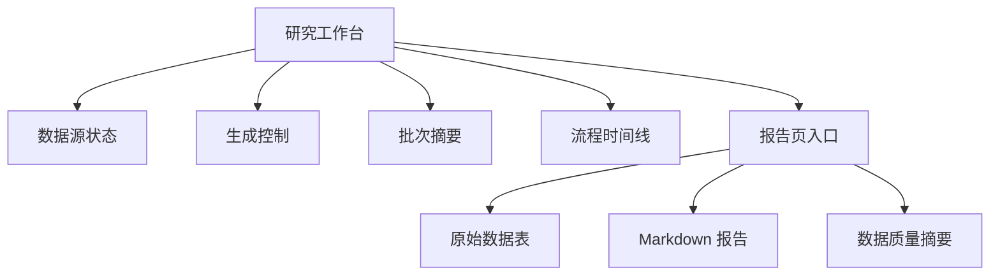

# Top 30 Mega-Cap CSP 分析 Web 应用页面设计文档

## 1. 设计目标

页面应呈现为“机构级研究终端”，重点不是装饰，而是让用户快速判断数据源是否可靠、报告是否完成、哪些字段缺失、Markdown 是否可交付。

## 2. 信息架构

## 3. 页面布局

### 3.1 研究工作台 `/`

- 顶部 Hero：标题、日期、批次状态、主要 CTA。
- 左侧控制列：数据源状态、生成选项、缺失能力提示。
- 右侧主区域：最近报告摘要、Top 5/Bottom 5 预览、流程时间线。
- 底部：数据完整性原则和免责声明提示。

### 3.2 报告页 `/report`

- 顶部工具栏：返回工作台、复制 Markdown、下载 Markdown。
- 第一块：纯数据表，保持 30 行，不加入分析判断。
- 第二块：Markdown 报告渲染区。
- 第三块：数据来源、访问时间、`unavailable` 汇总。

## 4. 视觉规范

- 背景：`#070b10` 到 `#111827` 的深色金融终端背景。
- 卡片：半透明冷灰边框，轻微内阴影。
- 成功状态：青色 `#22d3ee`。
- 警告状态：琥珀色 `#f59e0b`。
- 风险状态：红色 `#ef4444`。
- 文本：正文浅灰，辅助信息中灰，关键数字白色。
- 表格：sticky header、横向滚动、`unavailable` 使用琥珀色 pill。

## 5. 交互规范

- “生成报告”按钮在请求中显示 loading 状态。
- 阶段时间线依次显示 Universe、Market Data、Integrity、Analysis、Markdown。
- 复制成功后显示短暂状态反馈。
- 下载文件名格式：`top30-csp-report-{batchId}.md`。
- 数据源不可用时禁用生成按钮，但允许查看 mock 或最近报告状态。

## 6. 响应式规范

- 桌面宽屏：两列布局。
- 平板：控制区与摘要区上下堆叠。
- 手机：表格横向滚动，Markdown 保持单列阅读。

