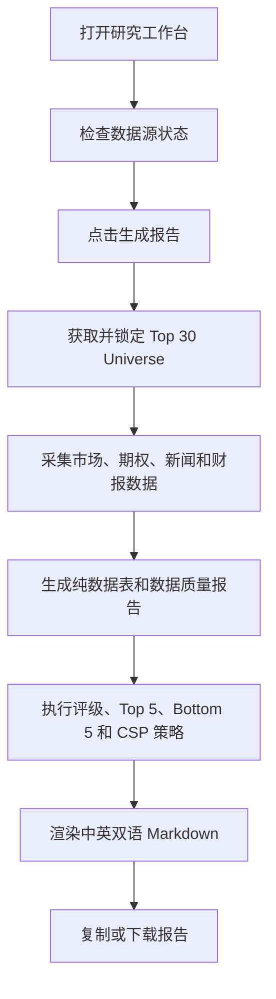

# Top 30 Mega-Cap CSP 分析 Web 应用 PRD

## 1. 产品概述

本产品是一个机构级投资研究 Web 应用，用于生成“全球市值 Top 30 且在 NYSE/NASDAQ 上市交易公司”的现金担保卖出 Put 分析 Markdown 报告。
- 解决手工拼接市值排名、市场数据、期权指标、新闻摘要和双语报告时容易出现数据口径不一致、缺失字段被误填、分析先于事实的问题。
- 目标用户是偏专业的投资者、组合经理、期权策略研究者，需要快速获得可复核、可复制、可执行的 CSP/Wheel Strategy 候选清单。

## 2. 核心功能

### 2.1 用户角色

| 角色 | 使用方式 | 核心权限 |
|------|----------|----------|
| 投资研究用户 | 本地 Web 应用访问 | 查看数据源状态、生成报告、复制或下载 Markdown |

### 2.2 功能模块

1. **研究工作台**：数据源状态、生成控制、批次摘要、缺失字段概览。
2. **原始数据表**：展示 30 行纯数据，不含任何分析判断。
3. **Markdown 报告**：展示中英双语报告，支持复制和下载。
4. **数据质量面板**：展示来源 URL、访问时间、同源校验、`unavailable` 字段汇总。

### 2.3 页面详情

| 页面名称 | 模块名称 | 功能说明 |
|----------|----------|----------|
| 研究工作台 | 数据源状态 | 展示 Futu OpenD、Python SDK、StockAnalysis universe、备用来源的可用性 |
| 研究工作台 | 报告生成控制 | 一键生成完整报告，显示生成阶段和错误信息 |
| 研究工作台 | 批次摘要 | 展示 batchId、生成时间、数据来源、Top 5 和 Bottom 5 概览 |
| 报告页 | 原始数据表 | 展示 Rank、Ticker、价格、市值、P/E、RSI、MA、IV、财报、新闻等 30 行数据 |
| 报告页 | Markdown 报告 | 渲染完整中文和英文报告，支持复制、下载 `.md` 文件 |
| 报告页 | 数据质量 | 汇总 `unavailable` 字段、来源 URL、时间戳和完整性警告 |

## 3. 核心流程

用户进入研究工作台后，先检查数据源状态；点击生成报告后，后端创建采集批次，获取 universe，合并多股权类别，采集市场、技术、期权、财报和新闻数据，完成数据完整性校验，再生成评级、Top 5、Bottom 5、CSP 策略，最后输出 Markdown。

## 4. 用户界面设计

### 4.1 设计风格

- 主色：深石墨黑、冷灰、炭蓝，营造机构交易台氛围。
- 强调色：青色表示数据可用，琥珀色表示警告，红色表示风险。
- 按钮：紧凑、硬朗、轻微发光边框，符合金融终端风格。
- 字体：标题使用有编辑感的衬线或显示字体；数字和表格使用等宽字体。
- 布局：桌面优先，左侧控制区、右侧报告与数据区，高信息密度但分区清晰。

### 4.2 页面设计概览

| 页面名称 | 模块名称 | UI 元素 |
|----------|----------|---------|
| 研究工作台 | Hero 区 | 批次状态、生成按钮、数据完整性摘要、当前日期 |
| 研究工作台 | 数据源卡片 | 可用性 badge、来源 URL、最后检查时间、缺失能力 |
| 研究工作台 | 流程时间线 | Universe、Market Data、Integrity、Analysis、Markdown 五阶段 |
| 报告页 | 原始数据表 | 横向滚动表格、`unavailable` 高亮、来源脚注 |
| 报告页 | Markdown 查看器 | 深色研究报告卡片、复制按钮、下载按钮 |

### 4.3 响应式

桌面优先；窄屏下控制区改为顶部堆叠，数据表保持横向滚动，报告正文保持可读宽度。

## 5. 验收标准

- Web UI 能触发报告生成并显示完整流程状态。
- 原始数据表必须先于分析结果出现，且正好 30 行。
- 无法获取字段必须显示 `unavailable`，不得编造。
- 报告必须先中文后英文，且包含指定免责声明。
- 可复制和下载 Markdown。
- 核心分析、期权策略、数据完整性和报告渲染逻辑均有单元测试。
