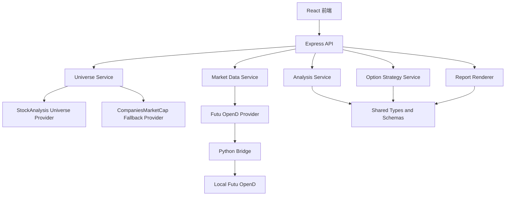
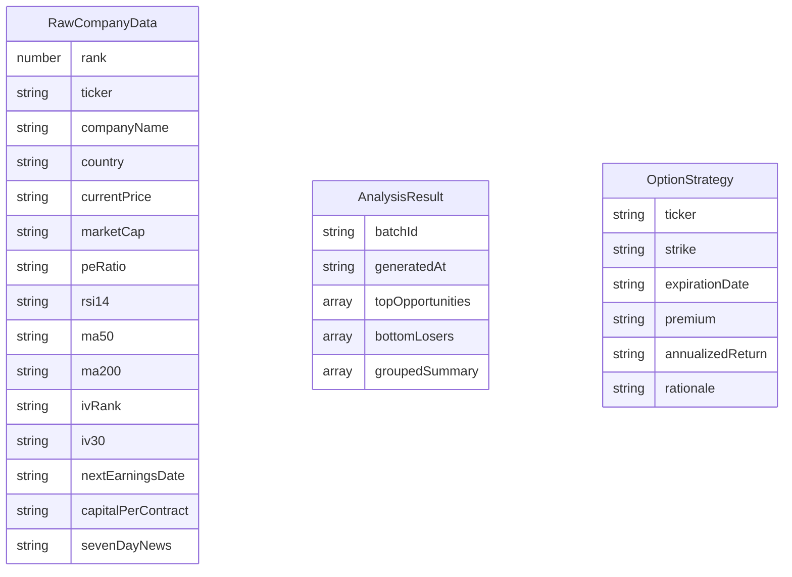

# Top 30 Mega-Cap CSP 分析 Web 应用技术架构

## 1. 架构设计



系统采用前后端同仓库 TypeScript 架构。前端负责数据源状态、生成流程和 Markdown 展示；后端负责数据采集适配、数据完整性校验、分析规则、期权策略和报告渲染。

## 2. 技术描述

- 前端：React 18 + TypeScript + Vite + Tailwind CSS + Zustand。
- 后端：Express + TypeScript ESM。
- 初始化工具：`vite-init`，模板使用 `react-express-ts`。
- 测试：Vitest，覆盖核心业务逻辑。
- 数据源：`DataProvider` 接口抽象，Futu OpenD 作为主要实现；OpenD 未启动或未登录时保守返回 `unavailable`。
- Futu 接入：Express 后端通过 Python Bridge 调用 `futu-api` SDK，连接本地 OpenD `127.0.0.1:11111`。

## 3. 路由定义

| 路由 | 用途 |
|------|------|
| `/` | 研究工作台，展示数据源状态、生成控制、批次摘要 |
| `/report` | 报告页，展示原始数据表、Markdown 报告、复制和下载操作 |

## 4. API 定义

### 4.1 生成报告

`POST /api/report/generate`

```ts
type GenerateReportRequest = {
  asOfDate?: string;
  forceRefresh?: boolean;
  outputLanguageMode: "zh-en";
  universeSourcePriority: ["stockanalysis", "companiesmarketcap"];
};

type GenerateReportResponse = {
  batchId: string;
  generatedAt: string;
  rawData: RawCompanyData[];
  dataQuality: DataQualityReport;
  analysis: AnalysisResult;
  markdown: string;
};
```

### 4.2 获取最近报告

`GET /api/report/latest`

```ts
type LatestReportResponse = GenerateReportResponse | {
  message: "unavailable";
};
```

### 4.3 重新渲染报告

`POST /api/report/render`

```ts
type RenderReportRequest = {
  rawData: RawCompanyData[];
  dataQuality: DataQualityReport;
};
```

### 4.4 数据源状态

`GET /api/source/status`

```ts
type SourceStatusResponse = {
  futuOpenDAvailable: boolean;
  futuPythonSdkAvailable: boolean;
  futuOpenDLoggedIn: boolean;
  optionsDataAvailable: boolean;
  technicalDataAvailable: boolean;
  universePrimaryAvailable: boolean;
  universeFallbackAvailable: boolean;
  lastCheckedAt: string;
  missingCapabilities: string[];
};
```

## 5. 服务分层

| 层级 | 文件 | 责任 |
|------|------|------|
| Provider | `api/providers/DataProvider.ts` | 定义外部数据采集接口 |
| Provider | `api/providers/futuOpenDProvider.ts` | 接入 Futu OpenD 行情、K 线和期权数据 |
| Provider | `api/providers/stockAnalysisUniverseProvider.ts` | 获取 StockAnalysis universe 排名 |
| Bridge | `api/futu_bridge/futu_snapshot.py` | 通过 Python SDK 调用 Futu OpenD 并输出事实数据 |
| Bridge | `api/futu_bridge/futu_status.py` | 检查 SDK、OpenD 连接和登录状态 |
| Service | `api/services/universeService.ts` | 合并股权类别、锁定 30 家公司 |
| Service | `api/services/marketDataService.ts` | 标准化市场、期权、财报、新闻数据 |
| Service | `api/services/analysisService.ts` | 生成评级、Top 5、Bottom 5 和分组 |
| Service | `api/services/optionStrategyService.ts` | 生成 CSP strike、expiry、premium、年化收益率 |
| Service | `api/services/reportRenderer.ts` | 渲染中英双语 Markdown |
| Utility | `api/utils/dataIntegrity.ts` | 校验来源、时间戳、缺失字段和事实/估算边界 |

## 6. 数据模型



## 7. 错误处理

- 外部数据源不可用：返回结构化错误和 `unavailable`，前端展示为数据源不可用。
- 单字段缺失：保留公司行，字段写 `unavailable`，进入缺失字段汇总。
- universe 不足 30：返回阻断性错误，不生成正式报告。
- 期权链不可用：策略层可使用 EST 估算，但必须标注估算依据。
- 时间戳不一致：数据完整性报告标记为失败，报告中提示不可用于实盘决策。
