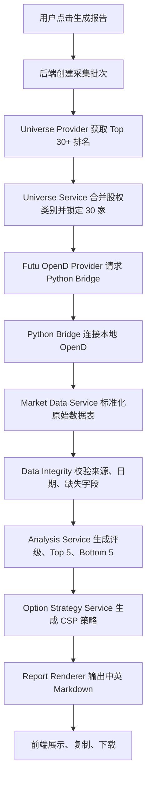

# Top 30 Mega-Cap Cash-Secured Put 分析 Web 应用实现规划

## 1. 摘要

目标是在当前空项目中从零实现一个 Web 应用，用于按用户提供的 Prompt 自动生成“Top 30 全球 mega-cap 美股/ADR 现金担保卖出 Put 分析”Markdown 报告。应用将以中文/英文双语输出为默认报告格式，严格区分事实数据与分析判断，并对无法获取的数据明确标注 `unavailable`，避免编造 RSI、P/E、IV、IV Rank、Delta、权利金等字段。

根据已确认偏好：
- 运行形态：Web 应用。
- 数据源：使用 Futu OpenD / Futu API，本地 OpenD 需运行并手动登录。
- 默认报告输出：Markdown。

由于当前项目为空，并且已触发 Web 应用构建规范，正式编码前需要先生成并提交 PRD、技术架构文档和页面设计文档供确认；确认后再进入代码实现。

## 2. 当前状态分析

### 2.1 项目状态

- 工作目录：`/Users/ShockCao/AICoding/Financial`
- 当前目录未发现源码、配置文件、`package.json`、`src/`、`api/` 或 `.trae/` 文档目录。
- 未发现项目级历史记忆文件：`/Users/bytedance/.trae-cn/memory/projects/-Users-ShockCao-AICoding-Financial/project_memory.md` 不存在。
- 因项目为空，后续实现需要初始化完整前后端工程。

### 2.2 已确认需求

- Universe 必须以 `https://stockanalysis.com/list/biggest-companies/` 当日排名为准，备用为 `https://companiesmarketcap.com`。
- 同一公司多股权类别需合并市值，并只分析流动性更好的 ticker；合并后保持 30 家公司。
- 必须包含美国公司与在美上市的非美国公司/ADR。
- 报告第一部分必须先输出 30 行纯数据表，不含分析判断。
- 后续分析必须基于纯数据表，输出 Buy/Add、Hold、Trim 评级、Top 5 双轨排序、Bottom 5 losers 和其余 20 只分组总结。
- 期权策略以 Cash-Secured Put 为主，对 Buy/Add/Hold 标的给出 30-45 DTE 卖 Put 思路。
- 权利金若非实时期权链，必须标注 `EST` 和估算依据。
- 最终报告必须先中文、后英文，并包含指定免责声明。

### 2.3 关键约束

- 数据完整性优先于覆盖率：无法获取的字段必须写 `unavailable`。
- 价格、市值数据必须来自同一日期、同一来源和同一采集批次。
- 禁止拼接不同日期价格数据。
- 分析引擎不得把估算值伪装成事实数据。
- Futu OpenD 需要本地运行、Python SDK 可用且用户手动登录；不可获取字段必须保持 `unavailable`。

## 3. 拟议技术路线

### 3.1 工程初始化

在用户批准计划后，按 Web 应用规范执行：

1. 生成 `.trae/documents/` 下的正式文档：
   - `top30_csp_prd.md`
   - `top30_csp_technical_architecture.md`
   - `top30_csp_page_design.md`
2. 使用 `vite-init` 初始化 React + TypeScript + Express 模板：
   - 推荐模板：`react-express-ts`
   - 前端：React 18、TypeScript、Vite、Tailwind CSS、Zustand
   - 后端：Express + TypeScript ESM
3. 安装依赖并建立基础脚本：
   - `dev`：启动前后端开发环境
   - `build`：构建前端和后端
   - `check`：TypeScript 类型检查与基础校验
   - `test`：运行核心逻辑单测

### 3.2 目标目录结构

建议结构如下：

```text
/Users/ShockCao/AICoding/Financial
├── api/
│   ├── index.ts
│   ├── routes/
│   │   ├── reportRoutes.ts
│   │   └── sourceRoutes.ts
│   ├── services/
│   │   ├── universeService.ts
│   │   ├── marketDataService.ts
│   │   ├── optionStrategyService.ts
│   │   ├── analysisService.ts
│   │   └── reportRenderer.ts
│   ├── providers/
│   │   ├── DataProvider.ts
│   │   ├── futuOpenDProvider.ts
│   │   ├── stockAnalysisUniverseProvider.ts
│   │   └── fallbackProvider.ts
│   ├── futu_bridge/
│   │   ├── futu_status.py
│   │   ├── futu_snapshot.py
│   │   └── futu_common.py
│   └── utils/
│       ├── dataIntegrity.ts
│       ├── timestamps.ts
│       └── blackScholes.ts
├── shared/
│   ├── types.ts
│   ├── schemas.ts
│   └── constants.ts
├── src/
│   ├── pages/
│   │   ├── Dashboard.tsx
│   │   └── ReportView.tsx
│   ├── components/
│   │   ├── DataSourcePanel.tsx
│   │   ├── UniverseTable.tsx
│   │   ├── ReportControls.tsx
│   │   ├── MarkdownReport.tsx
│   │   └── StatusTimeline.tsx
│   ├── hooks/
│   │   └── useReportGeneration.ts
│   ├── stores/
│   │   └── reportStore.ts
│   └── utils/
│       └── markdownDownload.ts
└── tests/
    ├── universeService.test.ts
    ├── analysisService.test.ts
    ├── optionStrategyService.test.ts
    └── reportRenderer.test.ts
```

## 4. 拟议变更清单

### 4.1 文档阶段

新增 `.trae/documents/top30_csp_prd.md`
- 说明产品目标、目标用户、核心流程、页面模块、输出格式和数据完整性要求。
- 明确核心用户流程：配置数据源 → 拉取 universe → 采集市场/期权/新闻数据 → 校验完整性 → 生成 Markdown → 复制/下载报告。

新增 `.trae/documents/top30_csp_technical_architecture.md`
- 定义前后端架构、接口契约、数据模型、服务分层和错误处理。
- 明确 Futu OpenD 作为 `DataProvider` 的一种实现，通过 Python Bridge 调用本地 OpenD。

新增 `.trae/documents/top30_csp_page_design.md`
- 定义桌面优先页面设计。
- 建议视觉方向：机构级交易台风格，深色底、冷灰信息密度、琥珀/青色强调色，突出数据状态、风险标签和报告生成进度。

### 4.2 前端实现

新增 `src/pages/Dashboard.tsx`
- 主入口页面。
- 提供数据源状态、生成按钮、报告时间戳、错误/缺失字段概览。

新增 `src/pages/ReportView.tsx`
- 显示 Markdown 渲染结果。
- 支持复制 Markdown、下载 `.md` 文件、查看原始数据表。

新增 `src/components/DataSourcePanel.tsx`
- 展示当前数据源：Futu OpenD、Python SDK、OpenD 登录状态、StockAnalysis universe、备用来源。
- 展示访问时间、批次 ID、数据完整性状态。

新增 `src/components/UniverseTable.tsx`
- 展示 30 行纯数据表。
- 对 `unavailable` 字段做醒目标记，但不加入分析判断。

新增 `src/components/ReportControls.tsx`
- 触发报告生成。
- 支持选择“仅刷新 universe / 完整刷新 / 使用最近批次重新渲染”。

新增 `src/components/MarkdownReport.tsx`
- 展示最终 Markdown。
- 保持中文在前、英文在后的报告结构。

新增 `src/hooks/useReportGeneration.ts` 和 `src/stores/reportStore.ts`
- 管理报告生成状态、错误、数据批次、报告内容。

### 4.3 后端实现

新增 `api/routes/reportRoutes.ts`
- `POST /api/report/generate`：触发完整采集、分析、报告渲染。
- `GET /api/report/latest`：读取最近一次报告结果。
- `POST /api/report/render`：基于已有标准化数据重新渲染 Markdown。

新增 `api/routes/sourceRoutes.ts`
- `GET /api/source/status`：检查 Futu OpenD、Python SDK、登录状态和行情能力是否可用。
- `POST /api/source/test`：执行轻量查询验证数据源连通性。

新增 `api/providers/DataProvider.ts`
- 定义统一接口：
  - `fetchUniverse(asOfDate)`
  - `fetchMarketSnapshot(tickers)`
  - `fetchTechnicalIndicators(tickers)`
  - `fetchOptionsSnapshot(tickers)`
  - `fetchEarningsDates(tickers)`
  - `fetchRecentNews(tickers, lookbackDays)`

新增 `api/providers/futuOpenDProvider.ts`
- 接入 Futu OpenD 行情、K 线和期权数据。
- OpenD 未启动或未登录时，返回明确错误并将不可得字段标为 `unavailable`。

新增 `api/providers/stockAnalysisUniverseProvider.ts`
- 负责采集 `https://stockanalysis.com/list/biggest-companies/` 的 Top company ranking。
- 若不可用，再尝试 `https://companiesmarketcap.com`。
- 记录来源 URL、访问时间、采集批次 ID。

新增 `api/services/universeService.ts`
- 合并多股权类别，如 `GOOGL/GOOG`、`BRK.A/BRK.B`。
- 选择流动性更高 ticker 用于分析。
- 合并后不足 30 家时顺延纳入后续排名，确保最终 30 家。
- 严格禁止纳入合并后排名 30 以外的公司，除非用于填补合并空位。

新增 `api/services/marketDataService.ts`
- 将数据源返回值标准化为 `RawCompanyData`。
- 对缺失字段统一写入 `unavailable`。
- 校验价格、市值是否同一来源、同一日期、同一批次。

新增 `api/services/analysisService.ts`
- 仅基于标准化原始数据表生成评级。
- 实现 Buy/Add、Hold、Trim 的规则引擎和可解释 rationale。
- 实现 Top 5 双轨排序：
  - Track A：IV Rank > 年化收益率 > 估值安全边际 > 事件日历清洁度。
  - Track B：基本面护城河 > 技术支撑距离 > 催化剂强度 > IV 水平。
- 实现 Bottom 5 losers 评分。

新增 `api/services/optionStrategyService.ts`
- 对 Buy/Add/Hold 标的生成 CSP 思路。
- 优先参考 0.30 Delta；若 Delta 不可得，使用 50 日/200 日均线或明确支撑位。
- 默认 DTE：30-45 天。
- 若无实时期权链，使用 30-day IV + Black-Scholes 近似估算，并强制标注 `EST`。
- 对低 IV、跨财报、高资本需求生成特殊标记。

新增 `api/services/reportRenderer.ts`
- 生成最终 Markdown：
  - A. 第零部分：纯数据表。
  - B. 第一部分：Top 5 最值得操作机会。
  - C. 第二部分：Bottom 5 Losers。
  - D. 第三部分：其余 20 只股票总结。
  - E. 数据来源、时间戳、unavailable 字段汇总。
  - F. 中文免责声明与英文免责声明。
- 先输出中文，再输出英文，含义保持一致。

新增 `api/utils/dataIntegrity.ts`
- 实现字段级校验。
- 检查来源一致性、时间戳一致性、禁止估算伪装为事实。
- 输出 `DataQualityReport` 供 UI 和报告底部展示。

新增 `api/utils/blackScholes.ts`
- 用于无期权链时估算 Put 权利金。
- 输入必须包含价格、strike、DTE、IV、无风险利率默认值或 unavailable 策略。
- 输出必须带 `EST`、估算依据和风险说明。

### 4.4 共享类型

新增 `shared/types.ts`
- `UniverseCompany`
- `RawCompanyData`
- `DataSourceCitation`
- `OptionStrategy`
- `CompanyVerdict`
- `TopOpportunity`
- `BottomLoser`
- `ReportGenerationResult`

新增 `shared/schemas.ts`
- 使用运行时 schema 校验后端响应。
- 防止前端渲染未标准化数据。

新增 `shared/constants.ts`
- 字段名、特殊标记、默认 DTE 范围、资本需求阈值 `$80,000`、低 IV 阈值 `25%`。

## 5. 数据流设计



## 6. API 契约草案

### 6.1 生成报告

`POST /api/report/generate`

请求：

```ts
type GenerateReportRequest = {
  asOfDate?: string;
  forceRefresh?: boolean;
  outputLanguageMode: "zh-en";
  universeSourcePriority: ["stockanalysis", "companiesmarketcap"];
};
```

响应：

```ts
type GenerateReportResponse = {
  batchId: string;
  generatedAt: string;
  rawData: RawCompanyData[];
  dataQuality: DataQualityReport;
  markdown: string;
};
```

### 6.2 数据源状态

`GET /api/source/status`

响应：

```ts
type SourceStatusResponse = {
  futuOpenDAvailable: boolean;
  futuPythonSdkAvailable: boolean;
  futuOpenDLoggedIn: boolean;
  optionsDataAvailable: boolean;
  technicalDataAvailable: boolean;
  universePrimaryAvailable: boolean;
  universeFallbackAvailable: boolean;
  lastCheckedAt: string;
  missingCapabilities: string[];
};
```

## 7. 分析与策略规则

### 7.1 原始数据表规则

- 原始数据表必须正好 30 行。
- 原始表不出现 Buy/Add/Hold/Trim、Top 5、Loser 等判断字段。
- 所有字段缺失时写 `unavailable`。
- 所有来源必须带 URL 或来源名称、访问时间戳。

### 7.2 评级规则

- Buy/Add：基本面强，估值合理或有吸引力，并至少满足技术支撑/超卖或正面催化之一。
- Hold：基本面稳健，但加仓吸引力不足，也无明显减仓风险。
- Trim：估值偏高、RSI > 70、技术延伸过度、负面新闻或下行风险增加。
- 若关键事实字段缺失，评级应降级为更保守，并在 rationale 中说明数据不足。

### 7.3 Top 5 规则

- Track A 评分：
  - IV Rank 优先。
  - 年化收益率次之。
  - 估值安全边际。
  - 事件日历清洁度。
- Track B 评分：
  - 基本面护城河。
  - 技术支撑距离。
  - 催化剂强度。
  - IV 水平达到中位数即可。
- 最终 Top 5 综合两个 Track。
- 每只 Top 5 必须标注 `A`、`B` 或 `Both`。

### 7.4 CSP 策略规则

- 仅对 Buy/Add/Hold 标的输出卖 Put 策略。
- 到期日选择今天起 30-45 天。
- Strike 优先接近 0.30 Delta；Delta 不可得时使用关键支撑位。
- 年化收益率公式固定：
  - `(Premium / Strike) * (365 / DTE)`
- IV Rank < 25% 标注 `Low IV - Wait`。
- 若为 Track B 核心底仓，可标注 `Low IV - Acceptable for core position building`。
- 财报日在到期日前标注 `Spans Earnings [日期]` 并提示跳空风险。
- 每手资本需求超过 `$80,000` 标注 `High Capital Requirement`。
- 无实时期权链时写：
  - `Option chain data unavailable; estimate based on nearest available market data`

## 8. 页面设计规划

### 8.1 页面

- `/`：Dashboard，展示数据源状态、生成控制、最近报告概览。
- `/report`：Markdown 报告查看页，展示纯数据表、分析报告、复制/下载操作。

### 8.2 视觉方向

- 风格：机构级交易台、研究终端、低噪声高信息密度。
- 色彩：深石墨背景、冷灰卡片、青色用于数据可用、琥珀用于警告、红色用于风险。
- 字体：避免普通系统感，正文与数字使用清晰等宽/金融终端风格字体；标题使用更具编辑感的字体。
- 交互：生成过程使用阶段时间线；缺失字段使用可展开摘要；报告表格支持横向滚动。

## 9. 测试与验收

### 9.1 单元测试

- `universeService.test.ts`
  - 合并 `GOOGL/GOOG`、`BRK.A/BRK.B`。
  - 合并后顺延补足 30 家。
  - 禁止纳入非顺延规则外的第 31 名之后公司。
- `analysisService.test.ts`
  - Buy/Add、Hold、Trim 规则覆盖。
  - Top 5 Track A / Track B / Both 标注。
  - Bottom 5 losers 排序。
- `optionStrategyService.test.ts`
  - 年化收益率公式。
  - 低 IV、跨财报、高资本需求标记。
  - 无期权链时 EST 标注。
- `reportRenderer.test.ts`
  - 中文在前、英文在后。
  - 原始数据表先于分析。
  - 免责声明存在。
  - `unavailable` 汇总存在。

### 9.2 集成验证

- 使用 mock provider 生成完整 30 行样例报告，验证流程可运行。
- Futu OpenD 启动并登录后，执行真实数据源连通性测试。
- 浏览器端验证：
  - 打开 Dashboard。
  - 点击生成报告。
  - 查看状态变化。
  - 打开报告页。
  - 复制和下载 Markdown。

### 9.3 验收标准

- 能在 Web UI 中一键生成 Markdown 报告。
- 报告严格包含用户 Prompt 中要求的 A-D 结构。
- 数据不可得时明确显示 `unavailable`，不编造字段。
- 来源 URL、访问时间、数据时间戳、缺失字段汇总清晰可见。
- 无真实期权链时，权利金必须使用单点 EST 值并注明估算依据。
- 所有核心规则有测试覆盖。

## 10. 假设与决策

- 假设用户会本地启动 Futu OpenD 并手动登录；若未启动，则 provider 返回不可用状态和 `unavailable` 字段，不输出伪造实盘报告。
- 假设 Web 应用不需要登录、多用户权限或数据库持久化；最近报告可先以内存或本地文件缓存实现。如需历史报告库，再追加轻量存储。
- 假设默认输出为 Markdown，HTML 仅用于 Web 页面渲染，不作为正式导出格式。
- 假设不使用 Futu 条件选股替代 Top 30 universe；Universe 仍以 StockAnalysis/CompaniesMarketCap 为准。
- 假设“实时”在工程中定义为一次生成批次内的同源同时间戳快照，而不是逐 tick streaming 行情。

## 11. 执行顺序

1. 创建 PRD、技术架构和页面设计文档，并等待用户确认。
2. 初始化 React + Express TypeScript Web 项目。
3. 定义共享类型、schema 和常量。
4. 实现后端 provider 接口、universe 采集与股权类别合并。
5. 接入 Futu OpenD Provider 与 Python Bridge；若 OpenD 未运行，返回不可用 provider 状态。
6. 实现数据标准化与完整性校验。
7. 实现分析规则、Top 5 双轨排序、Bottom 5 losers。
8. 实现 CSP 策略和 EST 权利金估算逻辑。
9. 实现 Markdown 双语报告渲染。
10. 实现 Dashboard、ReportView 和报告复制/下载。
11. 补充单元测试和集成验证。
12. 运行类型检查、测试、构建和浏览器验证。

## 12. 后续需要用户提供的信息

- Futu OpenD 是否已安装、是否能在本地启动并手动登录。
- OpenD API host/port，如非默认 `127.0.0.1:11111` 需提供环境变量。
- 是否允许缓存每次生成结果，以及缓存保留时长。
- 是否需要加入自定义 Prompt 编辑区，还是固定使用当前 Prompt v3。
