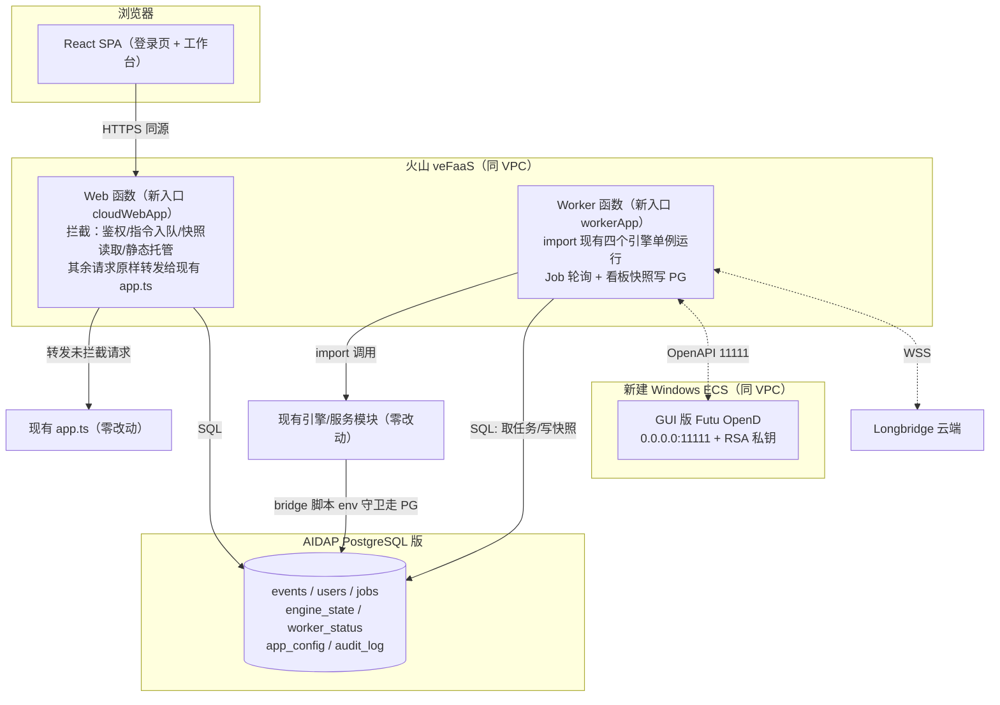

# 火山引擎 veFaaS + AIDAP PostgreSQL 云上部署设计方案

> 状态：**v4 · 阶段一（本地 PG 迁移 + 登录鉴权 + 云 Web 包裹）已完成并验证；本版新增云资源创建与部署执行手册（第 12–15 章）** · 2026-09-01
> 目标：将本工作站部署至火山引擎——veFaaS 承载 Web/API 与常驻交易引擎 worker，**新建 Windows ECS 承载 Futu OpenD（GUI 登录）**，AIDAP PostgreSQL 版作为云端数据库；新增登录鉴权，SQLite 全量迁移至 PostgreSQL。
> **最高约束：所有云上能力以新增文件实现；现有业务文件默认零改动，个别文件仅允许「追加环境变量守卫」式加法，无环境变量时代码路径与现状逐字节一致，本地 `npm run dev` / `npm test` 行为完全不变。**
>
> **实施进度**：✅ 本地 PostgreSQL（pgserver）+ schema + 全量迁移对账（3.3 万行） · ✅ 单管理员 scrypt+JWT 鉴权（httpOnly Cookie） · ✅ cloudWebApp 外层包裹 + 静态托管（现有 app.ts 零改动） · ✅ 4 个历史库脚本 PG 驱动垫片 · ✅ bridge/订阅进程云模式环境隔离修复（不注入 macOS 3.9 site-packages） · ✅ 实时订阅流式 JSON 解析修复 · ✅ TradingAgents 版本锁定与拉取脚本 · ⬜ PG 任务队列/worker 常驻函数（阶段三） · ⬜ 云上资源创建（本版规划）。

---

## 1. 需求与已确认决策

| 事项 | 决策 |
|---|---|
| 登录 | 单管理员账号，bcrypt/scrypt 密码哈希 + JWT（httpOnly Cookie）；`AUTH_ENABLED` 门控，本地默认关闭 |
| 数据库 | SQLite → PostgreSQL；先本地 PG 跑通迁移与测试，再 pg_dump 导入云端 AIDAP PostgreSQL 版；4 个 SQLite 库全量迁移 |
| 算力分布 | veFaaS Web 函数（自定义容器）：前端静态站 + 无状态 API；veFaaS 常驻 worker 函数：四大交易引擎 + 实时订阅；**新建 Windows ECS 跑 GUI 版 OpenD**；Web/Worker 经 PG 任务队列通信 |
| OpenD 宿主 | 新建同 VPC 的 Windows ECS，RDP 运维、GUI 登录、开机自启；Linux 部署机 115.191.35.144 仅作运维跳板与 worker 降级宿主 |
| 文件保护 | 严禁破坏现有文件；新增能力全部进独立目录；现有文件只允许 env 守卫式追加（见第 5 章白名单） |

## 2. veFaaS 与 OpenD 的可行性结论

- **OpenD 不能跑在 veFaaS**：登录态设备绑定、订阅连接绑定、回调写进程内缓存，FaaS 实例回收/替换/缩零会丢失全部状态。
- **OpenD 不跑在现有 Linux 机**：GUI 首次登录需问卷评估与协议确认、登录态过期需重登，纯命令行运维困难。
- **采用：新建 Windows ECS 跑 GUI 版 OpenD**（[官方文档](https://openapi.futunn.com/futu-api-doc/quick/opend-base.html)）。官方约束：监听非本地时**交易 API 必须配 RSA 私钥**（行情不受限）；同账号最多 10 个 OpenD 终端且最高行情权限互踢（设 `auto_hold_quote_right=1`，云端为唯一生产网关）；设备标识 `Device.dat` 不可镜像复制。
- 备选（不本期实施）：Linux 命令行 OpenD + `FutuOpenD.xml` 账号密码无人值守，首次短信验证码经 Telnet 输入；worker 连接方式不变。
- veFaaS Web 函数已核实支持自定义容器镜像（CR 同地域）、监听 `0.0.0.0:8000`、挂载 VPC。

## 3. 仓库现状（与本方案相关的关键事实）

- Express 单体：[app.ts](file:///Users/ShockCao/AICoding/Financial/api/app.ts) 挂载全部路由并 `export default app`；[server.ts](file:///Users/ShockCao/AICoding/Financial/api/server.ts) 为本地长驻入口。
- 四个引擎均**导出单例**，可被新代码直接 import：[simulationTradingEngine](file:///Users/ShockCao/AICoding/Financial/api/simulation/simulationTradingEngine.ts#L377)、[liveTradingEngine](file:///Users/ShockCao/AICoding/Financial/api/live/liveTradingEngine.ts#L616)、[longbridgeLiveTradingEngine](file:///Users/ShockCao/AICoding/Financial/api/longbridge/longbridgeLiveTradingEngine.ts#L405)、[aShareLiveTradingEngine](file:///Users/ShockCao/AICoding/Financial/api/ashare/aShareLiveTradingEngine.ts#L298)。
- 全部历史持久化都经 python bridge：TS 层 spawn [live_history_db.py](file:///Users/ShockCao/AICoding/Financial/api/futu_bridge/live_history_db.py)、`simulation_history_db.py`、`report_history_db.py`、`longbridge_live_history_db.py` 四个脚本（A 股复用 `live_history_db.py`）；sqlite 表结构统一为 `*_events(kind, ticker, side, strategy, status, ok, created_at, payload JSON)`。
- 鉴权空壳：[auth.ts](file:///Users/ShockCao/AICoding/Financial/api/routes/auth.ts) 三个 TODO handler。
- 前端 [main.tsx](file:///Users/ShockCao/AICoding/Financial/src/main.tsx) 仅 10 行，是包裹云端组件的唯一挂载点；[App.tsx](file:///Users/ShockCao/AICoding/Financial/src/App.tsx) 与全部页面无需改动。
- [runPythonBridge.ts](file:///Users/ShockCao/AICoding/Financial/api/utils/runPythonBridge.ts) 透传 `process.env.PYTHONPATH`，云端 python 驱动可经 PYTHONPATH 加载，无需改 bridge runner。

## 4. 目标架构



两个关键机制保证「现有代码零破坏」：

1. **Web 侧用外层包裹（wrapper）而非改路由**：新文件 `api/cloud/http/cloudWebApp.ts` 新建一个 express 应用，先注册云端拦截路由（登录、指令入队、快照读取、静态托管、鉴权中间件），再 `cloudApp.use(app)` 把**现有整个 app 原样挂为兜底**。Express 先注册先匹配——未拦截的路径（含全部历史查询，经 bridge→PG 天然可用）行为与现状完全一致；现有 `app.ts`、`routes/*` 一行不改。
2. **Worker 侧只 import 不改**：新文件 `api/cloud/worker/workerApp.ts` 直接 import 四个引擎单例与现有服务，调用其既有 `start/stop/runOnce/confirm` 等方法；引擎内部写历史仍走 bridge 脚本，脚本经环境变量切换 PG（见 5.2）。

## 5. 目录分割与文件修改范围（核心章节）

### 5.1 全部为新增文件（现有仓库的唯一改动来源不涉及业务逻辑）

```
deploy/volcano/
├── docker/Dockerfile.vefaas、.dockerignore        # 单镜像双角色（node+python3+futu-api+dist）
├── faas/run-web.sh、run-worker.sh                 # 函数启动脚本（APP_ROLE 切换）
├── pg/
│   ├── schema.sql                                 # 云端建表
│   ├── python/pg_history_driver.py                # 【新】bridge 脚本调用的 PG 驱动（psycopg）
│   ├── migrate_sqlite_to_pg.py                    # sqlite→PG 幂等迁移（只读 sqlite）
│   ├── dump_and_restore.sh、verify_row_counts.py  # 上云导入与对账
├── opend-windows-ecs/                             # Windows ECS OpenD runbook、FutuOpenD.xml 模板、RSA 密钥脚本、安全组清单
├── linux-deploy-host/worker-pm2-fallback.md       # Linux 机降级宿主说明
├── scripts/build-and-push-image.sh、ssh-ecs.sh    # 镜像构建/运维脚本（pem 不入库）
└── env/.env.cloud.example                         # 环境变量模板（无密钥值）

api/cloud/                                         # 全部新模块，不 import 时零副作用
├── http/cloudWebApp.ts                            # Web 包裹应用：拦截表 + 挂载现有 app + 静态托管
├── http/routeOverrides.ts                         # 拦截路由表：变更指令→入队；内存态读→worker 快照
├── auth/authService.ts、jwt.ts、requireAuth.ts    # 登录/JWT/中间件（node:crypto 实现，无新依赖）
├── jobs/jobQueue.ts、jobHandlers.ts               # PG 任务队列（SKIP LOCKED）与任务→引擎方法适配
├── db/pgClient.ts                                 # pg 连接池（唯一新增 npm 依赖：pg）
├── state/cloudConfigStore.ts、engineStateStore.ts、workerStatusStore.ts
└── worker/workerApp.ts                            # worker 入口：任务循环 + 引擎引导 + 快照落库

src/cloud/
├── CloudApp.tsx                                   # 包裹组件：VITE_AUTH_ENABLED 关闭时直接渲染 <App/>
├── LoginView.tsx、authStore.ts、RequireAuth.tsx、cloudFetch.ts
```

### 5.2 允许触碰的现有文件白名单（共 6 处，全部为「加法 + env 守卫」）

| # | 文件 | 改动形态 | 无环境变量时 |
|---|---|---|---|
| 1 | [live_history_db.py](file:///Users/ShockCao/AICoding/Financial/api/futu_bridge/live_history_db.py) | 文件顶部 import 后追加约 8 行守卫：`PG_HISTORY_DRIVER=1` 时经 `PYTHONPATH` 加载 `pg_history_driver.run(__file__)` 处理并退出 | 守卫不成立，**原 sqlite 代码路径逐行不变** |
| 2 | `api/futu_bridge/simulation_history_db.py` | 同上 | 同上 |
| 3 | `api/futu_bridge/report_history_db.py` | 同上 | 同上 |
| 4 | `api/longbridge/longbridge_live_history_db.py` | 同上 | 同上 |
| 5 | [package.json](file:///Users/ShockCao/AICoding/Financial/package.json) | **仅新增** `pg` 依赖（dependencies 追加一行） | 不影响任何现有依赖 |
| 6 | [main.tsx](file:///Users/ShockCao/AICoding/Financial/src/main.tsx) | `import App` 改为 `import { CloudApp } from './cloud/CloudApp'`（2 行）；CloudApp 内部在 `VITE_AUTH_ENABLED` 未开时原样渲染 `<App/>` | 页面树与现状完全一致 |

守卫代码形态（每个 python 脚本顶部，示意）：

```python
import os, sys
if os.environ.get("PG_HISTORY_DRIVER") == "1":
    sys.path.insert(0, os.environ.get("VOLCANO_CLOUD_PYTHONPATH", ""))
    from pg_history_driver import run as pg_run
    pg_run(__file__)
    sys.exit(0)
# —— 以下为原有全部代码，不做任何修改 ——
```

### 5.3 禁止触碰清单（实现时不得修改）

- 后端：[app.ts](file:///Users/ShockCao/AICoding/Financial/api/app.ts)、[server.ts](file:///Users/ShockCao/AICoding/Financial/api/server.ts)、[index.ts](file:///Users/ShockCao/AICoding/Financial/api/index.ts)、`api/routes/*` 全部路由、`api/live|longbridge|ashare|simulation|services|realtime|providers/*` 全部业务模块、四个引擎、四个 TS 持久化类、`api/utils/*`。
- 桥接：`futu_bridge/` 中除 5.2 列出的 4 个历史库脚本外的全部行情/交易/账户脚本（仅 worker 运行环境调用，不修改）。
- 前端：[App.tsx](file:///Users/ShockCao/AICoding/Financial/src/App.tsx)、`src/pages/*`、`src/components/*`、`src/hooks/*` 全部现有页面与组件。
- 共享：`shared/*` 类型定义（如云端确需新类型，定义在 `api/cloud/types.ts` 内）。
- 数据：`.data/*` 现有 sqlite/JSON 只读；迁移脚本**只读 sqlite**，不写、不删。

### 5.4 回归保证

1. **本地默认零感知**：不设置任何新环境变量时，`npm run dev`、`npm run check`、`npm test`、`npm run build` 路径与现状完全一致；现有测试不允许任何修改或跳过。
2. **双驱动测试**：新增测试仅在 `PERSISTENCE_DRIVER=pg`（本地 Docker PG）时启用，验证 PG 驱动与 sqlite 驱动对同一批输入返回一致结果（append/read_latest/paginate/对账）。
3. **守卫测试**：CI 中断言 4 个 python 脚本在未设 `PG_HISTORY_DRIVER` 时不 import psycopg、仍写 sqlite。
4. **云端灰度顺序**：先本地 PG 全量迁移+回归 → 镜像本地容器双角色联调 → 云上只开 Web（读历史/登录）→ 最后启 worker；任何阶段可通过环境变量切回本地 sqlite + 单机模式。

## 6. 数据模型（PG，`deploy/volcano/pg/schema.sql`）

- 事件表（镜像 sqlite 结构，bridge PG 驱动读写）：`simulation_events`、`live_events`、`longbridge_events`、`ashare_events`、`report_events`：`id BIGSERIAL`、`kind/ticker/side/strategy/status TEXT`、`ok BOOLEAN`、`created_at TIMESTAMPTZ`、`payload JSONB`，索引与现状一致。
- `cloud_users`（username 唯一、password_hash、last_login_at；首启从 `ADMIN_USERNAME/ADMIN_PASSWORD` 播种一次）。
- `cloud_jobs`（job_type、payload JSONB、status、claimed_by、run_after、attempts、last_error；认领 `FOR UPDATE SKIP LOCKED`）。
- `cloud_engine_state`（platform、engine_key、desired——worker 重启自愈依据）。
- `cloud_worker_status`（platform、snapshot JSONB、heartbeat_at——Web 侧只读看板来源）。
- `app_config`（key 主键、value JSONB——承接 `.data/*.json`，worker 启动时回写本地文件供现有服务读取）。
- `audit_log`（登录、订单确认/拒绝、任务失败等安全事件）。

## 7. 登录鉴权

1. `POST /api/auth/login`（与 `/api/health` 同为免鉴权接口）：scrypt 校验密码 → 签发 HMAC-SHA256 JWT（12h）→ `HttpOnly; Secure; SameSite=Strict` Cookie `fa_session`；失败统一错误 + 同 IP 限流。
2. `requireAuth` 在 cloudWebApp 中于兜底挂载前生效，保护全部 `/api/*`；另支持 `Authorization: Bearer`。
3. `/api/auth/logout` 清 Cookie；前端 `/login` 页 + `RequireAuth` 守卫，401 自动跳转。
4. `AUTH_ENABLED` 未设时中间件透传；`VITE_AUTH_ENABLED` 未设时 `CloudApp` 原样渲染现有 App。

## 8. Web 拦截路由表（`routeOverrides.ts`，全部为新增代码）

| 类型 | 端点（示例） | 云端行为 |
|---|---|---|
| 指令类 | `*/start`、`*/stop`、`*/run-once`、`*/pending-orders/:id/confirm|reject`、`POST /api/report/generate`、`*/llm-config` PUT、设置类写接口 | 写入 `cloud_jobs` 返回 `jobId`，worker 消费调现有引擎方法 |
| 内存态读 | 各平台 `*/dashboard`、`/api/account/*`、`/api/realtime/*` 状态、候选池实时态 | 读 `cloud_worker_status` 快照返回（worker 每 15–30s 落库） |
| 历史读 | `*/history/*`、报告历史 | **不拦截**，经现有路由 → bridge PG 驱动直达 PG |
| 认证 | `/api/auth/login|logout|me` | 新 auth 模块处理 |

## 9. 数据迁移（先本地、后上云）— 阶段一已落地

> 已交付脚本（均在 [deploy/volcano/pg](file:///Users/ShockCao/AICoding/Financial/deploy/volcano/pg)，使用独立 venv `.venv-cloud`，无需 Docker）：`local_pg.py`（pgserver 本地 PG 一键启停建表）、`schema.sql`、`migrate_sqlite_to_pg.py`、`verify_row_counts.py`。本地已完成 3.3 万行全量迁移 + 行数/payload 语义对账通过。

1. 本地：`.venv-cloud/bin/python deploy/volcano/pg/local_pg.py start`（pgserver 起 PG、建 `financial` 库、应用 `schema.sql`）。
2. `migrate_sqlite_to_pg.py`：逐库读 sqlite 事件表，**保留原始 id** 批量 upsert（`ON CONFLICT (id) DO NOTHING`，可重跑），迁移后重置序列；**全程只读 sqlite**。
3. `verify_row_counts.py`：按表对账行数 + payload 规范化哈希（jsonb 重排序后语义比对）。
4. 云模式回归：`CLOUD_MODE=1 CLOUD_PYTHON=1 PG_HISTORY_DRIVER=1 npm run server:cloud` + `VITE_AUTH_ENABLED=true vite build`，页面验证（登录/报告/实盘订阅）。
5. 上云：本地 PG `pg_dump --no-owner --no-privileges -f financial.sql financial` → 用 AIDAP 连接串 `psql`/TOS 导入 → `verify_row_counts.py` 指向 AIDAP `DATABASE_URL` 再对账（即阶段 B，见 15.2）。
6. 切换窗口冻结引擎写入后做最终增量迁移，此后 AIDAP 成为唯一数据源。

## 10. 部署步骤

1. **新建 Windows ECS**（同地域同 VPC，2C4G 起）：RDP（3389 仅放行操作员 IP）→ 安装 GUI OpenD → 登录 + 问卷评估 → 监听 `0.0.0.0:11111` → 配 RSA 私钥（`generate-opend-rsa-key.sh` 生成，私钥留 Windows，公钥入 worker Secret）→ `auto_hold_quote_right=1` → 防火墙/安全组 11111 仅放行 VPC 网段 → 开机自启。
2. **AIDAP**：开通 PostgreSQL 版引擎，建库建账号，拿连接串（优先连接池端点）。
3. **镜像**：`build-and-push-image.sh` 构建单镜像推送 CR（镜像内 `pip install futu-api psycopg`、npm 装 `pg`、含 `dist/`）。
4. **veFaaS Web 函数**：镜像 + VPC，`APP_ROLE=web`、`CLOUD_MODE=1`、`AUTH_ENABLED=true`、`DATABASE_URL`、`AUTH_JWT_SECRET`、管理员首启凭据、LLM/Longbridge 密钥；监听 8000。
5. **veFaaS Worker 函数**：同镜像 `APP_ROLE=worker`，单实例 + 预留并发；额外 `PG_HISTORY_DRIVER=1`、`FUTU_OPEND_HOST=<Windows ECS 内网 IP>`、OpenD RSA/交易密码 Secret；启动时按 `cloud_engine_state` 自愈引擎、回写 `app_config` 至本地 `.data`。
6. **Linux 部署机**：仅保留 SSH 运维与 worker 降级 PM2 配置，不部署业务。
7. 验收：未登录跳 `/login` → 报告异步生成（job 状态可观测）→ 引擎指令入队、worker 心跳与看板快照正常 → 实盘二次确认链路风控不变。

## 11. 风险与应对

| 风险 | 应对 |
|---|---|
| 改动现有文件引入回归 | 仅 6 处加法式白名单改动；env 缺失时代码路径不变；现有测试零修改；守卫单测 + 双驱动对账 |
| worker 被回收/冻结 | 单实例+预留并发；desired state 自愈、任务 SKIP LOCKED；不达标降级 Linux 机 PM2（同镜像 `APP_ROLE=worker`） |
| OpenD 登录态过期 | RDP 重登 runbook；worker 心跳探测 OpenD 并在看板暴露；OpenD 开机自启 |
| 远程交易安全 | 非本地监听必须 RSA 私钥；11111 仅 VPC、3389 仅操作员 IP；密钥走 veFaaS Secret；audit_log 全记录 |
| 行情权限互踢 | 云端 OpenD 唯一生产网关 + auto_hold；本地交易时段不挂同账号 |
| AIDAP Serverless 缩零 | 小连接池 + keepalive + 重试退避；statement_timeout；优先连接池端点 |
| 长任务超时 | 报告/引擎/确认全部异步 job，Web 不做长请求 |
| 镜像 python 依赖 | 镜像内安装 futu-api/psycopg，去除硬编码 macOS site-packages（仅容器内，不动本地 bridge 代码） |
| 日志膨胀 | worker 接火山 TLS，轮转策略保留；不打印密钥与完整 prompt |

---

# 第二部分：云资源创建与部署执行手册（v4 新增）

> 本部分为**可落地的资源创建顺序 + 规格 + 网络 + 环境变量矩阵 + 部署与验收**，所有配置项均对齐火山引擎官方约束（见引用链接）。命名统一前缀 `fin`，地域统一 **cn-beijing（华北2北京）**，全部资源同 VPC。

## 12. 云资源清单（创建顺序与规格）

> 依赖顺序自上而下，必须先创建网络与镜像仓库，再建计算与数据库。

| # | 资源 | 产品 | 规格/配置要点 | 用途 |
|---|---|---|---|---|
| 1 | 访问密钥 AK/SK | IAM | 子账号 + 最小权限策略（CR/VPC/ECS/veFaaS/AIDAP 分服务授权）；主账号密钥不入库 | 控制台/CLI/CI 推送镜像与创建资源 |
| 2 | **VPC** `fin-vpc` | VPC | 网段 `10.20.0.0/16`；至少 2 个可用区子网 `fin-subnet-a(10.20.1.0/24)`、`fin-subnet-b(10.20.2.0/24)` | 所有资源网络底座 |
| 3 | **安全组** | VPC | `fin-sg-opend`（见 13.3）、`fin-sg-faas`（出向全开、入向仅平台网段） | 访问控制 |
| 4 | NAT 网关 + EIP（可选） | VPC/NAT | 仅当 veFaaS worker 需访问公网（Longbridge WSS、Ark API）但又要关闭函数公网时；否则用「VPC+公网」组合 | worker 出公网 |
| 5 | **CR 标准版实例** `finreg` | CR | 标准版按量计费；开公网访问（推送）+ 内网访问（veFaaS 拉取）；设访问密码；命名空间 `fin`；镜像仓库自动建 | 托管单镜像 |
| 6 | **AIDAP PostgreSQL 版** | AIDAP | PostgreSQL 16；高可用版；库 `financial`；账号 `fin_app`；**优先连接池端点**；白名单限定 VPC 网段 | 云端数据库 |
| 7 | **Windows ECS** `fin-opend` | ECS | Windows Server 2022 中文版，2C4G+，系统盘 60G；入 `fin-subnet-a`，绑 `fin-sg-opend`；RDP 凭据 | 跑 GUI 版 Futu OpenD |
| 8 | **veFaaS Web 函数** `fin-web` | veFaaS（Web 应用函数） | 自定义容器镜像；`APP_ROLE=web`；监听 `0.0.0.0:8000`；**VPC+公网**；实例 1–4 vCPU；开单实例多并发；APIG 统一域名 + HTTPS | 前端站 + 无状态 API |
| 9 | **veFaaS Worker 函数** `fin-worker` | veFaaS（常驻型） | 同镜像；`APP_ROLE=worker`；**始终分配 CPU/预留实例数=1**、关闭单实例多并发、关闭公网出（经 NAT）；监听健康端口；无 APIG（仅内网） | 常驻交易引擎 + 实时订阅 |
| 10 | TLS 日志项目 | TLS | 项目 `fin`，主题 `fin-web`、`fin-worker`；veFaaS 绑定投递 | 日志与审计 |
| 11 | APIG API 网关 | APIG | 统一域名 + 路由到 `fin-web`；挂 HTTPS 证书；仅对外暴露入口 | 公网入口 |
| 12 | 云监控告警 | 云监控 | 告警：worker 心跳超时、AIDAP 连接错误率、OpenD 不可达、函数 5xx | 运维 |

关键官方约束（[veFaaS 创建 Web 应用](https://www.volcengine.com/docs/6662/1322678)、[云沙箱/常驻](https://www.volcengine.com/docs/6662/1656341)、[CR 推送](https://www.volcengine.com/docs/6420/79746)）：
- Webserver 模式必须实现 HTTP Server 并**监听 `0.0.0.0:8000`**（避免 9000/9001/9990）；镜像部署默认启动 `/opt/application/run.sh`（可用启动命令覆盖）。
- 容器镜像**必须推送至同地域 CR**；函数发布前等待镜像同步完成。
- 网络三组合：①关 VPC（仅公网）②开 VPC+公网 ③开 VPC 关公网（需 NAT）。Web 选②、Worker 选③。
- pip 依赖用火山镜像源 `https://mirrors.ivolces.com/pypi/simple/`，npm 用内网/公网源。

## 13. 网络与安全拓扑

### 13.1 网络连通矩阵

| 源 → 目标 | 地址/端口 | 协议 | 说明 |
|---|---|---|---|
| 浏览器 → APIG → fin-web | 443(HTTPS) | HTTPS | 唯一公网入口 |
| fin-web → AIDAP | PG 连接池端点:5432 | TCP（VPC 内网） | 历史读/鉴权/任务表 |
| fin-worker → AIDAP | :5432 | TCP（VPC 内网） | 任务消费/快照/事件写 |
| fin-worker → fin-opend(OpenD) | 11111 | TCP（VPC 内网） | Futu 行情/交易 OpenAPI |
| fin-worker → Longbridge 云端 | 443 | WSS/HTTPS（经 NAT 出公网） | 长桥行情/交易 |
| fin-worker → Ark LLM | 443 | HTTPS（经 NAT） | 大模型决策/报告 |
| fin-opend RDP | 3389 | RDP | **仅操作员办公 IP** |
| fin-web/worker → CR | 443 | 内网拉镜像（建实例时） | 镜像同步 |

### 13.2 VPC/子网规划

- VPC `fin-vpc` `10.20.0.0/16`；子网 `fin-subnet-a 10.20.1.0/24`（可用区 A）、`fin-subnet-b 10.20.2.0/24`（可用区 B）。
- OpenD ECS 与 worker 函数同 VPC 同地域，内网互通；worker 用 ECS **内网 IP** 连 OpenD（`FUTU_OPEND_HOST=10.20.1.x`），建议给 ECS 固定内网 IP 或在脚本/配置中登记。

### 13.3 安全组规则

**`fin-sg-opend`（Windows ECS）**
| 方向 | 协议端口 | 来源/目标 | 用途 |
|---|---|---|---|
| 入 | TCP 3389 | 操作员办公公网 IP/32（按需） | RDP 运维，用完可关 |
| 入 | TCP 11111 | VPC 网段 `10.20.0.0/16` | worker 访问 OpenD（行情不受限；交易需 RSA 私钥） |
| 出 | TCP 443 | `0.0.0.0/0` | OpenD 连 Futu 云端 |

**`fin-sg-faas`（veFaaS）**：入向由平台托管，无需开端口；出向全开（或出 VPC 经 NAT）。

## 14. 环境变量矩阵（Secret 注入，不入库）

> 完整模板见 [.env.cloud.example](file:///Users/ShockCao/AICoding/Financial/deploy/volcano/env/.env.cloud.example)。下表区分 Web/Worker。

| 变量 | Web | Worker | 说明 |
|---|---|---|---|
| `CLOUD_MODE` | `1` | `1` | 云模式开关 |
| `APP_ROLE` | `web` | `worker` | 镜像角色切换 |
| `CLOUD_PYTHON` | `1` | `1` | 不注入本机 macOS site-packages（容器内关键） |
| `PORT` | `8000` | `8000` | HTTP/健康端口，监听 0.0.0.0 |
| `AUTH_ENABLED` | `true` | `true` | 登录鉴权 |
| `CLOUD_COOKIE_SECURE` | `true` | - | HTTPS 域名下 Secure Cookie |
| `AUTH_JWT_SECRET` | ✔ Secret | - | ≥16 随机串 |
| `ADMIN_USERNAME`/`ADMIN_PASSWORD` | ✔ 仅首启播种 | - | 管理员初始凭据 |
| `DATABASE_URL` | ✔ AIDAP 连接池 | ✔ AIDAP 连接池 | `postgresql://fin_app:***@<pool-endpoint>/financial` |
| `PG_HISTORY_DRIVER` | - | `1` | bridge 历史走 PG（Web 仅读时也可置 1） |
| `VOLCANO_CLOUD_PYTHONPATH` | `/app/deploy/volcano/pg/python` | 同左 | PG 垫片路径 |
| `FUTU_PYTHON_BIN` | `python3` | `python3` | 容器内 python（含 futu-api/psycopg/pandas） |
| `FUTU_OPEND_HOST`/`FUTU_OPEND_PORT` | - | `10.20.1.x` / `11111` | Windows ECS 内网地址 |
| `TRADINGAGENTS_REPO_PATH`/`TRADINGAGENTS_PYTHON_BIN` | - | `/app/third_party/TradingAgents` / `/app/.venv-tradingagents/bin/python` | A 股多智能体（镜像构建期拉取） |
| `ARK_API_KEY`/`ARK_RESPONSES_URL`/`ARK_MODEL` 等 | - | ✔ Secret | 大模型（沿用 .env.local 变量名） |
| `LONGBRIDGE_APP_KEY/SECRET/ACCESS_TOKEN` | - | ✔ Secret | 长桥 |
| `LIVE_TRADING_ENABLED`/`FUTU_LIVE_TRD_ENV` | - | 按阶段，默认 `false` | 真实下单门禁（**灰度后期再开**） |

## 15. 镜像、部署顺序与验收

### 15.1 单镜像双角色

- 一个镜像同时供 Web 与 Worker，用 `APP_ROLE` + `run-web.sh`/`run-worker.sh` 切换。镜像内：Node 20（tsx 运行 `api/cloud/cloudServer.ts` 或 worker 入口）、Python 3.12（`futu-api`、`psycopg[binary]`、`pandas`、`numpy`）、前端 `dist/`、构建期执行 `bash deploy/volcano/scripts/fetch-tradingagents.sh` 拉取 TradingAgents 独立 venv。
- 镜像入口 `/opt/application/run.sh`（或在函数启动命令显式指定 `bash deploy/volcano/faas/run-web.sh` / `run-worker.sh`）。

镜像推送（[CR 命令](https://www.volcengine.com/docs/6420/79746)）：

```bash
# 1. 构建镜像（Dockerfile 内 pip 用火山镜像源）
docker build -f deploy/volcano/docker/Dockerfile.vefaas -t fin-workbench:$(git rev-parse --short HEAD) .
# 2. 登录 CR（账号名@账号ID，或用控制台“获取临时访问指令”，1 小时有效）
docker login --username=<User>@<UserID> finreg-cn-beijing.cr.volces.com
# 3. 打标并推送
docker tag fin-workbench:<sha> finreg-cn-beijing.cr.volces.com/fin/financial-workbench:<sha>
docker push finreg-cn-beijing.cr.volces.com/fin/financial-workbench:<sha>
```

### 15.2 分阶段部署顺序（灰度，每步可回退）

1. **阶段 A（云资源）**：创建 AK/SK → VPC/子网/安全组 → CR 实例与命名空间 → TLS 项目主题。
2. **阶段 B（数据库）**：开通 AIDAP PG 16，建库建账号；**本地 pgserver 数据 `pg_dump --no-owner` → AIDAP `psql` 导入**；运行 `verify_row_counts.py`（指向 AIDAP 连接串）对账。
3. **阶段 C（OpenD）**：建 Windows ECS → RDP 装 GUI OpenD → 登录+问卷+协议 → 监听 `0.0.0.0:11111` → 配 RSA 私钥（交易）→ `auto_hold_quote_right=1` → 开机自启；从 worker 侧（同 VPC 一台临时机）`telnet 10.20.1.x 11111` 验证连通。
4. **阶段 D（镜像与 Web）**：构建推送镜像 → 建 `fin-web` 函数（APP_ROLE=web、VPC+公网、APIG+HTTPS）→ 配 Secret → 发布。**此阶段不开 worker、不开实盘**，只验证：登录页、未登录 401、报告历史从 AIDAP 读出、生成报告（长任务先走现有同步链路验证，后迁异步）。
5. **阶段 E（Worker）**：建 `fin-worker` 常驻函数（单实例+预留、关公网经 NAT）→ 指向 OpenD 内网 IP、配全部交易 Secret（`LIVE_TRADING_ENABLED=false`）→ 发布；验证：worker 心跳、OpenD 连通、行情订阅事件、港股 LLM 调用到 Ark（美股闭市门禁跳过属正常）。
6. **阶段 F（人工确认闭环）**：开启候选池/直推生成待确认订单，**二次确认后才提交**；验证 audit_log 记录。
7. **阶段 G（实盘灰度，最后）**：评估充分后再置 `LIVE_TRADING_ENABLED=true`，小仓位、人工逐笔确认。

### 15.3 验收清单

- [ ] 未登录访问任意 `/api/*` 返回 401，登录页风格与平台一致；错误密码提示、限流生效。
- [ ] 管理员登录后报告历史从 **AIDAP** 读出，条数与本地对账一致。
- [ ] Web 函数健康检查 200；APIG HTTPS 可访问；Cookie `Secure; HttpOnly; SameSite=Strict`。
- [ ] worker 心跳写 `cloud_worker_status`，看板可读；OpenD 状态为已连接已登录。
- [ ] 港股开盘时段产生真实 LLM 决策（Ark 侧可见请求）；美股闭市被时段门禁跳过。
- [ ] 待确认订单必须人工确认才提交；`audit_log` 有登录/确认/拒绝记录。
- [ ] RDP 3389 仅限操作员 IP；11111 仅 VPC；Secret 不出现在镜像/仓库。

### 15.4 回滚方案

| 场景 | 回退 |
|---|---|
| 云端异常需快速恢复业务 | 本地 `npm run dev`/单机模式（不设云环境变量，走 sqlite）继续可用；数据 AIDAP 与本地 sqlite 并行，切换窗口冻结写入后做最终增量 |
| Worker 常驻不稳定 | 同镜像 `APP_ROLE=worker` 降级到 Linux 部署机 PM2（`115.191.35.144`），或临时置 worker 0 副本、Web 仅提供只读+登录 |
| OpenD 登录态过期 | RDP 重登 runbook；worker 心跳/看板暴露 OpenD 不可达告警 |
| 数据库迁移异常 | 本地 sqlite 只读保留为回滚源；AIDAP 重建后重新 `pg_dump/psql` 导入 |
| 镜像版本问题 | CR 保留历史 tag，函数切回上一镜像版本发布 |
