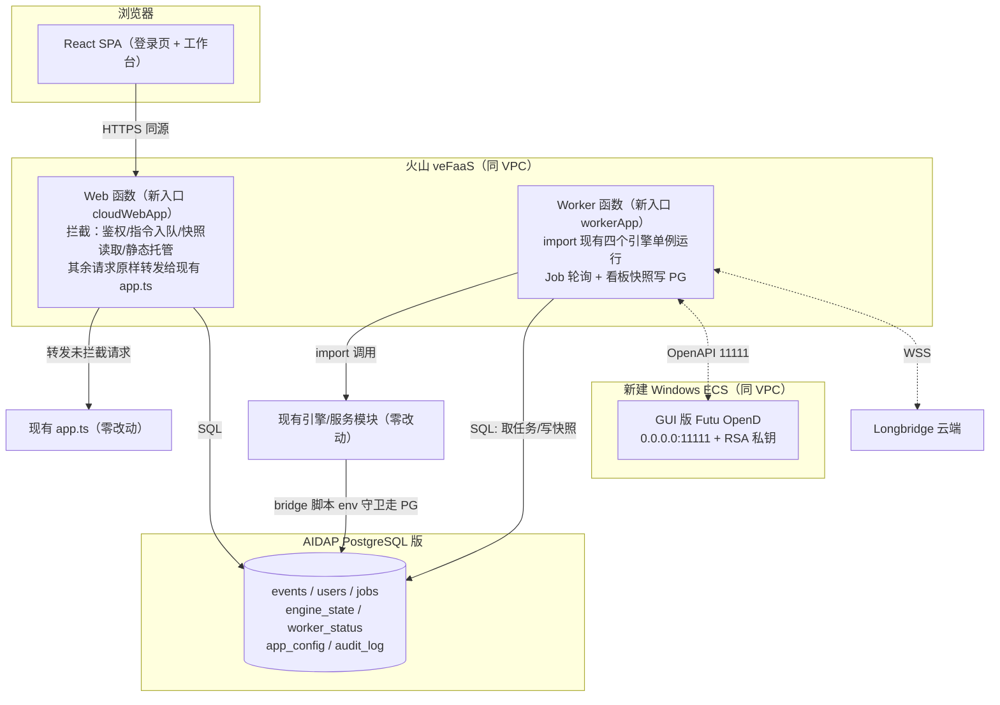

# 火山引擎 veFaaS + AIDAP PostgreSQL 云上部署设计方案

> 状态：待评审（v3，强化目录分割与现有文件保护） · 2026-08-31
> 目标：将本工作站部署至火山引擎——veFaaS 承载 Web/API 与常驻交易引擎 worker，**新建 Windows ECS 承载 Futu OpenD（GUI 登录）**，AIDAP PostgreSQL 版作为云端数据库；新增登录鉴权，SQLite 全量迁移至 PostgreSQL。
> **最高约束：所有云上能力以新增文件实现；现有业务文件默认零改动，个别文件仅允许「追加环境变量守卫」式加法，无环境变量时代码路径与现状逐字节一致，本地 `npm run dev` / `npm test` 行为完全不变。**

---

## 1. 需求与已确认决策

| 事项 | 决策 |
|---|---|
| 登录 | 单管理员账号，bcrypt/scrypt 密码哈希 + JWT（httpOnly Cookie）；`AUTH_ENABLED` 门控，本地默认关闭 |
| 数据库 | SQLite → PostgreSQL；先本地 PG 跑通迁移与测试，再 pg_dump 导入云端 AIDAP PostgreSQL 版；4 个 SQLite 库全量迁移 |
| 算力分布 | veFaaS Web 函数（自定义容器）：前端静态站 + 无状态 API；veFaaS 常驻 worker 函数：四大交易引擎 + 实时订阅；**新建 Windows ECS 跑 GUI 版 OpenD**；Web/Worker 经 PG 任务队列通信 |
| OpenD 宿主 | 新建同 VPC 的 Windows ECS，RDP 运维、GUI 登录、开机自启；Linux 部署机 115.191.35.144 仅作运维跳板与 worker 降级宿主 |
| 文件保护 | 严禁破坏现有文件；新增能力全部进独立目录；现有文件只允许 env 守卫式追加（见第 5 章白名单） |

## 2. veFaaS 与 OpenD 的可行性结论

- **OpenD 不能跑在 veFaaS**：登录态设备绑定、订阅连接绑定、回调写进程内缓存，FaaS 实例回收/替换/缩零会丢失全部状态。
- **OpenD 不跑在现有 Linux 机**：GUI 首次登录需问卷评估与协议确认、登录态过期需重登，纯命令行运维困难。
- **采用：新建 Windows ECS 跑 GUI 版 OpenD**（[官方文档](https://openapi.futunn.com/futu-api-doc/quick/opend-base.html)）。官方约束：监听非本地时**交易 API 必须配 RSA 私钥**（行情不受限）；同账号最多 10 个 OpenD 终端且最高行情权限互踢（设 `auto_hold_quote_right=1`，云端为唯一生产网关）；设备标识 `Device.dat` 不可镜像复制。
- 备选（不本期实施）：Linux 命令行 OpenD + `FutuOpenD.xml` 账号密码无人值守，首次短信验证码经 Telnet 输入；worker 连接方式不变。
- veFaaS Web 函数已核实支持自定义容器镜像（CR 同地域）、监听 `0.0.0.0:8000`、挂载 VPC。

## 3. 仓库现状（与本方案相关的关键事实）

- Express 单体：[app.ts](file:///Users/ShockCao/AICoding/Financial/api/app.ts) 挂载全部路由并 `export default app`；[server.ts](file:///Users/ShockCao/AICoding/Financial/api/server.ts) 为本地长驻入口。
- 四个引擎均**导出单例**，可被新代码直接 import：[simulationTradingEngine](file:///Users/ShockCao/AICoding/Financial/api/simulation/simulationTradingEngine.ts#L377)、[liveTradingEngine](file:///Users/ShockCao/AICoding/Financial/api/live/liveTradingEngine.ts#L616)、[longbridgeLiveTradingEngine](file:///Users/ShockCao/AICoding/Financial/api/longbridge/longbridgeLiveTradingEngine.ts#L405)、[aShareLiveTradingEngine](file:///Users/ShockCao/AICoding/Financial/api/ashare/aShareLiveTradingEngine.ts#L298)。
- 全部历史持久化都经 python bridge：TS 层 spawn [live_history_db.py](file:///Users/ShockCao/AICoding/Financial/api/futu_bridge/live_history_db.py)、`simulation_history_db.py`、`report_history_db.py`、`longbridge_live_history_db.py` 四个脚本（A 股复用 `live_history_db.py`）；sqlite 表结构统一为 `*_events(kind, ticker, side, strategy, status, ok, created_at, payload JSON)`。
- 鉴权空壳：[auth.ts](file:///Users/ShockCao/AICoding/Financial/api/routes/auth.ts) 三个 TODO handler。
- 前端 [main.tsx](file:///Users/ShockCao/AICoding/Financial/src/main.tsx) 仅 10 行，是包裹云端组件的唯一挂载点；[App.tsx](file:///Users/ShockCao/AICoding/Financial/src/App.tsx) 与全部页面无需改动。
- [runPythonBridge.ts](file:///Users/ShockCao/AICoding/Financial/api/utils/runPythonBridge.ts) 透传 `process.env.PYTHONPATH`，云端 python 驱动可经 PYTHONPATH 加载，无需改 bridge runner。

## 4. 目标架构



两个关键机制保证「现有代码零破坏」：

1. **Web 侧用外层包裹（wrapper）而非改路由**：新文件 `api/cloud/http/cloudWebApp.ts` 新建一个 express 应用，先注册云端拦截路由（登录、指令入队、快照读取、静态托管、鉴权中间件），再 `cloudApp.use(app)` 把**现有整个 app 原样挂为兜底**。Express 先注册先匹配——未拦截的路径（含全部历史查询，经 bridge→PG 天然可用）行为与现状完全一致；现有 `app.ts`、`routes/*` 一行不改。
2. **Worker 侧只 import 不改**：新文件 `api/cloud/worker/workerApp.ts` 直接 import 四个引擎单例与现有服务，调用其既有 `start/stop/runOnce/confirm` 等方法；引擎内部写历史仍走 bridge 脚本，脚本经环境变量切换 PG（见 5.2）。

## 5. 目录分割与文件修改范围（核心章节）

### 5.1 全部为新增文件（现有仓库的唯一改动来源不涉及业务逻辑）

```
deploy/volcano/
├── docker/Dockerfile.vefaas、.dockerignore        # 单镜像双角色（node+python3+futu-api+dist）
├── faas/run-web.sh、run-worker.sh                 # 函数启动脚本（APP_ROLE 切换）
├── pg/
│   ├── schema.sql                                 # 云端建表
│   ├── python/pg_history_driver.py                # 【新】bridge 脚本调用的 PG 驱动（psycopg）
│   ├── migrate_sqlite_to_pg.py                    # sqlite→PG 幂等迁移（只读 sqlite）
│   ├── dump_and_restore.sh、verify_row_counts.py  # 上云导入与对账
├── opend-windows-ecs/                             # Windows ECS OpenD runbook、FutuOpenD.xml 模板、RSA 密钥脚本、安全组清单
├── linux-deploy-host/worker-pm2-fallback.md       # Linux 机降级宿主说明
├── scripts/build-and-push-image.sh、ssh-ecs.sh    # 镜像构建/运维脚本（pem 不入库）
└── env/.env.cloud.example                         # 环境变量模板（无密钥值）

api/cloud/                                         # 全部新模块，不 import 时零副作用
├── http/cloudWebApp.ts                            # Web 包裹应用：拦截表 + 挂载现有 app + 静态托管
├── http/routeOverrides.ts                         # 拦截路由表：变更指令→入队；内存态读→worker 快照
├── auth/authService.ts、jwt.ts、requireAuth.ts    # 登录/JWT/中间件（node:crypto 实现，无新依赖）
├── jobs/jobQueue.ts、jobHandlers.ts               # PG 任务队列（SKIP LOCKED）与任务→引擎方法适配
├── db/pgClient.ts                                 # pg 连接池（唯一新增 npm 依赖：pg）
├── state/cloudConfigStore.ts、engineStateStore.ts、workerStatusStore.ts
└── worker/workerApp.ts                            # worker 入口：任务循环 + 引擎引导 + 快照落库

src/cloud/
├── CloudApp.tsx                                   # 包裹组件：VITE_AUTH_ENABLED 关闭时直接渲染 <App/>
├── LoginView.tsx、authStore.ts、RequireAuth.tsx、cloudFetch.ts
```

### 5.2 允许触碰的现有文件白名单（共 6 处，全部为「加法 + env 守卫」）

| # | 文件 | 改动形态 | 无环境变量时 |
|---|---|---|---|
| 1 | [live_history_db.py](file:///Users/ShockCao/AICoding/Financial/api/futu_bridge/live_history_db.py) | 文件顶部 import 后追加约 8 行守卫：`PG_HISTORY_DRIVER=1` 时经 `PYTHONPATH` 加载 `pg_history_driver.run(__file__)` 处理并退出 | 守卫不成立，**原 sqlite 代码路径逐行不变** |
| 2 | `api/futu_bridge/simulation_history_db.py` | 同上 | 同上 |
| 3 | `api/futu_bridge/report_history_db.py` | 同上 | 同上 |
| 4 | `api/longbridge/longbridge_live_history_db.py` | 同上 | 同上 |
| 5 | [package.json](file:///Users/ShockCao/AICoding/Financial/package.json) | **仅新增** `pg` 依赖（dependencies 追加一行） | 不影响任何现有依赖 |
| 6 | [main.tsx](file:///Users/ShockCao/AICoding/Financial/src/main.tsx) | `import App` 改为 `import { CloudApp } from './cloud/CloudApp'`（2 行）；CloudApp 内部在 `VITE_AUTH_ENABLED` 未开时原样渲染 `<App/>` | 页面树与现状完全一致 |

守卫代码形态（每个 python 脚本顶部，示意）：

```python
import os, sys
if os.environ.get("PG_HISTORY_DRIVER") == "1":
    sys.path.insert(0, os.environ.get("VOLCANO_CLOUD_PYTHONPATH", ""))
    from pg_history_driver import run as pg_run
    pg_run(__file__)
    sys.exit(0)
# —— 以下为原有全部代码，不做任何修改 ——
```

### 5.3 禁止触碰清单（实现时不得修改）

- 后端：[app.ts](file:///Users/ShockCao/AICoding/Financial/api/app.ts)、[server.ts](file:///Users/ShockCao/AICoding/Financial/api/server.ts)、[index.ts](file:///Users/ShockCao/AICoding/Financial/api/index.ts)、`api/routes/*` 全部路由、`api/live|longbridge|ashare|simulation|services|realtime|providers/*` 全部业务模块、四个引擎、四个 TS 持久化类、`api/utils/*`。
- 桥接：`futu_bridge/` 中除 5.2 列出的 4 个历史库脚本外的全部行情/交易/账户脚本（仅 worker 运行环境调用，不修改）。
- 前端：[App.tsx](file:///Users/ShockCao/AICoding/Financial/src/App.tsx)、`src/pages/*`、`src/components/*`、`src/hooks/*` 全部现有页面与组件。
- 共享：`shared/*` 类型定义（如云端确需新类型，定义在 `api/cloud/types.ts` 内）。
- 数据：`.data/*` 现有 sqlite/JSON 只读；迁移脚本**只读 sqlite**，不写、不删。

### 5.4 回归保证

1. **本地默认零感知**：不设置任何新环境变量时，`npm run dev`、`npm run check`、`npm test`、`npm run build` 路径与现状完全一致；现有测试不允许任何修改或跳过。
2. **双驱动测试**：新增测试仅在 `PERSISTENCE_DRIVER=pg`（本地 Docker PG）时启用，验证 PG 驱动与 sqlite 驱动对同一批输入返回一致结果（append/read_latest/paginate/对账）。
3. **守卫测试**：CI 中断言 4 个 python 脚本在未设 `PG_HISTORY_DRIVER` 时不 import psycopg、仍写 sqlite。
4. **云端灰度顺序**：先本地 PG 全量迁移+回归 → 镜像本地容器双角色联调 → 云上只开 Web（读历史/登录）→ 最后启 worker；任何阶段可通过环境变量切回本地 sqlite + 单机模式。

## 6. 数据模型（PG，`deploy/volcano/pg/schema.sql`）

- 事件表（镜像 sqlite 结构，bridge PG 驱动读写）：`simulation_events`、`live_events`、`longbridge_events`、`ashare_events`、`report_events`：`id BIGSERIAL`、`kind/ticker/side/strategy/status TEXT`、`ok BOOLEAN`、`created_at TIMESTAMPTZ`、`payload JSONB`，索引与现状一致。
- `cloud_users`（username 唯一、password_hash、last_login_at；首启从 `ADMIN_USERNAME/ADMIN_PASSWORD` 播种一次）。
- `cloud_jobs`（job_type、payload JSONB、status、claimed_by、run_after、attempts、last_error；认领 `FOR UPDATE SKIP LOCKED`）。
- `cloud_engine_state`（platform、engine_key、desired——worker 重启自愈依据）。
- `cloud_worker_status`（platform、snapshot JSONB、heartbeat_at——Web 侧只读看板来源）。
- `app_config`（key 主键、value JSONB——承接 `.data/*.json`，worker 启动时回写本地文件供现有服务读取）。
- `audit_log`（登录、订单确认/拒绝、任务失败等安全事件）。

## 7. 登录鉴权

1. `POST /api/auth/login`（与 `/api/health` 同为免鉴权接口）：scrypt 校验密码 → 签发 HMAC-SHA256 JWT（12h）→ `HttpOnly; Secure; SameSite=Strict` Cookie `fa_session`；失败统一错误 + 同 IP 限流。
2. `requireAuth` 在 cloudWebApp 中于兜底挂载前生效，保护全部 `/api/*`；另支持 `Authorization: Bearer`。
3. `/api/auth/logout` 清 Cookie；前端 `/login` 页 + `RequireAuth` 守卫，401 自动跳转。
4. `AUTH_ENABLED` 未设时中间件透传；`VITE_AUTH_ENABLED` 未设时 `CloudApp` 原样渲染现有 App。

## 8. Web 拦截路由表（`routeOverrides.ts`，全部为新增代码）

| 类型 | 端点（示例） | 云端行为 |
|---|---|---|
| 指令类 | `*/start`、`*/stop`、`*/run-once`、`*/pending-orders/:id/confirm|reject`、`POST /api/report/generate`、`*/llm-config` PUT、设置类写接口 | 写入 `cloud_jobs` 返回 `jobId`，worker 消费调现有引擎方法 |
| 内存态读 | 各平台 `*/dashboard`、`/api/account/*`、`/api/realtime/*` 状态、候选池实时态 | 读 `cloud_worker_status` 快照返回（worker 每 15–30s 落库） |
| 历史读 | `*/history/*`、报告历史 | **不拦截**，经现有路由 → bridge PG 驱动直达 PG |
| 认证 | `/api/auth/login|logout|me` | 新 auth 模块处理 |

## 9. 数据迁移（先本地、后上云）

1. 本地 Docker PG 16 + `schema.sql` 建表。
2. `migrate_sqlite_to_pg.py`（uv 运行）：逐库读 sqlite 事件表批量 upsert（幂等键 `(source_db, source_id)`），`.data/*.json` 写入 `app_config`；**全程只读 sqlite**。
3. `verify_row_counts.py`：按 kind 对账行数 + 抽样 payload 哈希。
4. `PERSISTENCE_DRIVER=pg` 本地回归：check/test/build + 页面验证。
5. `pg_dump --no-owner --no-privileges` → AIDAP 连接串 `psql` 导入 → 云上再对账。
6. 切换窗口冻结引擎写入后做最终增量迁移。

## 10. 部署步骤

1. **新建 Windows ECS**（同地域同 VPC，2C4G 起）：RDP（3389 仅放行操作员 IP）→ 安装 GUI OpenD → 登录 + 问卷评估 → 监听 `0.0.0.0:11111` → 配 RSA 私钥（`generate-opend-rsa-key.sh` 生成，私钥留 Windows，公钥入 worker Secret）→ `auto_hold_quote_right=1` → 防火墙/安全组 11111 仅放行 VPC 网段 → 开机自启。
2. **AIDAP**：开通 PostgreSQL 版引擎，建库建账号，拿连接串（优先连接池端点）。
3. **镜像**：`build-and-push-image.sh` 构建单镜像推送 CR（镜像内 `pip install futu-api psycopg`、npm 装 `pg`、含 `dist/`）。
4. **veFaaS Web 函数**：镜像 + VPC，`APP_ROLE=web`、`CLOUD_MODE=1`、`AUTH_ENABLED=true`、`DATABASE_URL`、`AUTH_JWT_SECRET`、管理员首启凭据、LLM/Longbridge 密钥；监听 8000。
5. **veFaaS Worker 函数**：同镜像 `APP_ROLE=worker`，单实例 + 预留并发；额外 `PG_HISTORY_DRIVER=1`、`FUTU_OPEND_HOST=<Windows ECS 内网 IP>`、OpenD RSA/交易密码 Secret；启动时按 `cloud_engine_state` 自愈引擎、回写 `app_config` 至本地 `.data`。
6. **Linux 部署机**：仅保留 SSH 运维与 worker 降级 PM2 配置，不部署业务。
7. 验收：未登录跳 `/login` → 报告异步生成（job 状态可观测）→ 引擎指令入队、worker 心跳与看板快照正常 → 实盘二次确认链路风控不变。

## 11. 风险与应对

| 风险 | 应对 |
|---|---|
| 改动现有文件引入回归 | 仅 6 处加法式白名单改动；env 缺失时代码路径不变；现有测试零修改；守卫单测 + 双驱动对账 |
| worker 被回收/冻结 | 单实例+预留并发；desired state 自愈、任务 SKIP LOCKED；不达标降级 Linux 机 PM2（同镜像 `APP_ROLE=worker`） |
| OpenD 登录态过期 | RDP 重登 runbook；worker 心跳探测 OpenD 并在看板暴露；OpenD 开机自启 |
| 远程交易安全 | 非本地监听必须 RSA 私钥；11111 仅 VPC、3389 仅操作员 IP；密钥走 veFaaS Secret；audit_log 全记录 |
| 行情权限互踢 | 云端 OpenD 唯一生产网关 + auto_hold；本地交易时段不挂同账号 |
| AIDAP Serverless 缩零 | 小连接池 + keepalive + 重试退避；statement_timeout；优先连接池端点 |
| 长任务超时 | 报告/引擎/确认全部异步 job，Web 不做长请求 |
| 镜像 python 依赖 | 镜像内安装 futu-api/psycopg，去除硬编码 macOS site-packages（仅容器内，不动本地 bridge 代码） |
| 日志膨胀 | worker 接火山 TLS，轮转策略保留；不打印密钥与完整 prompt |
