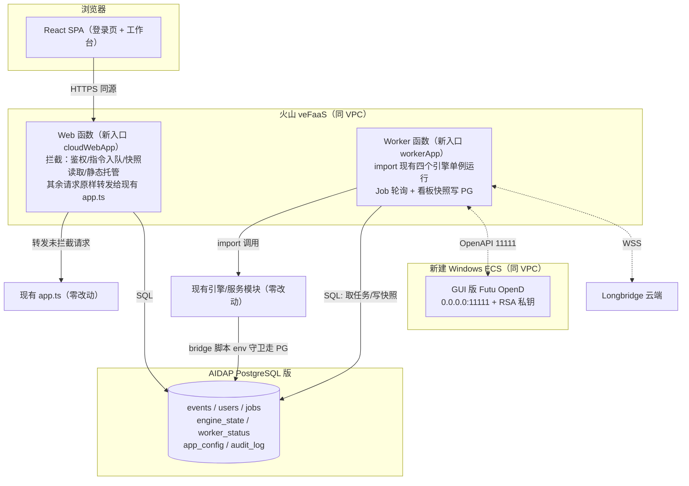
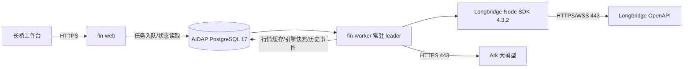

# 火山引擎 veFaaS + AIDAP PostgreSQL 云上部署设计方案

> 状态：**v5 · Web/Worker/OpenD/AIDAP 已部署；本版新增长桥云端部署专项方案（第 16 章）** · 2026-09-05
> 目标：将本工作站部署至火山引擎——veFaaS 承载 Web/API 与常驻交易引擎 worker，**新建 Windows ECS 承载 Futu OpenD（GUI 登录）**，AIDAP PostgreSQL 版作为云端数据库；新增登录鉴权，SQLite 全量迁移至 PostgreSQL。
> **最高约束：所有云上能力以新增文件实现；现有业务文件默认零改动，个别文件仅允许「追加环境变量守卫」式加法，无环境变量时代码路径与现状逐字节一致，本地 `npm run dev` / `npm test` 行为完全不变。**
>
> **实施进度**：✅ 本地 PostgreSQL（pgserver）+ schema + 全量迁移对账（3.3 万行） · ✅ 单管理员 scrypt+JWT 鉴权（httpOnly Cookie） · ✅ cloudWebApp 外层包裹 + 静态托管（现有 app.ts 零改动） · ✅ 4 个历史库脚本 PG 驱动垫片 · ✅ bridge/订阅进程云模式环境隔离修复（不注入 macOS 3.9 site-packages） · ✅ 实时订阅流式 JSON 解析修复 · ✅ TradingAgents 版本锁定与拉取脚本 · ⬜ PG 任务队列/worker 常驻函数（阶段三） · ⬜ 云上资源创建（本版规划）。

---

## 1. 需求与已确认决策

| 事项 | 决策 |
|---|---|
| 登录 | 单管理员账号，bcrypt/scrypt 密码哈希 + JWT（httpOnly Cookie）；`AUTH_ENABLED` 门控，本地默认关闭 |
| 数据库 | SQLite → PostgreSQL；先本地 PG 跑通迁移与测试，再 pg_dump 导入云端 AIDAP PostgreSQL 版；4 个 SQLite 库全量迁移 |
| 算力分布 | veFaaS Web 函数（自定义容器）：前端静态站 + 无状态 API；veFaaS 常驻 worker 函数：四大交易引擎 + 实时订阅；**新建 Windows ECS 跑 GUI 版 OpenD**；Web/Worker 经 PG 任务队列通信 |
| OpenD 宿主 | 新建同 VPC 的 Windows ECS，RDP 运维、GUI 登录、开机自启；Linux 部署机 115.191.35.144 仅作运维跳板与 worker 降级宿主 |
| 文件保护 | 严禁破坏现有文件；新增能力全部进独立目录；现有文件只允许 env 守卫式追加（见第 5 章白名单） |

## 2. veFaaS 与 OpenD 的可行性结论

- **OpenD 不能跑在 veFaaS**：登录态设备绑定、订阅连接绑定、回调写进程内缓存，FaaS 实例回收/替换/缩零会丢失全部状态。
- **OpenD 不跑在现有 Linux 机**：GUI 首次登录需问卷评估与协议确认、登录态过期需重登，纯命令行运维困难。
- **采用：新建 Windows ECS 跑 GUI 版 OpenD**（[官方文档](https://openapi.futunn.com/futu-api-doc/quick/opend-base.html)）。官方约束：监听非本地时**交易 API 必须配 RSA 私钥**（行情不受限）；同账号最多 10 个 OpenD 终端且最高行情权限互踢（设 `auto_hold_quote_right=1`，云端为唯一生产网关）；设备标识 `Device.dat` 不可镜像复制。
- 备选（不本期实施）：Linux 命令行 OpenD + `FutuOpenD.xml` 账号密码无人值守，首次短信验证码经 Telnet 输入；worker 连接方式不变。
- veFaaS Web 函数已核实支持自定义容器镜像（CR 同地域）、监听 `0.0.0.0:8000`、挂载 VPC。

## 3. 仓库现状（与本方案相关的关键事实）

- Express 单体：[app.ts](file:///Users/ShockCao/AICoding/Financial/api/app.ts) 挂载全部路由并 `export default app`；[server.ts](file:///Users/ShockCao/AICoding/Financial/api/server.ts) 为本地长驻入口。
- 四个引擎均**导出单例**，可被新代码直接 import：[simulationTradingEngine](file:///Users/ShockCao/AICoding/Financial/api/simulation/simulationTradingEngine.ts#L377)、[liveTradingEngine](file:///Users/ShockCao/AICoding/Financial/api/live/liveTradingEngine.ts#L616)、[longbridgeLiveTradingEngine](file:///Users/ShockCao/AICoding/Financial/api/longbridge/longbridgeLiveTradingEngine.ts#L405)、[aShareLiveTradingEngine](file:///Users/ShockCao/AICoding/Financial/api/ashare/aShareLiveTradingEngine.ts#L298)。
- 全部历史持久化都经 python bridge：TS 层 spawn [live_history_db.py](file:///Users/ShockCao/AICoding/Financial/api/futu_bridge/live_history_db.py)、`simulation_history_db.py`、`report_history_db.py`、`longbridge_live_history_db.py` 四个脚本（A 股复用 `live_history_db.py`）；sqlite 表结构统一为 `*_events(kind, ticker, side, strategy, status, ok, created_at, payload JSON)`。
- 鉴权空壳：[auth.ts](file:///Users/ShockCao/AICoding/Financial/api/routes/auth.ts) 三个 TODO handler。
- 前端 [main.tsx](file:///Users/ShockCao/AICoding/Financial/src/main.tsx) 仅 10 行，是包裹云端组件的唯一挂载点；[App.tsx](file:///Users/ShockCao/AICoding/Financial/src/App.tsx) 与全部页面无需改动。
- [runPythonBridge.ts](file:///Users/ShockCao/AICoding/Financial/api/utils/runPythonBridge.ts) 透传 `process.env.PYTHONPATH`，云端 python 驱动可经 PYTHONPATH 加载，无需改 bridge runner。

## 4. 目标架构



两个关键机制保证「现有代码零破坏」：

1. **Web 侧用外层包裹（wrapper）而非改路由**：新文件 `api/cloud/http/cloudWebApp.ts` 新建一个 express 应用，先注册云端拦截路由（登录、指令入队、快照读取、静态托管、鉴权中间件），再 `cloudApp.use(app)` 把**现有整个 app 原样挂为兜底**。Express 先注册先匹配——未拦截的路径（含全部历史查询，经 bridge→PG 天然可用）行为与现状完全一致；现有 `app.ts`、`routes/*` 一行不改。
2. **Worker 侧只 import 不改**：新文件 `api/cloud/worker/workerApp.ts` 直接 import 四个引擎单例与现有服务，调用其既有 `start/stop/runOnce/confirm` 等方法；引擎内部写历史仍走 bridge 脚本，脚本经环境变量切换 PG（见 5.2）。

## 5. 目录分割与文件修改范围（核心章节）

### 5.1 全部为新增文件（现有仓库的唯一改动来源不涉及业务逻辑）

```
deploy/volcano/
├── docker/Dockerfile.vefaas、.dockerignore        # 单镜像双角色（node+python3+futu-api+dist）
├── faas/run-web.sh、run-worker.sh                 # 函数启动脚本（APP_ROLE 切换）
├── pg/
│   ├── schema.sql                                 # 云端建表
│   ├── python/pg_history_driver.py                # 【新】bridge 脚本调用的 PG 驱动（psycopg）
│   ├── migrate_sqlite_to_pg.py                    # sqlite→PG 幂等迁移（只读 sqlite）
│   ├── dump_and_restore.sh、verify_row_counts.py  # 上云导入与对账
├── opend-windows-ecs/                             # Windows ECS OpenD runbook、FutuOpenD.xml 模板、RSA 密钥脚本、安全组清单
├── linux-deploy-host/worker-pm2-fallback.md       # Linux 机降级宿主说明
├── scripts/build-and-push-image.sh、ssh-ecs.sh    # 镜像构建/运维脚本（pem 不入库）
└── env/.env.cloud.example                         # 环境变量模板（无密钥值）

api/cloud/                                         # 全部新模块，不 import 时零副作用
├── http/cloudWebApp.ts                            # Web 包裹应用：拦截表 + 挂载现有 app + 静态托管
├── http/routeOverrides.ts                         # 拦截路由表：变更指令→入队；内存态读→worker 快照
├── auth/authService.ts、jwt.ts、requireAuth.ts    # 登录/JWT/中间件（node:crypto 实现，无新依赖）
├── jobs/jobQueue.ts、jobHandlers.ts               # PG 任务队列（SKIP LOCKED）与任务→引擎方法适配
├── db/pgClient.ts                                 # pg 连接池（唯一新增 npm 依赖：pg）
├── state/cloudConfigStore.ts、engineStateStore.ts、workerStatusStore.ts
└── worker/workerApp.ts                            # worker 入口：任务循环 + 引擎引导 + 快照落库

src/cloud/
├── CloudApp.tsx                                   # 包裹组件：VITE_AUTH_ENABLED 关闭时直接渲染 <App/>
├── LoginView.tsx、authStore.ts、RequireAuth.tsx、cloudFetch.ts
```

### 5.2 允许触碰的现有文件白名单（共 6 处，全部为「加法 + env 守卫」）

| # | 文件 | 改动形态 | 无环境变量时 |
|---|---|---|---|
| 1 | [live_history_db.py](file:///Users/ShockCao/AICoding/Financial/api/futu_bridge/live_history_db.py) | 文件顶部 import 后追加约 8 行守卫：`PG_HISTORY_DRIVER=1` 时经 `PYTHONPATH` 加载 `pg_history_driver.run(__file__)` 处理并退出 | 守卫不成立，**原 sqlite 代码路径逐行不变** |
| 2 | `api/futu_bridge/simulation_history_db.py` | 同上 | 同上 |
| 3 | `api/futu_bridge/report_history_db.py` | 同上 | 同上 |
| 4 | `api/longbridge/longbridge_live_history_db.py` | 同上 | 同上 |
| 5 | [package.json](file:///Users/ShockCao/AICoding/Financial/package.json) | **仅新增** `pg` 依赖（dependencies 追加一行） | 不影响任何现有依赖 |
| 6 | [main.tsx](file:///Users/ShockCao/AICoding/Financial/src/main.tsx) | `import App` 改为 `import { CloudApp } from './cloud/CloudApp'`（2 行）；CloudApp 内部在 `VITE_AUTH_ENABLED` 未开时原样渲染 `<App/>` | 页面树与现状完全一致 |

守卫代码形态（每个 python 脚本顶部，示意）：

```python
import os, sys
if os.environ.get("PG_HISTORY_DRIVER") == "1":
    sys.path.insert(0, os.environ.get("VOLCANO_CLOUD_PYTHONPATH", ""))
    from pg_history_driver import run as pg_run
    pg_run(__file__)
    sys.exit(0)
# —— 以下为原有全部代码，不做任何修改 ——
```

### 5.3 禁止触碰清单（实现时不得修改）

- 后端：[app.ts](file:///Users/ShockCao/AICoding/Financial/api/app.ts)、[server.ts](file:///Users/ShockCao/AICoding/Financial/api/server.ts)、[index.ts](file:///Users/ShockCao/AICoding/Financial/api/index.ts)、`api/routes/*` 全部路由、`api/live|longbridge|ashare|simulation|services|realtime|providers/*` 全部业务模块、四个引擎、四个 TS 持久化类、`api/utils/*`。
- 桥接：`futu_bridge/` 中除 5.2 列出的 4 个历史库脚本外的全部行情/交易/账户脚本（仅 worker 运行环境调用，不修改）。
- 前端：[App.tsx](file:///Users/ShockCao/AICoding/Financial/src/App.tsx)、`src/pages/*`、`src/components/*`、`src/hooks/*` 全部现有页面与组件。
- 共享：`shared/*` 类型定义（如云端确需新类型，定义在 `api/cloud/types.ts` 内）。
- 数据：`.data/*` 现有 sqlite/JSON 只读；迁移脚本**只读 sqlite**，不写、不删。

### 5.4 回归保证

1. **本地默认零感知**：不设置任何新环境变量时，`npm run dev`、`npm run check`、`npm test`、`npm run build` 路径与现状完全一致；现有测试不允许任何修改或跳过。
2. **双驱动测试**：新增测试仅在 `PERSISTENCE_DRIVER=pg`（本地 Docker PG）时启用，验证 PG 驱动与 sqlite 驱动对同一批输入返回一致结果（append/read_latest/paginate/对账）。
3. **守卫测试**：CI 中断言 4 个 python 脚本在未设 `PG_HISTORY_DRIVER` 时不 import psycopg、仍写 sqlite。
4. **云端灰度顺序**：先本地 PG 全量迁移+回归 → 镜像本地容器双角色联调 → 云上只开 Web（读历史/登录）→ 最后启 worker；任何阶段可通过环境变量切回本地 sqlite + 单机模式。

## 6. 数据模型（PG，`deploy/volcano/pg/schema.sql`）

- 事件表（镜像 sqlite 结构，bridge PG 驱动读写）：`simulation_events`、`live_events`、`longbridge_events`、`ashare_events`、`report_events`：`id BIGSERIAL`、`kind/ticker/side/strategy/status TEXT`、`ok BOOLEAN`、`created_at TIMESTAMPTZ`、`payload JSONB`，索引与现状一致。
- `cloud_users`（username 唯一、password_hash、last_login_at；首启从 `ADMIN_USERNAME/ADMIN_PASSWORD` 播种一次）。
- `cloud_jobs`（job_type、payload JSONB、status、claimed_by、run_after、attempts、last_error；认领 `FOR UPDATE SKIP LOCKED`）。
- `cloud_engine_state`（platform、engine_key、desired——worker 重启自愈依据）。
- `cloud_worker_status`（platform、snapshot JSONB、heartbeat_at——Web 侧只读看板来源）。
- `app_config`（key 主键、value JSONB——承接 `.data/*.json`，worker 启动时回写本地文件供现有服务读取）。
- `audit_log`（登录、订单确认/拒绝、任务失败等安全事件）。

## 7. 登录鉴权

1. `POST /api/auth/login`（与 `/api/health` 同为免鉴权接口）：scrypt 校验密码 → 签发 HMAC-SHA256 JWT（12h）→ `HttpOnly; Secure; SameSite=Strict` Cookie `fa_session`；失败统一错误 + 同 IP 限流。
2. `requireAuth` 在 cloudWebApp 中于兜底挂载前生效，保护全部 `/api/*`；另支持 `Authorization: Bearer`。
3. `/api/auth/logout` 清 Cookie；前端 `/login` 页 + `RequireAuth` 守卫，401 自动跳转。
4. `AUTH_ENABLED` 未设时中间件透传；`VITE_AUTH_ENABLED` 未设时 `CloudApp` 原样渲染现有 App。

## 8. Web 拦截路由表（`routeOverrides.ts`，全部为新增代码）

| 类型 | 端点（示例） | 云端行为 |
|---|---|---|
| 指令类 | `*/start`、`*/stop`、`*/run-once`、`*/pending-orders/:id/confirm|reject`、`POST /api/report/generate`、`*/llm-config` PUT、设置类写接口 | 写入 `cloud_jobs` 返回 `jobId`，worker 消费调现有引擎方法 |
| 内存态读 | 各平台 `*/dashboard`、`/api/account/*`、`/api/realtime/*` 状态、候选池实时态 | 读 `cloud_worker_status` 快照返回（worker 每 15–30s 落库） |
| 历史读 | `*/history/*`、报告历史 | **不拦截**，经现有路由 → bridge PG 驱动直达 PG |
| 认证 | `/api/auth/login|logout|me` | 新 auth 模块处理 |

## 9. 数据迁移（先本地、后上云）— 阶段一已落地

> 已交付脚本（均在 [deploy/volcano/pg](file:///Users/ShockCao/AICoding/Financial/deploy/volcano/pg)，使用独立 venv `.venv-cloud`，无需 Docker）：`local_pg.py`（pgserver 本地 PG 一键启停建表）、`schema.sql`、`migrate_sqlite_to_pg.py`、`verify_row_counts.py`。本地已完成 3.3 万行全量迁移 + 行数/payload 语义对账通过。

1. 本地：`.venv-cloud/bin/python deploy/volcano/pg/local_pg.py start`（pgserver 起 PG、建 `financial` 库、应用 `schema.sql`）。
2. `migrate_sqlite_to_pg.py`：逐库读 sqlite 事件表，**保留原始 id** 批量 upsert（`ON CONFLICT (id) DO NOTHING`，可重跑），迁移后重置序列；**全程只读 sqlite**。
3. `verify_row_counts.py`：按表对账行数 + payload 规范化哈希（jsonb 重排序后语义比对）。
4. 云模式回归：`CLOUD_MODE=1 CLOUD_PYTHON=1 PG_HISTORY_DRIVER=1 npm run server:cloud` + `VITE_AUTH_ENABLED=true vite build`，页面验证（登录/报告/实盘订阅）。
5. 上云：本地 PG `pg_dump --no-owner --no-privileges -f financial.sql financial` → 用 AIDAP 连接串 `psql`/TOS 导入 → `verify_row_counts.py` 指向 AIDAP `DATABASE_URL` 再对账（即阶段 B，见 15.2）。
6. 切换窗口冻结引擎写入后做最终增量迁移，此后 AIDAP 成为唯一数据源。

## 10. 部署步骤

1. **新建 Windows ECS**（同地域同 VPC，2C4G 起）：RDP（3389 仅放行操作员 IP）→ 安装 GUI OpenD → 登录 + 问卷评估 → 监听 `0.0.0.0:11111` → 配 RSA 私钥（`generate-opend-rsa-key.sh` 生成，私钥留 Windows，公钥入 worker Secret）→ `auto_hold_quote_right=1` → 防火墙/安全组 11111 仅放行 VPC 网段 → 开机自启。
2. **AIDAP**：开通 PostgreSQL 版引擎，建库建账号，拿连接串（优先连接池端点）。
3. **镜像**：`build-and-push-image.sh` 构建单镜像推送 CR（镜像内 `pip install futu-api psycopg`、npm 装 `pg`、含 `dist/`）。
4. **veFaaS Web 函数**：镜像 + VPC，`APP_ROLE=web`、`CLOUD_MODE=1`、`AUTH_ENABLED=true`、`DATABASE_URL`、`AUTH_JWT_SECRET`、管理员首启凭据、LLM/Longbridge 密钥；监听 8000。
5. **veFaaS Worker 函数**：同镜像 `APP_ROLE=worker`，单实例 + 预留并发；额外 `PG_HISTORY_DRIVER=1`、`FUTU_OPEND_HOST=<Windows ECS 内网 IP>`、OpenD RSA/交易密码 Secret；启动时按 `cloud_engine_state` 自愈引擎、回写 `app_config` 至本地 `.data`。
6. **Linux 部署机**：仅保留 SSH 运维与 worker 降级 PM2 配置，不部署业务。
7. 验收：未登录跳 `/login` → 报告异步生成（job 状态可观测）→ 引擎指令入队、worker 心跳与看板快照正常 → 实盘二次确认链路风控不变。

## 11. 风险与应对

| 风险 | 应对 |
|---|---|
| 改动现有文件引入回归 | 仅 6 处加法式白名单改动；env 缺失时代码路径不变；现有测试零修改；守卫单测 + 双驱动对账 |
| worker 被回收/冻结 | 单实例+预留并发；desired state 自愈、任务 SKIP LOCKED；不达标降级 Linux 机 PM2（同镜像 `APP_ROLE=worker`） |
| OpenD 登录态过期 | RDP 重登 runbook；worker 心跳探测 OpenD 并在看板暴露；OpenD 开机自启 |
| 远程交易安全 | 非本地监听必须 RSA 私钥；11111 仅 VPC、3389 仅操作员 IP；密钥走 veFaaS Secret；audit_log 全记录 |
| 行情权限互踢 | 云端 OpenD 唯一生产网关 + auto_hold；本地交易时段不挂同账号 |
| AIDAP Serverless 缩零 | 小连接池 + keepalive + 重试退避；statement_timeout；优先连接池端点 |
| 长任务超时 | 报告/引擎/确认全部异步 job，Web 不做长请求 |
| 镜像 python 依赖 | 镜像内安装 futu-api/psycopg，去除硬编码 macOS site-packages（仅容器内，不动本地 bridge 代码） |
| 日志膨胀 | worker 接火山 TLS，轮转策略保留；不打印密钥与完整 prompt |

---

# 第二部分：云资源创建与部署执行手册（v4 新增）

> 本部分为**可落地的资源创建顺序 + 规格 + 网络 + 环境变量矩阵 + 部署与验收**，所有配置项均对齐火山引擎官方约束（见引用链接）。命名统一前缀 `fin`，地域统一 **cn-beijing（华北2北京）**，全部资源同 VPC。

## 12. 云资源清单（创建顺序与规格）

> 依赖顺序自上而下，必须先创建网络与镜像仓库，再建计算与数据库。

| # | 资源 | 产品 | 规格/配置要点 | 用途 |
|---|---|---|---|---|
| 1 | 访问密钥 AK/SK | IAM | 子账号 + 最小权限策略（CR/VPC/ECS/veFaaS/AIDAP 分服务授权）；主账号密钥不入库 | 控制台/CLI/CI 推送镜像与创建资源 |
| 2 | **VPC** `fin-vpc` | VPC | 网段 `10.20.0.0/16`；至少 2 个可用区子网 `fin-subnet-a(10.20.1.0/24)`、`fin-subnet-b(10.20.2.0/24)` | 所有资源网络底座 |
| 3 | **安全组** | VPC | `fin-sg-opend`（见 13.3）、`fin-sg-faas`（出向全开、入向仅平台网段） | 访问控制 |
| 4 | NAT 网关 + EIP（可选） | VPC/NAT | 仅当 veFaaS worker 需访问公网（Longbridge WSS、Ark API）但又要关闭函数公网时；否则用「VPC+公网」组合 | worker 出公网 |
| 5 | **CR 标准版实例** `finreg` | CR | 标准版按量计费；开公网访问（推送）+ 内网访问（veFaaS 拉取）；设访问密码；命名空间 `fin`；镜像仓库自动建 | 托管单镜像 |
| 6 | **AIDAP PostgreSQL 版** | AIDAP | PostgreSQL 17；实例 `minty-date-8fd69eac`；库 `financial`；账号 `fin_app`；**优先连接池端点**；白名单限定 VPC 网段 | 云端数据库 |
| 7 | **Windows ECS** `fin-opend` | ECS | Windows Server 2022 中文版，2C4G+，系统盘 60G；入 `fin-subnet-a`，绑 `fin-sg-opend`；RDP 凭据 | 跑 GUI 版 Futu OpenD |
| 8 | **veFaaS Web 函数** `fin-web` | veFaaS（Web 应用函数） | 自定义容器镜像；`APP_ROLE=web`；监听 `0.0.0.0:8000`；**VPC+公网**；实例 1–4 vCPU；开单实例多并发；APIG 统一域名 + HTTPS | 前端站 + 无状态 API |
| 9 | **veFaaS Worker 函数** `fin-worker` | veFaaS（常驻型） | 同镜像；`APP_ROLE=worker`；**始终分配 CPU/预留实例数=1**、关闭单实例多并发、关闭公网出（经 NAT）；监听健康端口；无 APIG（仅内网） | 常驻交易引擎 + 实时订阅 |
| 10 | TLS 日志项目 | TLS | 项目 `fin`，主题 `fin-web`、`fin-worker`；veFaaS 绑定投递 | 日志与审计 |
| 11 | APIG API 网关 | APIG | 统一域名 + 路由到 `fin-web`；挂 HTTPS 证书；仅对外暴露入口 | 公网入口 |
| 12 | 云监控告警 | 云监控 | 告警：worker 心跳超时、AIDAP 连接错误率、OpenD 不可达、函数 5xx | 运维 |

关键官方约束（[veFaaS 创建 Web 应用](https://www.volcengine.com/docs/6662/1322678)、[云沙箱/常驻](https://www.volcengine.com/docs/6662/1656341)、[CR 推送](https://www.volcengine.com/docs/6420/79746)）：
- Webserver 模式必须实现 HTTP Server 并**监听 `0.0.0.0:8000`**（避免 9000/9001/9990）；镜像部署默认启动 `/opt/application/run.sh`（可用启动命令覆盖）。
- 容器镜像**必须推送至同地域 CR**；函数发布前等待镜像同步完成。
- 网络三组合：①关 VPC（仅公网）②开 VPC+公网 ③开 VPC 关公网（需 NAT）。Web 选②、Worker 选③。
- pip 依赖用火山镜像源 `https://mirrors.ivolces.com/pypi/simple/`，npm 用内网/公网源。

## 13. 网络与安全拓扑

### 13.1 网络连通矩阵

| 源 → 目标 | 地址/端口 | 协议 | 说明 |
|---|---|---|---|
| 浏览器 → APIG → fin-web | 443(HTTPS) | HTTPS | 唯一公网入口 |
| fin-web → AIDAP | PG 连接池端点:5432 | TCP（VPC 内网） | 历史读/鉴权/任务表 |
| fin-worker → AIDAP | :5432 | TCP（VPC 内网） | 任务消费/快照/事件写 |
| fin-worker → fin-opend(OpenD) | 11111 | TCP（VPC 内网） | Futu 行情/交易 OpenAPI |
| fin-worker → Longbridge 云端 | 443 | WSS/HTTPS（经 NAT 出公网） | 长桥行情/交易 |
| fin-web → Ark LLM | `ark.cn-beijing.volces.com:443` | HTTPS（PrivateLink） | 30/60 日报告的大模型生成 |
| fin-worker → Ark LLM | `ark.cn-beijing.volces.com:443` | HTTPS（PrivateLink） | Futu/长桥实盘量化决策 |
| fin-opend RDP | 3389 | RDP | **仅操作员办公 IP** |
| fin-web/worker → CR | 443 | 内网拉镜像（建实例时） | 镜像同步 |

### 13.2 VPC/子网规划

- VPC `fin-vpc` `10.20.0.0/16`；子网 `fin-subnet-a 10.20.1.0/24`（可用区 A）、`fin-subnet-b 10.20.2.0/24`（可用区 B）。
- OpenD ECS 与 worker 函数同 VPC 同地域，内网互通；worker 用 ECS **内网 IP** 连 OpenD（`FUTU_OPEND_HOST=10.20.1.x`），建议给 ECS 固定内网 IP 或在脚本/配置中登记。

### 13.3 方舟 PrivateLink 验收

- 按方舟网络配置文档，PrivateLink 生效后仍使用
  `https://ark.cn-beijing.volces.com/api/v3/responses`，依靠 VPC 内私有
  DNS 将同一域名解析到终端节点；不得把私网 IP 硬编码进 URL，否则会破坏
  TLS SNI、证书校验和双可用区故障切换。
- `fin-web` 与 `fin-worker` 均已关联 `fin-vpc`
  (`vpc-3nqey47tkx0xs931ecfjzkvv`)。
- 2026-09-05 容器内验收：两端 DNS 仅返回 `10.20.1.110`、
  `10.20.2.194`；TLS 实际远端为私网地址；使用现有 `ARK_API_KEY`
  调用 `/ping` 均返回 HTTP 200。
- 使用当前 DeepSeek-v4-Pro 接入点 `ep-20260616231829-mnq2t` 对
  `/api/v3/responses` 发起实际推理请求也均返回 HTTP 200：
  `fin-web` 实际连接 `10.20.1.110:443`，`fin-worker` 实际连接
  `10.20.2.194:443`，两端均未经过公网 IP。
- Futu/长桥实盘通过 `fin-worker` 的 `callArkResponses()` 请求方舟；
  30/60 日报告通过 `fin-web` 的同一函数请求方舟，因此三条 DeepSeek
  链路均复用已验收的 PrivateLink 路径。

### 13.4 安全组规则

**`fin-sg-opend`（Windows ECS）**
| 方向 | 协议端口 | 来源/目标 | 用途 |
|---|---|---|---|
| 入 | TCP 3389 | 操作员办公公网 IP/32（按需） | RDP 运维，用完可关 |
| 入 | TCP 11111 | VPC 网段 `10.20.0.0/16` | worker 访问 OpenD（行情不受限；交易需 RSA 私钥） |
| 出 | TCP 443 | `0.0.0.0/0` | OpenD 连 Futu 云端 |

**`fin-sg-faas`（veFaaS）**：入向由平台托管，无需开端口；出向全开（或出 VPC 经 NAT）。

## 14. 环境变量矩阵（Secret 注入，不入库）

> 完整模板见 [.env.cloud.example](file:///Users/ShockCao/AICoding/Financial/deploy/volcano/env/.env.cloud.example)。下表区分 Web/Worker。

| 变量 | Web | Worker | 说明 |
|---|---|---|---|
| `CLOUD_MODE` | `1` | `1` | 云模式开关 |
| `APP_ROLE` | `web` | `worker` | 镜像角色切换 |
| `CLOUD_PYTHON` | `1` | `1` | 不注入本机 macOS site-packages（容器内关键） |
| `PORT` | `8000` | `8000` | HTTP/健康端口，监听 0.0.0.0 |
| `AUTH_ENABLED` | `true` | `true` | 登录鉴权 |
| `CLOUD_COOKIE_SECURE` | `true` | - | HTTPS 域名下 Secure Cookie |
| `AUTH_JWT_SECRET` | ✔ Secret | - | ≥16 随机串 |
| `ADMIN_USERNAME`/`ADMIN_PASSWORD` | ✔ 仅首启播种 | - | 管理员初始凭据 |
| `DATABASE_URL` | ✔ AIDAP 连接池 | ✔ AIDAP 连接池 | `postgresql://fin_app:***@<pool-endpoint>/financial` |
| `PG_HISTORY_DRIVER` | - | `1` | bridge 历史走 PG（Web 仅读时也可置 1） |
| `VOLCANO_CLOUD_PYTHONPATH` | `/app/deploy/volcano/pg/python` | 同左 | PG 垫片路径 |
| `FUTU_PYTHON_BIN` | `python3` | `python3` | 容器内 python（含 futu-api/psycopg/pandas） |
| `FUTU_OPEND_HOST`/`FUTU_OPEND_PORT` | - | `10.20.1.x` / `11111` | Windows ECS 内网地址 |
| `TRADINGAGENTS_REPO_PATH`/`TRADINGAGENTS_PYTHON_BIN` | - | `/app/third_party/TradingAgents` / `/app/.venv-tradingagents/bin/python` | A 股多智能体（镜像构建期拉取） |
| `ARK_API_KEY`/`ARK_RESPONSES_URL`/`ARK_MODEL` 等 | - | ✔ Secret | 大模型（沿用 .env.local 变量名） |
| `LONGBRIDGE_APP_KEY/SECRET/ACCESS_TOKEN` | - | ✔ Secret | 长桥 |
| `LIVE_TRADING_ENABLED`/`FUTU_LIVE_TRD_ENV` | - | 按阶段，默认 `false` | 真实下单门禁（**灰度后期再开**） |

## 15. 镜像、部署顺序与验收

### 15.1 单镜像双角色

- 一个镜像同时供 Web 与 Worker，用 `APP_ROLE` + `run-web.sh`/`run-worker.sh` 切换。镜像内：Node 20（tsx 运行 `api/cloud/cloudServer.ts` 或 worker 入口）、Python 3.12（`futu-api`、`psycopg[binary]`、`pandas`、`numpy`）、前端 `dist/`、构建期执行 `bash deploy/volcano/scripts/fetch-tradingagents.sh` 拉取 TradingAgents 独立 venv。
- 镜像入口 `/opt/application/run.sh`（或在函数启动命令显式指定 `bash deploy/volcano/faas/run-web.sh` / `run-worker.sh`）。

镜像推送（[CR 命令](https://www.volcengine.com/docs/6420/79746)）：

```bash
# 1. 构建镜像（Dockerfile 内 pip 用火山镜像源）
docker build -f deploy/volcano/docker/Dockerfile.vefaas -t fin-workbench:$(git rev-parse --short HEAD) .
# 2. 登录 CR（账号名@账号ID，或用控制台“获取临时访问指令”，1 小时有效）
docker login --username=<User>@<UserID> finreg-cn-beijing.cr.volces.com
# 3. 打标并推送
docker tag fin-workbench:<sha> finreg-cn-beijing.cr.volces.com/fin/financial-workbench:<sha>
docker push finreg-cn-beijing.cr.volces.com/fin/financial-workbench:<sha>
```

### 15.2 分阶段部署顺序（灰度，每步可回退）

1. **阶段 A（云资源）**：创建 AK/SK → VPC/子网/安全组 → CR 实例与命名空间 → TLS 项目主题。
2. **阶段 B（数据库）**：开通 AIDAP PG 16，建库建账号；**本地 pgserver 数据 `pg_dump --no-owner` → AIDAP `psql` 导入**；运行 `verify_row_counts.py`（指向 AIDAP 连接串）对账。
3. **阶段 C（OpenD）**：建 Windows ECS → RDP 装 GUI OpenD → 登录+问卷+协议 → 监听 `0.0.0.0:11111` → 配 RSA 私钥（交易）→ `auto_hold_quote_right=1` → 开机自启；从 worker 侧（同 VPC 一台临时机）`telnet 10.20.1.x 11111` 验证连通。
4. **阶段 D（镜像与 Web）**：构建推送镜像 → 建 `fin-web` 函数（APP_ROLE=web、VPC+公网、APIG+HTTPS）→ 配 Secret → 发布。**此阶段不开 worker、不开实盘**，只验证：登录页、未登录 401、报告历史从 AIDAP 读出、生成报告（长任务先走现有同步链路验证，后迁异步）。
5. **阶段 E（Worker）**：建 `fin-worker` 常驻函数（单实例+预留、关公网经 NAT）→ 指向 OpenD 内网 IP、配全部交易 Secret（`LIVE_TRADING_ENABLED=false`）→ 发布；验证：worker 心跳、OpenD 连通、行情订阅事件、港股 LLM 调用到 Ark（美股闭市门禁跳过属正常）。
6. **阶段 F（人工确认闭环）**：开启候选池/直推生成待确认订单，**二次确认后才提交**；验证 audit_log 记录。
7. **阶段 G（实盘灰度，最后）**：评估充分后再置 `LIVE_TRADING_ENABLED=true`，小仓位、人工逐笔确认。

### 15.3 验收清单

- [ ] 未登录访问任意 `/api/*` 返回 401，登录页风格与平台一致；错误密码提示、限流生效。
- [ ] 管理员登录后报告历史从 **AIDAP** 读出，条数与本地对账一致。
- [ ] Web 函数健康检查 200；APIG HTTPS 可访问；Cookie `Secure; HttpOnly; SameSite=Strict`。
- [ ] worker 心跳写 `cloud_worker_status`，看板可读；OpenD 状态为已连接已登录。
- [ ] 港股开盘时段产生真实 LLM 决策（Ark 侧可见请求）；美股闭市被时段门禁跳过。
- [ ] 待确认订单必须人工确认才提交；`audit_log` 有登录/确认/拒绝记录。
- [ ] RDP 3389 仅限操作员 IP；11111 仅 VPC；Secret 不出现在镜像/仓库。

### 15.4 回滚方案

| 场景 | 回退 |
|---|---|
| 云端异常需快速恢复业务 | 本地 `npm run dev`/单机模式（不设云环境变量，走 sqlite）继续可用；数据 AIDAP 与本地 sqlite 并行，切换窗口冻结写入后做最终增量 |
| Worker 常驻不稳定 | 同镜像 `APP_ROLE=worker` 降级到 Linux 部署机 PM2（`115.191.35.144`），或临时置 worker 0 副本、Web 仅提供只读+登录 |
| OpenD 登录态过期 | RDP 重登 runbook；worker 心跳/看板暴露 OpenD 不可达告警 |
| 数据库迁移异常 | 本地 sqlite 只读保留为回滚源；AIDAP 重建后重新 `pg_dump/psql` 导入 |
| 镜像版本问题 | CR 保留历史 tag，函数切回上一镜像版本发布 |

---

# 第三部分：长桥云端部署专项方案（v5 新增）

> 目标：在不影响现有 Futu 实盘链路的前提下，将长桥账户、持仓、行情订阅、量化评估、候选池、人工确认和真实下单门禁完整迁入云端。
>
> 核心决策：**生产运行时以 `longbridge@4.3.2` Node SDK 为主，不把 Longbridge Terminal CLI 的 OAuth 本地缓存作为 veFaaS 运行依赖。** CLI 只用于运维机诊断。首期复用现有 `fin-worker`；达到隔离阈值后再拆分独立 worker。

## 16.1 当前云端审计结论

审计时间：2026-09-05。检查过程中不输出任何凭据值。

| 项目 | 当前状态 | 结论 |
|---|---|---|
| Web 函数 | `fin-web`，镜像 v20，Revision 19 | 已部署 |
| Worker 函数 | `fin-worker`，镜像 v21，Revision 21，常驻实例 1 | 已部署并接管 leader |
| 公网出口 | `EnableSharedInternetAccess=true` | 当前可访问长桥 HTTPS/WSS；若后续关闭共享公网，必须先配置 NAT |
| Node SDK | `longbridge@4.3.2`，含 Linux glibc 原生包 | 已在镜像中 |
| Longbridge Terminal CLI | 镜像中没有 `longbridge` 可执行文件 | 账户/持仓已改 SDK；行情补拉和下单仍待改造 |
| 长桥凭据 | worker 已配置 App Key、App Secret、Access Token | SDK 只读鉴权探测通过；当前 token 约 17 天后到期，必须先轮换 |
| 长桥行情权限 | 美股 LV1、港股 LV2、A 股 LV1；美股期权未授权 | 首期仅允许股票/ETF；期权功能必须保持关闭 |
| 长桥账户权限 | 账户、持仓、订单读取探测通过 | 尚未用真实订单验证提交权限 |
| 长桥交易门禁 | `liveTradingEnabled=false`、`autoSubmitEnabled=false` | 已关闭，完成 dry-run 验收后再开启 |
| Web 长桥凭据 | 未配置 | 正确；Web 不应直连长桥 |
| 云路由 | source/workbench/live dashboard/realtime status 已读 worker 快照 | 行情详情、设置和订单动作仍待补齐 |
| Worker 注册表 | 已注册 `longbridge_live` | 具备任务执行入口 |
| 期望状态 | `cloud_engine_state` 暂无 `longbridge_live` 行 | 尚未启动云端长桥引擎 |
| Worker 快照 | 已含 sourceStatus/account/workbench/realtime；引擎 running=false | 只读账户链路已上线 |
| AIDAP 长桥表 | 已建表；历史信号约 926 条 | 数据层已具备，无需新数据库 |

当前缺口不是“再创建一套云资源”，而是以下四项：

1. 账户与持仓已改为 SDK；行情历史补拉和提交订单仍通过 `execFile(longbridge ...)`，镜像未安装 CLI。
2. 官方 CLI 使用 OAuth 2.0 token cache；veFaaS 本地文件系统会随实例替换丢失，不适合作为无人值守生产认证源。
3. 当前 Legacy API Key access token 只剩约 17 天有效期，仓库尚无自动续签和 Secret 更新流程。
4. 长桥行情详情、配置和订单动作尚未完整路由到 worker，Web 进程仍可能读到空内存或直接调用缺失的 CLI。
5. 长桥前端仍按同步接口处理 start/stop/run-once，云端实际返回 202 入队回执，存在与 Futu 停止白屏同类风险。

## 16.2 目标架构与部署边界



职责边界：

- `fin-web`：鉴权、页面、历史查询、任务入队、读取 worker 快照；**不持有长桥凭据，不调用 SDK/CLI**。
- `fin-worker`：唯一持有长桥凭据；维护 Quote/Trade Context、WSS 订阅、量化引擎、订单确认与提交。
- AIDAP：保存 `cloud_jobs`、`cloud_engine_state`、`cloud_worker_status`、长桥历史表、配置与审计。
- Longbridge Terminal CLI：只安装在受控运维机供人工诊断；不作为线上请求链路依赖。

首期不新增 `fin-longbridge-worker`。现有 worker 已支持多引擎注册、任务队列和 leader 锁，先复用可减少状态同步复杂度。满足以下任一条件后再拆分：

- 长桥单轮评估持续超过 60 秒并影响 Futu 控制任务；
- WSS 订阅或原生 SDK导致 worker 内存持续超过 70%；
- 两个平台需要独立发布、扩缩容或故障域；
- 长桥任务队列 P95 等待时间超过 10 秒。

拆分前必须先实现 `WORKER_PLATFORMS`、按平台 advisory lock、按平台心跳合并；禁止直接复制 `fin-worker`，否则两个实例会争抢当前全局 leader 锁。

## 16.3 生产通道改造

### 16.3.1 授权模型与权限边界

长桥存在两套不同授权模型，不能混用：

| 模式 | 凭据/状态 | 适用场景 | 本项目决策 |
|---|---|---|---|
| Legacy API Key | App Key + App Secret + Access Token | 无头服务、Node SDK、veFaaS worker | **生产采用** |
| OAuth 2.0 | Client ID + 浏览器授权 + token cache | Terminal CLI、MCP、人工工具 | 仅运维诊断，暂不进入生产请求链路 |

生产 worker 采用 Legacy API Key 的原因：

- `longbridge@4.3.2` 提供 `Config.fromApikey()`，可直接使用 veFaaS Secret 注入的三元组。
- SDK 提供 `Config.refreshAccessToken(expiredAt)`，可在旧 token 到期前无浏览器续签。
- CLI/OAuth 将 token 缓存在 `~/.longbridge/openapi/tokens/<client_id>`；veFaaS 实例文件系统不持久，实例替换后不能保证授权恢复。
- Web 函数不持有任何长桥凭据；只有常驻 worker 可以初始化 QuoteContext/TradeContext。

授权开通必须包含：

1. 在长桥开发者平台创建生产 OpenAPI 应用，区分测试应用与生产应用。
2. 绑定实际交易账户并确认账户地区、可交易市场、币种和账户类型。
3. 开通账户资产、持仓、订单查询权限。
4. 开通所需市场行情权限；行情订阅能力受账户购买的 Quote Package 限制。
5. 真实交易阶段再确认下单权限；只读探测通过不代表提交权限已生效。
6. 美股期权行情当前未授权，因此 universe、页面和下单入口必须排除美股期权。

当前云端只读鉴权探测结果：

```text
SDK 原生模块：可加载
股票报价：通过
账户资产：通过
持仓读取：通过
订单读取：通过
行情权限：美股 LV1、港股 LV2、A 股 LV1
未授权：美股期权 OpenAPI 行情
当前 Access Token 到期时间：2026-09-22 17:23:17（北京时间）
```

授权启动门禁：

- 缺少任一三元组时，`longbridge_live.start` 必须失败并保持 `desired=stopped`。
- token 已过期或剩余时间小于 24 小时时，禁止启动评估和真实交易。
- QuoteContext、TradeContext 的只读探测全部成功后，才允许进入 dry-run。
- `accountBalance()`、`stockPositions()`、`todayOrders()` 只验证读权限；真实提交权限只能在 LB-E 阶段由用户确认最小限价单后验证。
- 权限不足必须按市场/能力显式展示，不得把“期权未授权”误报为整个长桥不可用。

### 16.3.2 Access Token 自动续签

新增 `deploy/volcano/longbridge/rotate-access-token.ts`，由受控发布环境定时执行，禁止在业务请求中临时续签。

续签流程：

1. 每日只解析 token 的 `exp` 元数据，不输出 token 内容。
2. 剩余 30 天触发预警；剩余 14 天自动续签；剩余 24 小时进入交易熔断。
3. 使用当前 Secret 创建 `Config.fromApikey()`，调用 `refreshAccessToken(now + 90 days)` 获取新 token。
4. 使用最小权限火山 IAM 身份调用 veFaaS OpenAPI，只更新 `fin-worker` 的 `LONGBRIDGE_ACCESS_TOKEN` 和 `LONGBRIDGE_TOKEN_EXPIRES_AT`。
5. 发布新 worker revision，等待新实例获得 leader 锁。
6. 在新实例执行 quote、accountBalance、stockPositions、todayOrders 四项只读探测。
7. 探测通过后标记轮换成功；失败则关闭长桥 desired 状态和交易门禁，保留 Futu 服务。

安全要求：

- 新旧 token 绝不写日志、AIDAP `app_config`、构建参数、镜像层或 Git。
- 轮换脚本标准输出只能包含到期时间、函数 revision 和探测布尔值。
- 自动化身份只能读取/更新 `fin-worker` 函数配置和发布版本，不授予交易 API 之外的云资源权限。
- 不假设旧 token 与新 token 可以长期共存；发布和探测必须在同一轮换事务中完成。
- 禁止把 App Secret 或 Access Token 下发到 `fin-web`。

OAuth 备选仅在未来完全迁移到 OAuth 时启用：

1. 注册 OAuth Client 和固定回调地址。
2. 在受控运维机完成一次浏览器授权。
3. 将 token cache 加密后存入专用 Secret，并在 worker 启动时恢复到固定 `HOME`。
4. SDK 自动刷新后必须同步回 Secret，否则实例替换会回退到旧 token。

在完成“刷新后 token cache 回写 Secret”的闭环前，禁止生产 worker 使用 OAuth 模式。

### 16.3.3 上云后的 Token 更新操作手册

实施 LB-A 时新增以下命令，作为唯一受支持的 token 运维入口：

```bash
# 仅查看状态，不显示 token
npm run cloud:longbridge:token:status

# 使用当前有效 token 立即续签 90 天，并自动更新/发布 fin-worker
npm run cloud:longbridge:token:rotate

# 应急：从标准输入接收开发者平台新签发的 token，不写 shell 历史
read -s LONGBRIDGE_NEW_ACCESS_TOKEN
printf '%s' "$LONGBRIDGE_NEW_ACCESS_TOKEN" \
  | npm run cloud:longbridge:token:set -- --stdin
unset LONGBRIDGE_NEW_ACCESS_TOKEN
```

上述命令分别对应：

- `deploy/volcano/longbridge/token-status.ts`
- `deploy/volcano/longbridge/rotate-access-token.ts`
- `deploy/volcano/longbridge/set-access-token.ts`

正常更新：

1. Linux 部署机每日执行 `token:status`。
2. 剩余 14 天时自动执行 `token:rotate`，用户通常无需操作。
3. 脚本从 `fin-worker` 当前 Secret 读取三元组，在内存中调用 `Config.refreshAccessToken()`。
4. 新 token 先在隔离进程完成四项只读探测，再写入 veFaaS。
5. 脚本调用 `GetFunction` 读取完整环境变量数组，只替换 token 与到期时间；禁止用部分数组覆盖，避免丢失 Futu、Ark、数据库等变量。
6. 创建并发布新 worker revision，等待 leader 心跳切换。
7. 再次执行只读探测，通过后退出 0；日志仅输出 revision、到期时间和布尔结果。

计划由 `115.191.35.144` Linux 部署机安装定时任务，脚本必须使用 `flock` 防止并发轮换：

```cron
15 3 * * * /usr/bin/flock -n /var/lock/fin-longbridge-token.lock \
  /opt/financial/bin/longbridge-token-maintain \
  >> /var/log/financial/longbridge-token-maintain.log 2>&1
```

定时任务和人工命令使用同一套最小权限火山 IAM 凭据。日志重定向、退出码和 release ID 必须保留，脚本可幂等重跑。

应急更新：

- token 仍有效：直接运行 `npm run cloud:longbridge:token:rotate`，无需进入长桥控制台。
- token 已过期但 `refreshAccessToken()` 仍成功：按正常更新流程自动完成。
- token 已过期且 SDK 拒绝续签：停止 `longbridge_live`、关闭真实交易门禁；在长桥开发者平台重新签发一次 token，然后通过 `token:set -- --stdin` 自动更新和发布。
- App Key/App Secret 被撤销：必须重新创建或恢复生产 OpenAPI 应用；禁止只替换 Access Token 后继续运行。

`token:set` 必须执行以下保护：

1. 从 stdin 读取且不回显，不接受 `--token <value>` 命令行参数。
2. 解析新 token 的到期时间，少于 30 天则拒绝更新。
3. 使用新 token 完成只读探测，失败则不修改云函数。
4. 更新前保存脱敏配置快照和当前 revision；不保存旧 token 明文。
5. 发布失败时关闭长桥引擎和交易门禁，不影响 Futu；禁止用不确定的旧 token 自动回滚。

用户可通过以下三个位置确认更新成功：

- 页面长桥数据源状态：显示“已授权”和 token 到期时间。
- `cloud_worker_status`：新 worker ID、心跳正常、Longbridge source status 可用。
- 运维日志：出现 `TOKEN_ROTATION_SUCCEEDED`、新 revision、四项只读探测全部为 true。

本地凭据治理：

- `.env.local` 只允许开发环境使用，生产 token 应迁出并在轮换后删除旧值。
- 本地自动化凭据放入 gitignored 的 `.data/cloud-faas/longbridge.env`，权限必须为 `0600`。
- 该文件只保存火山发布身份和必要的 Longbridge 三元组，不进入镜像、Git 或日志。

### 16.3.4 SDK 网关

新增 `api/longbridge/longbridgeSdkGateway.ts`，集中管理三个惰性单例：

- `Config.fromApikey(LONGBRIDGE_APP_KEY, LONGBRIDGE_APP_SECRET, LONGBRIDGE_ACCESS_TOKEN)`
- `QuoteContext.new(config)`：报价、K 线、盘口、逐笔和 WSS 订阅。
- `TradeContext.new(config)`：账户资产、持仓、今日订单和提交订单。

将以下生产调用从 CLI 改为 SDK：

| 当前模块 | 当前方式 | 目标 SDK 能力 |
|---|---|---|
| `longbridgeAdapter.ts` | `assets`、`positions` CLI | `accountBalance()`、`stockPositions()` |
| `longbridgeMarketDataService.ts` | `quote/kline/depth/trades` CLI | `quote()`、`candlesticks()`、`depth()`、实时缓存 |
| `longbridgeLiveOrderService.ts` | `order buy/sell` CLI | `submitOrder()` |
| `longbridgeRealtimeSubscriptionService.ts` | 已使用 SDK | 复用统一 QuoteContext，禁止重复建连 |

实现要求：

- 所有 Longbridge Context 只在 worker 初始化，Web import 时不得建立连接。
- SDK 错误统一转换为现有响应类型，不把 App Secret、Access Token、完整原始请求写日志。
- REST 调用并发不超过 10 次/秒；保留应用级限流和指数退避。
- WSS 断线自动重连并重新订阅；订阅列表、最后推送时间、错误原因进入 worker 快照。
- `LONGBRIDGE_ACCESS_TOKEN` 按 16.3.2 自动续签；轮换后滚动发布 worker。

### 16.3.5 CLI 兼容层

`longbridgeCli.ts` 保留为本地/运维回退，但云端默认：

```text
LONGBRIDGE_RUNTIME_PROVIDER=sdk
```

仅当显式设置 `LONGBRIDGE_RUNTIME_PROVIDER=cli` 时才调用 Longbridge Terminal。官方 CLI 使用 OAuth 2.0 token cache，不能假设 `LONGBRIDGE_APP_KEY/SECRET/ACCESS_TOKEN` 等价于 CLI 登录态。

`loadLongbridgeSourceStatus()` 应改为报告：

- SDK 原生模块是否加载成功；
- QuoteContext/TradeContext 鉴权和权限探测；
- 行情、账户、交易权限是否可用；
- token 到期时间与剩余天数；
- WSS 订阅状态。

云端能力判断不得依赖 TRAE 本地 Skill 文件是否存在；Skill 是开发辅助能力，不是生产运行依赖。

## 16.4 云路由与任务队列补齐

必须保证所有需要长桥凭据或进程内状态的操作都在 worker 执行。

| API | 云端处理方式 |
|---|---|
| `GET /api/longbridge/source/status` | 读取 worker `longbridge.sourceStatus` 快照 |
| `GET /api/longbridge/workbench/dashboard` | 读取 worker `longbridge.workbench` 快照 |
| `GET /api/longbridge/live-trading/dashboard` | 读取 worker `longbridge_live` 快照 |
| `GET /api/longbridge/realtime/status/subscription` | 读取 worker 订阅快照 |
| `GET /api/longbridge/realtime/:symbol` | 入队 `longbridge_live.market_data`，有限轮询后返回 |
| `POST /api/longbridge/realtime/subscribe` | 入队 `longbridge_live.subscribe` |
| `POST .../start|stop|run-once` | 入队现有 `longbridge_live.*` |
| `POST .../pending-orders/:id/confirm` | 入队 `longbridge_live.confirm`；必须携带 confirmationId |
| `POST .../pending-orders/:id/reject` | 入队 `longbridge_live.reject` |
| `POST .../pending-orders/batch-expire` | 入队 `longbridge_live.batch_expire` |
| `PUT .../settings` | 写 `app_config` 并入队 `longbridge_live.reload_settings` |
| `PUT .../llm-config|trade-strategy-config` | 写 `app_config` 并通知 worker 重载 |
| `GET .../history/*` | 保持 Web → PG 历史表直读 |

任务约束：

- Web 对控制任务返回 202 时，不得把入队回执当成 dashboard。
- 前端轮询 dashboard 或 job 状态，拿到完整结构后才更新页面。
- 任务最长等待必须有上限；超时只结束前端等待，不取消已入队任务。
- 确认下单使用幂等键 `confirmationId`，重复请求不得重复下单。
- `cloud_jobs` 记录请求人，`audit_log` 记录确认、拒绝、提交结果和门禁阻断。

## 16.5 Worker 快照

将当前单一 `longbridge_live.dashboard()` 扩展为：

```json
{
  "longbridge_live": {
    "engine": {},
    "sourceStatus": {},
    "account": {},
    "realtime": {},
    "signals": [],
    "pendingOrders": [],
    "candidatePool": {},
    "warnings": []
  }
}
```

快照要求：

- 心跳周期 15 秒，失败时保留最后成功快照并标记 `stale=true`。
- 标量和必要状态完整保留；大型数组按固定上限截断，不插入异构占位对象。
- Web 侧缺少快照时返回 503，禁止回退到 Web 进程直接连接长桥。
- `sourceStatus` 至少包含 token 到期时间、行情权限、交易权限、WSS 状态、最后成功请求时间。

## 16.6 镜像与运行环境

现有 Debian Trixie 镜像和 `longbridge@4.3.2` 原生 glibc 包可继续使用。构建时增加强制验证：

```bash
node -e "const lb=require('longbridge'); console.log(Boolean(lb.Config && lb.QuoteContext && lb.TradeContext))"
```

镜像要求：

- 使用 `npm ci --include=optional`，确认安装 `longbridge-linux-x64-gnu@4.3.2`。
- 不把 Longbridge Terminal CLI 作为生产必需包。
- 不复制本机 `~/.longbridge`、`.env.local` 或 token cache 到镜像。
- 镜像构建日志只打印依赖版本和能力布尔值，不打印凭据。

## 16.7 Worker 环境变量

| 变量 | 初始值/要求 | 说明 |
|---|---|---|
| `LONGBRIDGE_RUNTIME_PROVIDER` | `sdk` | 云端强制 SDK |
| `LONGBRIDGE_APP_KEY` | Secret | 仅 worker |
| `LONGBRIDGE_APP_SECRET` | Secret | 仅 worker |
| `LONGBRIDGE_ACCESS_TOKEN` | Secret | 仅 worker，由轮换脚本更新 |
| `LONGBRIDGE_TOKEN_EXPIRES_AT` | Secret 元数据 | ISO 时间，用于启动门禁与告警 |
| `LONGBRIDGE_AUTH_MODE` | `legacy_api_key` | 明确禁止云端误用 CLI OAuth |
| `LONGBRIDGE_LIVE_TRADING_ENABLED` | `false` | dry-run 验收完成前关闭 |
| `LONGBRIDGE_AUTO_SUBMIT_ENABLED` | `false` | 默认永久关闭，人工确认 |
| `LONGBRIDGE_LIVE_EVALUATION_CONCURRENCY` | `1` | 首期串行评估 |
| `LONGBRIDGE_REALTIME_BACKFILL_CONCURRENCY` | `2` | 历史补拉并发 |
| `LONGBRIDGE_REALTIME_REQUIRED_KLINE_COUNT` | `120` | 1 分钟 K 线窗口 |
| `LONGBRIDGE_REALTIME_CACHE_STALE_MS` | `90000` | 缓存过期阈值 |
| `LONGBRIDGE_CLI_MIN_INTERVAL_MS` | 删除/仅 CLI 模式 | SDK 模式不使用 |
| `ARK_API_KEY` 等 | 沿用 worker Secret | 长桥策略决策调用 |
| `DATABASE_URL`/`PG_HISTORY_DRIVER` | 沿用现值 | AIDAP 历史与任务队列 |

发布脚本必须分别接受：

```text
LONGBRIDGE_LIVE_TRADING_ENABLED=false
LONGBRIDGE_AUTO_SUBMIT_ENABLED=false
```

禁止复用 Futu 的 `LIVE_TRADING_ENABLED` 控制长桥门禁。

## 16.8 分阶段实施

### LB-A：代码与镜像

1. 先轮换当前仅剩约 17 天有效期的 Access Token。
2. 新增 SDK 网关，替换账户、持仓、行情、订单 CLI 调用。
3. 复用现有实时订阅 SDK，统一 Context 生命周期。
4. 补齐云路由、worker job handler、配置持久化和前端 202 轮询。
5. 增加 token 到期门禁、自动续签脚本、SDK mock 单测、任务队列测试和 confirmationId 幂等测试。
6. 构建新镜像，执行 Linux 原生模块和四项只读授权 smoke test。

### LB-B：只读灰度

1. 保持 `LONGBRIDGE_LIVE_TRADING_ENABLED=false`、`LONGBRIDGE_AUTO_SUBMIT_ENABLED=false`。
2. 发布 worker，再发布 web；强制新 worker leader 接管。
3. 验证 source status、账户资产、持仓、报价、1m/30m K 线、盘口、逐笔和 WSS 推送。
4. 验证 Web 进程无长桥凭据且不会直连长桥。

### LB-C：评估 dry-run

1. 入队 `longbridge_live.start`，确认 `cloud_engine_state.desired=running`。
2. 验证 worker 重启后自动恢复订阅和引擎。
3. 单轮评估只生成信号、候选池或待确认订单，不提交真实订单。
4. 对账 AIDAP 长桥历史表与页面分页结果。

### LB-D：人工确认沙盒

1. 保持真实交易门禁关闭，验证确认、拒绝、批量过期和幂等逻辑。
2. 确认门禁关闭时返回明确的 blocked 结果，且 `submitted_orders` 无真实订单。
3. 审计日志必须包含用户、confirmationId、策略、标的、方向、数量和结果。

### LB-E：真实交易灰度

1. 人工复核凭据有效期、账户、市场、币种、购买力和风控参数。
2. 设置 `LONGBRIDGE_LIVE_TRADING_ENABLED=true`，继续保持自动提交关闭。
3. 仅使用最小数量、限价单、人工逐笔确认。
4. 核对长桥订单 ID、订单状态、费用和 AIDAP 审计记录。

## 16.9 验收清单

- [ ] worker 镜像可加载 `Config/QuoteContext/TradeContext` 和 Linux 原生模块。
- [ ] 生产 OpenAPI 应用、账户绑定和市场权限已经人工确认。
- [ ] App Key/App Secret/Access Token 仅存在于 worker Secret。
- [ ] Access Token 已续签至目标有效期，30/14/1 天告警和熔断规则可验证。
- [ ] quote/accountBalance/stockPositions/todayOrders 四项只读鉴权探测通过。
- [ ] 美股期权未授权时，期权 universe 和下单入口保持关闭。
- [ ] worker 对 `openapi.longbridge.com` 与报价 WSS 端点的 443 连通。
- [ ] `source/status` 显示 SDK 鉴权、行情、账户、交易权限真实状态。
- [ ] 账户资产与持仓来自 worker，Web 无凭据、无 SDK/CLI 调用。
- [ ] 订阅状态显示已订阅标的、最后推送时间、重连次数和错误。
- [ ] 1m/30m K 线满足窗口；休市时按市场时段门禁跳过。
- [ ] start/stop/run-once 的 202 回执不会覆盖页面 dashboard。
- [ ] worker 重启后根据 `cloud_engine_state` 恢复长桥引擎。
- [ ] AIDAP 中信号、候选池、待确认单、拒绝、确认、提交记录完整。
- [ ] 门禁关闭时任何确认请求都不能提交真实订单。
- [ ] 门禁开启后仍必须人工确认；`LONGBRIDGE_AUTO_SUBMIT_ENABLED=false`。
- [ ] Futu 引擎心跳和控制任务延迟没有明显回归。

## 16.10 回滚

| 故障 | 回滚动作 |
|---|---|
| SDK 原生模块加载失败 | worker 回退上一镜像；保持长桥 desired=stopped，不影响 Web/Futu |
| Longbridge 鉴权失效 | 关闭长桥 desired 状态和交易门禁，轮换 Access Token 后重发 worker |
| WSS 持续断线 | 停止长桥引擎，保留历史只读；不得自动切 Web 直连 |
| 长桥任务阻塞 Futu | 停止长桥 desired 状态；进入独立 worker 拆分方案 |
| 下单返回不确定 | 以 confirmationId/remark 查询订单，不自动重试提交 |
| 新 Web 路由异常 | Web 回退上一镜像；worker 长桥门禁保持关闭 |

## 16.11 推荐实施顺序

本次应按以下顺序执行，不能直接只补环境变量后启动：

1. 关闭当前长桥真实交易门禁，轮换只剩约 17 天的 Access Token。
2. 落地 30/14/1 天告警、自动续签和 veFaaS Secret 更新。
3. SDK 化账户、行情和订单通道。
4. 补齐 Web → PG → worker 路由。
5. 修复长桥前端异步控制响应。
6. 发布只读和 dry-run，完成数据与人工确认验收。
7. 最后单独审批开启真实交易门禁。

## 16.12 实施进度（2026-09-05）

已完成 LB-A/LB-B 的只读账户子阶段：

- 新增 `longbridgeSdkGateway.ts`，以 API Key 三元组初始化 SDK，复用 QuoteContext/TradeContext。
- 账户资产、现金、购买力、风险等级、持仓和今日订单读取已脱离 CLI。
- worker 心跳已包含 `sourceStatus`、`account`、`workbench`、`realtime`。
- Web 的 source、workbench、live dashboard、realtime status 已改为读取 worker 快照。
- 长桥 start/stop/run-once 前端已兼容云端 202 入队回执，避免将回执误当看板。
- `fin-web` 已发布 v20 / Revision 19。
- `fin-worker` 已发布 v21 / Revision 21，MinInstance=1，唯一 leader 已接管。
- 公网登录、source、workbench、live dashboard 四个接口均返回 HTTP 200。
- 云端鉴权、行情、账户、持仓、订单读取均通过；账户指标 4/4 可用，当前股票持仓 0。
- token 到期时间已进入 source status；真实交易和自动提交均关闭。

仍待完成：

- `longbridgeMarketDataService.ts` 的 CLI 历史行情补拉改为 SDK。
- `longbridgeLiveOrderService.ts` 的真实订单提交改为 SDK。
- realtime symbol 查询、订阅、配置更新、确认/拒绝/批量过期动作全部 worker 化。
- `token:status`、`token:rotate`、`token:set` 三个运维命令及部署机定时任务。
- 完成 LB-C dry-run 后再申请开启真实交易门禁。

## 16.13 HeySocks 订单专用出口与真实下单验收（2026-09-06）

已完成：

- Windows ECS `10.20.1.37:1080` 运行源码编译的 HTTP CONNECT relay。
- Relay 仅允许 `CONNECT openapi.longbridge.com:443`，其他目标返回 `403 Forbidden`。
- `fin-worker` 到 Relay 的 TCP、TLS 1.3 和证书校验均通过。
- 长桥 SDK 订单提交改为独立 Node 子进程，仅该子进程注入 `HTTPS_PROXY`。
- `fin-worker` 已发布 `v22 / Revision 22`，`MinInstance=1`。
- `fin-web` 已发布 `v22 / Revision 20`。
- `LONGBRIDGE_LIVE_TRADING_ENABLED=true`，`LONGBRIDGE_AUTO_SUBMIT_ENABLED=false`。
- 真实测试订单：`AAPL.US`、买入 1 股、限价 `1.00 USD`、仅常规时段。
- 长桥返回订单号 `1280934164840890368`，随后撤单成功。
- 最终订单状态为 `Canceled`，成交数量为 `0`。
- `v23 / Worker Revision 23` 已移除固定出口 IP 门禁，只保留真实交易总开关与订单专用私网代理。
- `v24 / Web Revision 21 / Worker Revision 24` 已将确认、拒绝和批量过期操作全部改为 Web 入队、Worker 执行。
- Worker 已收敛为 `MinInstance=1 / MaxInstance=1`，并清理发布切换期间残留的旧 leader 数据库会话。
- 生产确认路由使用不存在的订单 ID 验证后返回 HTTP 400、`blockedByGate=false`，确认不再由 Web 进程误判门禁关闭。
- `v25 / Web Revision 22 / Worker Revision 25` 增加长桥订单详情查询：由 Web 入队、Worker 经订单专用私网代理调用 SDK `orderDetail`、`todayExecutions`/`historyExecutions`。
- 已提交订单卡片提供“订单详情”入口，展示实时状态、委托与成交数量、成交均价、状态时间线、成交记录及费用明细。
- 生产验收订单 `1281090161546940416` 查询成功：`SNDK.US`、状态“未报”、委托 1 股、成交 0 股、限价 `1733.79 USD`。

出口策略：

- 不再要求登记或校验 HeySocks 固定公网出口 IP。
- 真实交易门禁只要求 `LONGBRIDGE_LIVE_TRADING_ENABLED=true` 且配置订单专用私网代理。
- Relay 继续只监听 VPC 私网地址，并仅允许 `openapi.longbridge.com:443`，以目标白名单和网络边界控制出口风险。
